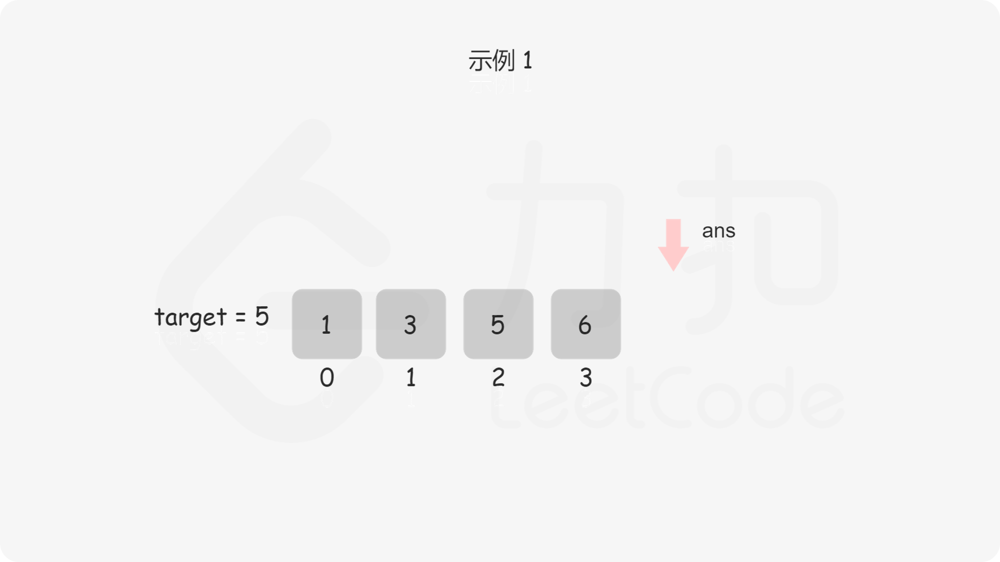
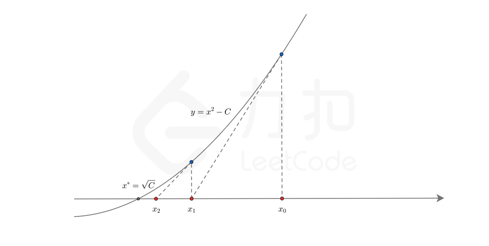

# 搜索插入位置

**链接**
==[35.搜索插入位置](https://programmercarl.com/0035.搜索插入位置.html)==

## 题目
给定一个**排序数组**和一个目标值，在数组中找到目标值，并返回其索引。==如果目标值不存在于数组中，返回它将会被按顺序插入的位置。==

请必须使用时间复杂度为**O(log n)** 的算法。

示例 1:

```tex
输入: nums = [1,3,5,6], target = 5
输出: 2
```


示例 2:

```tex
输入: nums = [1,3,5,6], target = 2
输出: 1
```


示例 3:

```tex
输入: nums = [1,3,5,6], target = 7
输出: 4
```


>提示:
1 <= nums.length <= 10^4
-104 <= nums[i] <= 10^4
nums 为 **无重复元素** 的 **升序** 排列数组
-10^4 <= target <= 10^4


## 过程

首先写一个==普通二分查找==。

```c++
class Solution {
public:
    int searchInsert(vector<int>& nums, int target) {
        int right=nums.size()-1;
        int left=0;
        int mid;
        
        while(right>=left){
            mid=left+(right-left)/2;

            if(nums[mid]==target)return mid;
            else if(nums[mid]>target)right=mid-1;
            else if(nums[mid]<target)left=mid+1;
        }

        return -1;
    }
};
```

然后你再认真审题，题目中说==如果目标值不存在于数组中，返回它将会被按顺序插入的位置。==



然后转念一想，==这不就是找比**目标值target**小的第一个数的位置。(相当于找第一个大于等于目标的数)==

根据if的判断条件，==left左边的值一直保持小于target，right右边的值一直保持大于等于target==，而且left最终一定等于right+1，这么一来，循环结束后，在left和right之间画一条竖线，恰好可以把数组分为两部分：**left左边的部分和right右边的部分，而且left左边的部分全部小于target，并以right结尾；right右边的部分全部大于等于target，并以left为首。**所以最终答案一定在left的位置。

```c++
class Solution {
public:
    int searchInsert(vector<int>& nums, int target) {
        int right=nums.size()-1;
        int left=0;
        int mid;
        
        while(right>=left){
            mid=left+(right-left)/2;

            if(nums[mid]==target)return mid;
            else if(nums[mid]>target)right=mid-1;
            else if(nums[mid]<target)left=mid+1;
        }

        
        return left;
    }
};
```

-----

# 在排序数组中查找元素的第一个和最后一个位置


**链接**

* [34.在排序数组中查找元素的第一个和最后一个位置](https://leetcode.cn/problems/find-first-and-last-position-of-element-in-sorted-array/)

## 题目

给你一个按照非递减顺序排列的整数数组 `nums`，和一个目标值 `target`。请你找出给定目标值在数组中的开始位置和结束位置。

如果数组中不存在目标值 `target`，返回 `[-1, -1]`。

你必须设计并实现时间复杂度为 `O(log n)` 的算法解决此问题。

 

**示例 1：**

```
输入：nums = [5,7,7,8,8,10], target = 8
输出：[3,4]
```

**示例 2：**

```
输入：nums = [5,7,7,8,8,10], target = 6
输出：[-1,-1]
```

**示例 3：**

```
输入：nums = [], target = 0
输出：[-1,-1]
```

 

**提示：**

- `0 <= nums.length <= 10^5`
- `-10^9 <= nums[i] <= 10^9`
- `nums` 是一个非递减数组
- `-10^9 <= target <= 10^9`


很显然是**搜索插入位置**的升级版，区别就是要查找两次，一次左边，一次右边。

故我们有两个思路

- 写==两次==[搜索插入位置](搜索插入位置)
- 写==一次==[搜索插入位置](搜索插入位置)，然后根据左边界推导右边界。==**（有很多很多坑）**==


**==空数组==**，**==数组越界==**

```c++
class Solution {
public:
    vector<int> searchRange(vector<int>& nums, int target) {
        int right=nums.size()-1;
        int left=0;
        int have=0;

        while(right>=left){
            int mid=left+(right-left)/2;

            if(nums[mid]==target)have=1;

            if(nums[mid]>=target)right=mid-1;
            else if(nums[mid]<target)left=mid+1;
        }

        int con=0;
        while(nums[left+con]==nums[left])con++;

        if(have)return vector<int>{left,left+con-1};
        else return vector<int>{-1,-1};
    }
};

```

然后发现示例过了，提交上去，结果==运行错误==

看看样例

```tex
nums =
[]
target =
0
```

好家伙，忘记考虑**==空数组==**的问题了，还有就是`nums[left+con]`也不安全，报错了，越界了。


改改

```c++
class Solution {
public:
    vector<int> searchRange(vector<int>& nums, int target) {
        int right=nums.size()-1;
        int left=0;
        int have=0;

        while(right>=left){
            int mid=left+(right-left)/2;

            if(nums[mid]==target)have=1;

            if(nums[mid]>=target)right=mid-1;
            else if(nums[mid]<target)left=mid+1;
        }


        int con=0;
        if(have){
            while(!nums.empty()&&(left+con)<nums.size()&&nums[left+con]==nums[left])con++;
            if(con>0)return vector<int>{left,left+con-1};
            else return vector<int>{left,left+con};
        }else return vector<int>{-1,-1};
    }
};

```

好了，AC了


来优化一下

正常思路

寻找target在数组里的左右边界，有如下三种情况：

- 情况一：target 在数组范围的右边或者左边，例如数组{3, 4, 5}，target为2或者数组{3, 4, 5},target为6，此时应该返回{-1, -1}
- 情况二：target 在数组范围中，且数组中不存在target，例如数组{3,6,7},target为5，此时应该返回{-1, -1}
- 情况三：target 在数组范围中，且数组中存在target，例如数组{3,6,7},target为6，此时应该返回{1, 1}

这三种情况都考虑到，说明就想的很清楚了。

接下来，在去寻找左边界，和右边界了。


```c++
class Solution {
public:
    vector<int> searchRange(vector<int>& nums, int target) {
        int leftBorder = getLeftBorder(nums, target);
        int rightBorder = getRightBorder(nums, target);
        // 情况一
        if (leftBorder == -2 || rightBorder == -2) return {-1, -1};
        // 情况三
        if (rightBorder - leftBorder > 1) return {leftBorder + 1, rightBorder - 1};
        // 情况二
        return {-1, -1};
    }
private:
     int getRightBorder(vector<int>& nums, int target) {
        int left = 0;
        int right = nums.size() - 1;
        int rightBorder = -2; // 记录一下rightBorder没有被赋值的情况
        while (left <= right) {
            int middle = left + ((right - left) / 2);
            if (nums[middle] > target) {
                right = middle - 1;
            } else { // 寻找右边界，nums[middle] == target的时候更新left
                left = middle + 1;
                rightBorder = left;
            }
        }
        return rightBorder;
    }
    int getLeftBorder(vector<int>& nums, int target) {
        int left = 0;
        int right = nums.size() - 1;
        int leftBorder = -2; // 记录一下leftBorder没有被赋值的情况
        while (left <= right) {
            int middle = left + ((right - left) / 2);
            if (nums[middle] >= target) { // 寻找左边界，nums[middle] == target的时候更新right
                right = middle - 1;
                leftBorder = right;
            } else {
                left = middle + 1;
            }
        }
        return leftBorder;
    }
};
```


-----
# x 的平方根

**链接**

* [69.x 的平方根](https://leetcode.cn/problems/sqrtx/)

## 题目

给你一个非负整数 `x` ，计算并返回 `x` 的 **算术平方根** 。

由于返回类型是整数，结果只保留 **整数部分** ，小数部分将被 **舍去 。**

**注意：**不允许使用任何内置指数函数和算符，例如 `pow(x, 0.5)` 或者 `x ** 0.5` 。

 

**示例 1：**

```
输入：x = 4
输出：2
```

**示例 2：**

```
输入：x = 8
输出：2
解释：8 的算术平方根是 2.82842..., 由于返回类型是整数，小数部分将被舍去。
```

 

**提示：**

- 0 <= x <= $2^{31}$ - 1


## 方法

### 一：袖珍计算器算法

「袖珍计算器算法」是一种用指数函数 `exp` 和对数函数 `ln` 代替平方根函数的方法。我们通过有限的可以使用的数学函数，得到我们想要计算的结果。

我们将 $x$ 写成幂的形式 $x^{1/2}$，再使用自然对数 $e$ 进行换底，即可得到

$$
\sqrt{x} = x^{1/2} = (e^{\ln x})^{1/2} = e^{\frac{1}{2} \ln x}
$$

这样我们就可以得到 $\sqrt{x}$ 的值了。

**注意：** 由于计算机无法存储浮点数的精确值（浮点数的存储方法可以参考 IEEE 754，这里不再赘述），而指数函数和对数函数的参数和返回值均为浮点数，因此运算过程中会存在误差。例如当 $x = 2147395600$ 时，$e^{\frac{1}{2} \ln x}$ 的计算结果与正确值 $46340$ 相差 $10^{-11}$，这样在对结果取整数部分时，会得到 $46339$ 这个错误的结果。

**因此在得到结果的整数部分 $ans$ 后，我们应当找出 $ans$ 与 $ans+1$ 中哪一个是真正的答案。**

```cpp
class Solution {
public:
    int mySqrt(int x) {
        if (x == 0) {
            return 0;
        }
        int ans = exp(0.5 * log(x));
        return ((long long)(ans + 1) * (ans + 1) <= x ? ans + 1 : ans);
    }
};
```

**复杂度分析**

- 时间复杂度：$O(1)$，由于内置的 `exp` 函数与 `log` 函数一般都很快，我们在这里将其复杂度视为 $O(1)$。
- 空间复杂度：$O(1)$。

---

### 二：二分查找

由于 $x$ 平方根的整数部分 $ans$ 是满足 $k^2 \leq x$ 的最大 $k$ 值，因此我们可以对 $k$ 进行二分查找，从而得到答案。

二分查找的下界为 $0$，上界可以粗略地设定为 $x$。在二分查找的每一步中，我们只需要比较中间元素 $mid$ 的平方与 $x$ 的大小关系，并通过比较的结果调整上下界的范围。由于我们所有的运算都是整数运算，不会存在误差，因此在得到最终的答案 $ans$ 后，也就不需要再去尝试 $ans+1$ 了。

```cpp
class Solution {
public:
    int mySqrt(int x) {
        int l = 0, r = x, ans = -1;
        while (l <= r) {
            int mid = l + (r - l) / 2;
            if ((long long)mid * mid <= x) {
                ans = mid;
                l = mid + 1;
            } else {
                r = mid - 1;
            }
        }
        return ans;
    }
};
```

**复杂度分析**

- 时间复杂度：$O(\log x)$，即为二分查找需要的次数。
- 空间复杂度：$O(1)$。

---

## 三：牛顿迭代

### 思路

牛顿迭代法是一种可以用来快速求解函数零点的方法。

为了叙述方便，我们用 $C$ 表示待求出平方根的那个整数。显然，$C$ 的平方根就是函数的零点。

$$
y = f(x) = x^2 - C
$$

牛顿迭代法的本质是借助泰勒级数，从初始值开始快速向零点逼近。我们任取一个 $x_0$ 作为初始值，在每一步的迭代中，我们找到函数图像上的点 $(x_i, f(x_i))$，过该点作一条斜率为该点导数 $f'(x_i)$ 的直线，与横轴的交点记为 $x_{i+1}$。$x_{i+1}$ 相较于 $x_i$ 而言距离零点更近。在经过多次迭代后，我们就可以得到一个距离零点非常接近的交点。下图给出了从 $x_0$ 开始迭代两次，得到 $x_1$ 和 $x_2$ 的过程。




### 算法

我们选择 $x_0 = C$ 作为初始值。

在每一步迭代中，我们通过当前的交点 $x_i$，找到函数图像上的点 $(x_i, x_i^2 - C)$，作一条斜率为 $f'(x_i) = 2x_i$ 的直线，直线的方程为：

$$
\begin{aligned}
y_l &= 2x_i (x - x_i) + x_i^2 - C \\
    &= 2x_i x - (x_i^2 + C)
\end{aligned}
$$

与横轴的交点为方程 $2x_i x - (x_i^2 + C) = 0$ 的解，即为新的迭代结果 $x_{i+1}$：

$$
x_{i+1} = \frac{1}{2} \left( x_i + \frac{C}{x_i} \right)
$$

在进行 $k$ 次迭代后，$x_k$ 的值与真实的零点 $\sqrt{C}$ 足够接近，即可作为答案。

### 细节

- **为什么选择 $x_0 = C$ 作为初始值？**  
  因为 $y = x^2 - C$ 有两个零点 $-\sqrt{C}$ 和 $\sqrt{C}$。如果我们取的初始值较小，可能会迭代到 $-\sqrt{C}$ 这个零点，而我们希望找到的是 $\sqrt{C}$ 这个零点。因此选择 $x_0 = C$ 作为初始值，每次迭代均有 $x_{i+1} < x_i$，零点 $\sqrt{C}$ 在其左侧，所以我们一定会迭代到这个零点。

- **迭代到何时才算结束？**  
  每一次迭代后，我们都会距离零点更进一步，所以当相邻两次迭代得到的交点非常接近时，我们就可以断定，此时的结果已经足够我们得到答案了。一般来说，可以判断相邻两次迭代的结果的差值是否小于一个极小的非负数 $\epsilon$，其中 $\epsilon$ **一般可以取 $10^{-6}$ 或 $10^{-7}$。**

- **如何通过迭代得到的近似零点得出最终的答案？**  
  由于 $y = f(x)$ 在 $[\sqrt{C}, +\infty]$ 上是凸函数（convex function）且恒大于等于零，那么只要我们选取的初始值 $x_0$ 大于等于 $\sqrt{C}$，每次迭代得到的结果 $x_i$ 都会恒大于等于 $\sqrt{C}$。因此只要 $\epsilon$ 选择地足够小，最终的结果 $x_k$ 只会稍稍大于真正的零点 $\sqrt{C}$。在题目给出的 32 位整数范围内，不会出现下面的情况：  
  真正的零点为 $n - \frac{1}{2}\epsilon$，其中 $n$ 是一个正整数，而我们迭代得到的结果为 $n + \frac{1}{2}\epsilon$。在对结果保留整数部分后得到 $n$，但正确的结果为 $n-1$。

```cpp
class Solution {
public:
    int mySqrt(int x) {
        if (x == 0) {
            return 0;
        }

        double C = x, x0 = x;
        while (true) {
            double xi = 0.5 * (x0 + C / x0);
            if (fabs(x0 - xi) < 1e-7) {
                break;
            }
            x0 = xi;
        }
        return int(x0);
    }
};
```

**复杂度分析**

- 时间复杂度：$O(\log x)$，此方法是二次收敛的，相较于二分查找更快。
- 空间复杂度：$O(1)$。


-----
# 完全平方数

**链接**

* [367. 有效的完全平方数](https://leetcode.cn/problems/valid-perfect-square/)

## 题目

给你一个正整数 `num` 。如果 `num` 是一个完全平方数，则返回 `true` ，否则返回 `false` 。

**完全平方数** 是一个可以写成某个整数的平方的整数。换句话说，它可以写成某个整数和自身的乘积。

**注意：**不能使用任何内置的库函数，如 `sqrt` 。

**示例 1：**

```
输入：num = 16
输出：true
解释：返回 true ，因为 4 * 4 = 16 且 4 是一个整数。
```

**示例 2：**

```
输入：num = 14
输出：false
解释：返回 false ，因为 3.742 * 3.742 = 14 但 3.742 不是一个整数。
```

**提示：**

- 1 <= num <=$2^{31}$ - 1

## 方法

### 一：内置库函数（不符合题意）

**思路和算法**

根据完全平方数的性质，只需要直接判断 `num` 的平方根 `x` 是否为整数即可。若不能直接判断浮点数是否等于整数，可通过 `⌊x⌋² = num` 来检验。

**代码**

```cpp
class Solution {
public:
    bool isPerfectSquare(int num) {
        int x = (int) sqrt(num);
        return x * x == num;
    }
};
```

**复杂度分析**

- 时间复杂度：$O(1)$，依赖 CPU 指令集。
- 空间复杂度：$O(1)$。

---

### 二：线性枚举

**思路和算法**

从 $1$ 开始逐个尝试正整数 $x$，检查 $x^2$ 是否等于 $num$。一旦 $x^2 > num$，即可停止。

**代码**

```cpp
class Solution {
public:
    bool isPerfectSquare(int num) {
        long x = 1, square = 1;
        while (square <= num) {
            if (square == num) {
                return true;
            }
            ++x;
            square = x * x;
        }
        return false;
    }
};
```

**复杂度分析**

- 时间复杂度：$O(\sqrt{n})$，最坏需要遍历 $\sqrt{n}$ 次。
- 空间复杂度：$O(1)$。

---

### 三：二分查找

**思路和算法**

利用二分查找在 $[1, num]$ 范围内寻找平方等于 $num$ 的整数。每次比较中间值 $mid$ 的平方与 $num$ 的大小，不断缩小搜索区间。

**代码**

```cpp
class Solution {
public:
    bool isPerfectSquare(int num) {
        int left = 0, right = num;
        while (left <= right) {
            int mid = left + (right - left) / 2;
            long square = (long) mid * mid;
            if (square < num) {
                left = mid + 1;
            } else if (square > num) {
                right = mid - 1;
            } else {
                return true;
            }
        }
        return false;
    }
};
```

**复杂度分析**

- 时间复杂度：$O(\log n)$。
- 空间复杂度：$O(1)$。

---

### 四：牛顿迭代法

**思路和算法**


如果 `num` 为完全平方数，则存在正整数 $x$ 满足 $x \times x = \text{num}$。考虑方程：
$$ f(x) = x^2 - \text{num} = 0 $$
该方程的正根即为 $\sqrt{\text{num}}$。通过牛顿迭代法可逼近该根，最后判断其整数平方是否等于 `num`。

#### 1. 初始值的选取

函数 $f(x) = x^2 - \text{num}$ 有两个零点：$-\sqrt{\text{num}}$ 和 $\sqrt{\text{num}}$，且 $1 \le \sqrt{\text{num}} \le \text{num}$。  
由于 $f(x)$ 是凸函数，若初始值 $x_0 \ge \sqrt{\text{num}}$，则每次迭代得到的 $x_i$ 也满足 $x_i \ge \sqrt{\text{num}}$。  
因此，取初始值 $x_0 = \text{num}$ 即可保证收敛方向正确。

#### 2. 迭代公式

对 $f(x)$ 求导得 $f'(x) = 2x$。  
设当前值为 $x_i$，过点 $(x_i, x_i^2 - \text{num})$ 作斜率为 $2x_i$ 的切线，其方程为：
$$
y - (x_i^2 - \text{num}) = 2x_i (x - x_i) 
$$
令 $y = 0$，解得切线与 $x$ 轴的交点横坐标：
$$
2x_i x - x_i^2 - \text{num} = 0 \quad \Rightarrow \quad x_{i+1} = \frac{x_i^2 + \text{num}}{2x_i} = \frac{1}{2}\left(x_i + \frac{\text{num}}{x_i}\right) 
$$

#### 3. 迭代终止条件

每次迭代后，$x_i$ 会更接近 $\sqrt{\text{num}}$。当相邻两次迭代值之差小于一个极小正数 $\epsilon$（如 $10^{-6}$ 或 $10^{-7}$）时，可以认为迭代收敛：
$$
|x_{i+1} - x_i| < \epsilon
$$

#### 4. 由近似根得到最终答案

迭代终止时的 $x_i$ 满足 $x_i \ge \sqrt{\text{num}}$。  
- 若 `num` 是完全平方数，则 $\sqrt{\text{num}}$ 为整数，且 $\lfloor x_i \rfloor^2 = \text{num}$。  
- 否则，$\lfloor x_i \rfloor^2 \neq \text{num}$。

因此，只需取整 $x = \lfloor x_i \rfloor$，判断 $x \times x = \text{num}$ 是否成立即可。

#### 总结

求方程 $f(x) = x^2 - num = 0$ 的正根。取初始值 $x_0 = num$，迭代公式为：
$$
x_{i+1} = \frac{1}{2}\left(x_i + \frac{num}{x_i}\right)
$$
当相邻两次迭代值之差小于 $10^{-6}$ 时停止，取整后验证平方是否等于 $num$。

**代码**

```cpp
class Solution {
public:
    bool isPerfectSquare(int num) {
        double x0 = num;
        while (true) {
            double x1 = (x0 + num / x0) / 2;
            if (x0 - x1 < 1e-6) {
                break;
            }
            x0 = x1;
        }
        int x = (int) x0;
        return x * x == num;
    }
};
```

**复杂度分析**

- 时间复杂度：$O(\log n)$，每次迭代误差至少缩小到原来的 $1/4$。
- 空间复杂度：$O(1)$。

