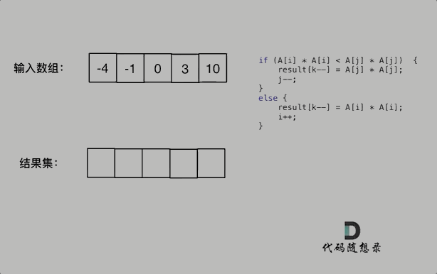

# 有序数组的平方：从暴力到双指针的优雅解法

## 题目链接

[力扣题目链接](https://leetcode.cn/problems/squares-of-a-sorted-array/)

## 题目描述

给你一个按 **非递减顺序** 排序的整数数组 `nums`，返回 **每个数字的平方** 组成的新数组，要求也按 **非递减顺序** 排序。

**示例 1：**
```
输入：nums = [-4,-1,0,3,10]
输出：[0,1,9,16,100]
解释：平方后，数组变为 [16,1,0,9,100]
      排序后，数组变为 [0,1,9,16,100]
```

**示例 2：**
```
输入：nums = [-7,-3,2,3,11]
输出：[4,9,9,49,121]
```

## 算法公开课

**[《代码随想录》算法视频公开课](https://programmercarl.com/other/gongkaike.html)：[双指针法经典题目!LeetCode:977.有序数组的平方](https://www.bilibili.com/video/BV1QB4y1D7ep)，相信结合视频再看本篇题解，更有助于大家对本题的理解。**

---

## 解题思路

### 暴力排序法（直接了当但效率低）

最直观的想法是：遍历数组，将每个元素平方，然后对平方后的数组进行排序。

**代码实现：**
```cpp
class Solution {
public:
    vector<int> sortedSquares(vector<int>& nums) {
        for (int i = 0; i < nums.size(); i++) {
            nums[i] *= nums[i];
        }
        sort(nums.begin(), nums.end()); // 快速排序
        return nums;
    }
};
```

**时间复杂度分析：**
- 平方操作：O(n)
- 排序操作：O(n log n)
- 总时间复杂度：O(n + n log n) = **O(n log n)**

**空间复杂度：**
- 如果使用 `sort` 进行原地排序，则空间复杂度为 O(1)
- 但如果不能修改原数组，需要额外 O(n) 的空间

**缺陷：** 没有利用 **原数组已排序** 这一重要条件！

### 双指针法（巧妙利用数组特性）

#### 核心洞察
数组平方的最大值一定在数组的两端，不是最左边就是最右边，不可能是中间。

**分析：**
- 原数组按非递减顺序排序
- 负数平方后会变成正数，且顺序会反转（例如：-4, -1 平方后变成 16, 1）
- 正数平方后顺序不变（例如：0, 3, 10 平方后变成 0, 9, 100）

因此，平方后的数组实际上是两个有序子数组的合并：
- 负数部分平方后：单调递减
- 非负数部分平方后：单调递增

#### 算法步骤
1. 定义两个指针 `i` 和 `j`，分别指向原数组的首尾
2. 定义一个新数组 `result`，大小与原数组相同
3. 定义指针 `k` 指向 `result` 数组的末尾（从后往前填充）
4. 比较 `nums[i]²` 和 `nums[j]²`，将较大的放入 `result[k]`
5. 移动相应指针，直到所有元素处理完毕

**动画演示：**



**代码实现：**
```cpp
class Solution {
public:
    vector<int> sortedSquares(vector<int>& nums) {
        int n = nums.size();
        vector<int> result(n, 0);  // 创建结果数组
        int k = n - 1;             // 从结果数组的末尾开始填充
      
        // 双指针从两端向中间移动
        for (int i = 0, j = n - 1; i <= j;) {
            if (nums[i] * nums[i] < nums[j] * nums[j]) {
                result[k--] = nums[j] * nums[j];
                j--;
            } else {
                result[k--] = nums[i] * nums[i];
                i++;
            }
        }
      
        return result;
    }
};
```

#### 为什么从后往前填充？
因为平方后的最大值一定在两端，所以我们可以先确定最大值，然后是次大值，依次类推。这样最终得到的结果数组就是从小到大排序的。

#### 为什么循环条件是 `i <= j`？
因为当 `i == j` 时，还有一个元素需要处理。如果写成 `i < j`，就会漏掉中间的元素。

---

## 复杂度分析

### 双指针法
- **时间复杂度：** O(n)
  - 每个元素只被访问一次
  - 比较和赋值操作都是常数时间

- **空间复杂度：** O(n)
  - 需要额外的数组存储结果
  - 如果题目允许修改原数组，可以将空间复杂度优化到 O(1)

### 暴力排序法 vs 双指针法
| 方法     | 时间复杂度 | 空间复杂度   | 是否利用原数组有序性 |
| -------- | ---------- | ------------ | -------------------- |
| 暴力排序 | O(n log n) | O(1) 或 O(n) | 否                   |
| 双指针   | O(n)       | O(n)         | 是                   |

---

## 其他双指针解法

除了从两端向中间的双指针法，还有一种从中间向两端的双指针法（类似归并排序）：

```cpp
class Solution {
public:
    vector<int> sortedSquares(vector<int>& nums) {
        int n = nums.size();
      
        // 找到正负数的分界线
        int negative = -1;
        for (int i = 0; i < n; ++i) {
            if (nums[i] < 0) {
                negative = i;  // 最后一个负数的位置
            } else {
                break;
            }
        }
      
        vector<int> result;
        int i = negative;      // 从最后一个负数开始向左
        int j = negative + 1;  // 从第一个非负数开始向右
      
        // 合并两个有序部分
        while (i >= 0 || j < n) {
            if (i < 0) {
                // 只有非负数部分剩余
                result.push_back(nums[j] * nums[j]);
                ++j;
            } else if (j == n) {
                // 只有负数部分剩余
                result.push_back(nums[i] * nums[i]);
                --i;
            } else if (nums[i] * nums[i] < nums[j] * nums[j]) {
                result.push_back(nums[i] * nums[i]);
                --i;
            } else {
                result.push_back(nums[j] * nums[j]);
                ++j;
            }
        }
      
        return result;
    }
};
```

这种方法同样时间复杂度为 O(n)，但实现稍复杂，需要先找到正负分界线。

---

## 边界情况考虑

1. **全为正数**：`[1, 2, 3]` → 直接平方后顺序不变
2. **全为负数**：`[-3, -2, -1]` → 平方后顺序反转
3. **包含零**：`[-2, -1, 0, 1, 2]` → 正确处理正负两部分
4. **单个元素**：`[5]` → 直接返回 `[25]`
5. **空数组**：`[]` → 返回 `[]`

---

## 总结

**有序数组的平方**问题是一个经典的双指针应用场景，它展示了如何利用数据特性设计高效算法：

1. **抓住核心特性**：平方后的最大值一定在数组两端
2. **选择合适方向**：从结果数组末尾开始填充，从大到小确定元素
3. **简化代码实现**：双指针从两端向中间移动，代码简洁高效

通过这道题，我们不仅掌握了一种高效的算法，更重要的是学会了 **如何分析数据特性来优化算法**。当遇到类似"有序数组"、"单调性"等关键词时，双指针算法往往是一个值得考虑的方向。

**记住：** 优秀的算法不是凭空想出来的，而是基于对问题特性的深刻理解。多观察、多分析，才能发现隐藏的优化机会！