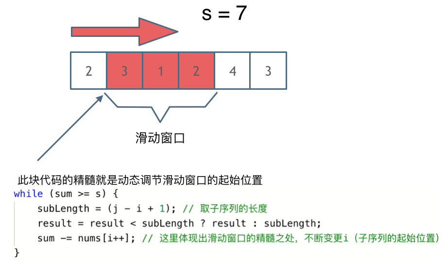

## 题目

[209.长度最小的子数组](https://leetcode.cn/problems/minimum-size-subarray-sum/)


给定一个含有 n 个正整数的数组和一个正整数 s ，找出该数组中满足其和 ≥ s 的长度最小的 连续 子数组，并返回其长度。如果不存在符合条件的子数组，返回 0。

示例：

* 输入：s = 7, nums = [2,3,1,2,4,3]
* 输出：2
* 解释：子数组 [4,3] 是该条件下的长度最小的子数组。

提示：

* 1 <= target <= 10^9
* 1 <= nums.length <= 10^5
* 1 <= nums[i] <= 10^5


## 方法

### 滑动窗口

```c++
class Solution {
public:
    int minSubArrayLen(int s, vector<int>& nums) {
        int result = INT32_MAX;
        int sum = 0; // 滑动窗口数值之和
        int i = 0; // 滑动窗口起始位置
        int subLength = 0; // 滑动窗口的长度
        for (int j = 0; j < nums.size(); j++) {
            sum += nums[j];
            // 注意这里使用while，每次更新 i（起始位置），并不断比较子序列是否符合条件
            while (sum >= s) {
                subLength = (j - i + 1); // 取子序列的长度
                result = result < subLength ? result : subLength;
                sum -= nums[i++]; // 这里体现出滑动窗口的精髓之处，不断变更i（子序列的起始位置）
            }
        }
        // 如果result没有被赋值的话，就返回0，说明没有符合条件的子序列
        return result == INT32_MAX ? 0 : result;
    }
};
```

或者

```c++
class Solution {
public:
    int minSubArrayLen(int target, vector<int>& nums) {
    int min = __INT32_MAX__;//int 的最大值
    int low , fast;
    int have = 0;//确定有无
    int term = nums[0];
    for(low = 0,fast = low;fast < nums.size();){
        if(term < target){
            fast++;
            if(fast < nums.size()){
                term += nums[fast];
            }
        }else{
            have = 1;
            if(min > fast - low){
                min = fast - low;
            }
            term -= nums[low];
            low++;
        }
    }

 
    if(!have){ 
        return 0;
    }else{
        return min+1;
    }
  }
};
```





