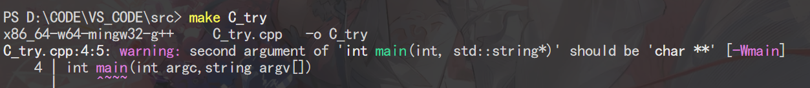
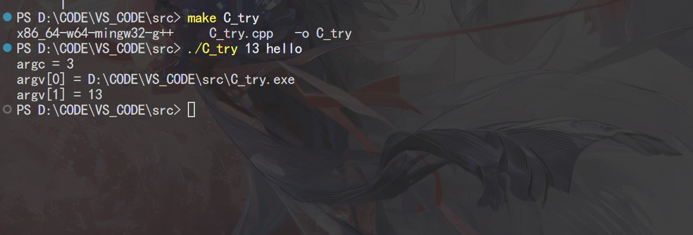

# week_2

## 调试

我使用的是**VSCode**,如果是**Visual Studio**它有自带的。

我们以C/C++为示例。

### 流程

1. **安装对应语言的调试扩展** VSCode默认仅内置了JavaScript/TypeScript的调试支持，其他语言需要先安装对应的扩展：

   - C/C++：安装C/C++扩展包

   

2. 打开目录中的**.vscode**创建配置文件**launch.json**

   

   ```json
   {
     "version": "0.2.0",
     "configurations": [
       {
         "name": "C++调试",
         "type": "cppdbg",
         "request": "launch",
         // exe生成在src文件夹下，所以路径要加上src
         "program": "${workspaceFolder}/src/${fileBasenameNoExtension}.exe",
         "args": [],
         "cwd": "${workspaceFolder}",
         "externalConsole": false, // 用VSCode内置终端输出，改成true会弹出独立黑框
         "MIMode": "gdb",
         "preLaunchTask": "C/C++: g++.exe 生成活动文件" // 和tasks.json的任务名对应，保证调试前自动编译最新代码
       }
     ]
   }
   ```

3. 设置**断点**，然后点击debug图标就行


## 命令行参数

- **命令行参数（Command-line Arguments）** 是在运行程序时直接在命令行传给程序的参数。

  ```c
  // 使用get_string获取用户输入打招呼
  #include <cs50.h>
  #include <stdio.h>
  int main(void)
  {
      string answer = get_string("你叫什么名字？ ");
      printf("hello, %s\n", answer);
  }
  ```

- 如果能在程序启动时就直接传入参数，会更高效。我们可以修改代码如下：

  ```c
  // 读取命令行参数打招呼
  #include <cs50.h>
  #include <stdio.h>
  int main(int argc, string argv[])
  {
      // 检查是否传入了1个额外参数（程序名本身是第0个参数）
      if (argc == 2)
      {
          printf("hello, %s\n", argv[1]);
      }
      else
      {
          printf("hello, world\n");
      }
  }
  ```

  这里的`argc`是**参数计数（argument count）**，表示命令行传入的参数总个数；`argv`是**参数数组（argument vector）**，是存储所有参数的字符串数组。

- 你也可以打印所有传入的命令行参数：

  ```c
  // 打印所有命令行参数
  #include <cs50.h>
  #include <stdio.h>
  int main(int argc, string argv[])
  {
      for (int i = 0; i < argc; i++)
      {
          printf("%s\n", argv[i]);
      }
  }
  ```

  运行后你会看到，第一个参数`argv[0]`永远是程序本身的名字，后面跟着你运行时传入的所有参数。

  

==你可以在终端输入`echo $?`查看上一条运行命令的退出状态码。==

但在c++中有一点小小不同

如果你按c来写的话

```c++
#include <bits/stdc++.h>
using namespace std;

int main(int argc, string argv[])
{
    cout<<"argc = "<<argc<<"\n";
    cout<<"argv[0] = "<<argv[0]<<"\n";
    cout<<"argv[1] = "<<argv[1]<<"\n";
    return 0;
}
```

它会进行警告




因为C++标准明确规定了`main`函数（程序入口函数）的合法参数形式只有两种：

```c++
// 无参数版本

int main()

// 接收命令行参数的版本

int main(int argc, char* argv[]) // 等价于 int main(int argc, char** argv)
```

其他没有太大变化



