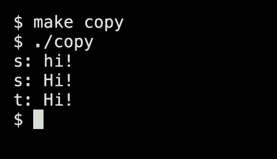
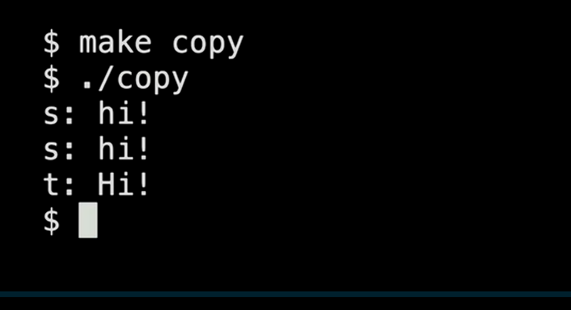
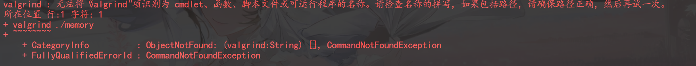
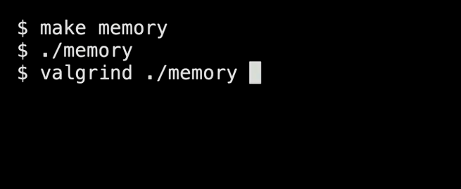
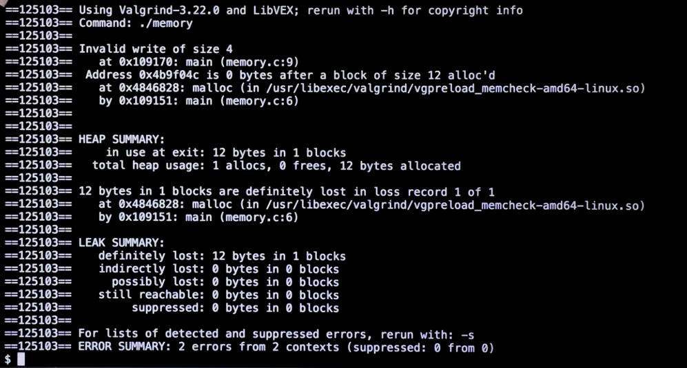
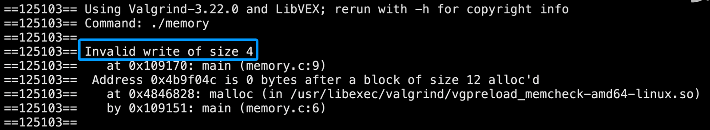
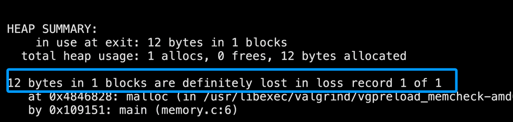
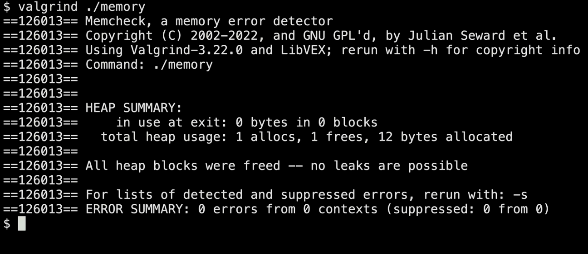
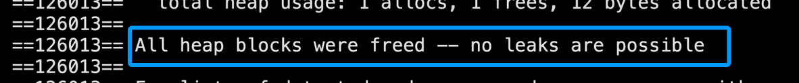
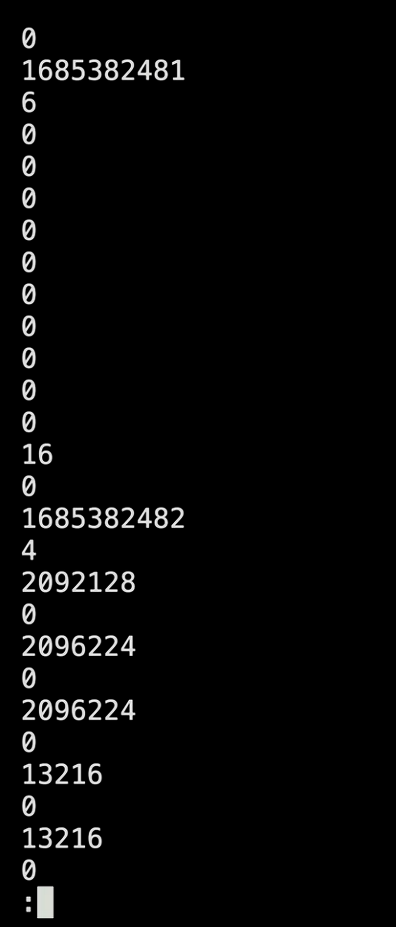

## 本期主题

内存与指针

在更低的层次上操作数据，包括图像和其他东西


## 十六进制

 在人们使用的文件，图片，我们倾向于使用16进制


内存的位置是未知的，由计算机分配。


## 指针

我们将使用**“&”**，**“*”**来调用指针

**“&”**是地址运算符，编译器会告诉你变量在计算机内存中的位置。

**“*”**是解引用运算符，通过它，我们可以有一个地址去访问。

格式

```c
int n = 50;
int *p = &n;//询问n的地址，然后存储在p中
```

指针本身是有地址的，所以有多级指针。

> 每次运行，变量的地址都会或多或少的改变，我们不在乎东西在哪里，我们只在乎能不能访问。


## typedef

- 创造一个别名

```c
typedef char * string;//把sstring作为char * 的别名
typedef int inted;
```


## 字符串指针的指向问题

**指针指向的是地址**

```c
#include <stdio.h>
#include <string.h>
#include <ctype.h>
#include <cs50.h>


int main()
{
    char *s=get_string("s: ");
    
    char *t=s;
    
    t[0] = toupper(t[0]);
    
    printf("s: %s\n",s);
    printf("t: %s\n",t); 
    return 0;
}
```



**char *t=s;**意为t和s指向同一个地方，所以跟随t[0]找到原来的副本，改动后会同时修改s。


## 内存控制

来自库**stdlib.h**

- **malloc()**

你给它一个数字X，它将为你分配X字节的内存，同时返回该内存的地址。

如果因为内存不足，它会返还**0**；

>
>
>字符0被称为NUL
>
>指针0被称为NULL

- **free()**

把malloc()拿走的内存还给计算机。

```c
#include <stdio.h>
#include <string.h>
#include <ctype.h>
#include <cs50.h>
#include <stdlib.h>


int main()
{
    char *s=get_string("s: ");
    
    char *t=malloc(strlen(s)+1);//加一是因为要空字符
    
    for(int i = 0,n = strlen(s);i <= n;i++){
       t[i] = s[i]; 
    }
    //注意这里是i <= n，这样循环也会把空字符“\0“复制过来。
    t[0] = toupper(t[0]);
    
    printf("s: %s\n",s);
    printf("t: %s\n",t); 
    return 0;
}
```



> **一定要检查边界情况。**

- 会不会没有足够的内存给t

- ```c
  if (t == NULL)
  {
      return 1;
  }
  ```

- 会不会输入一个回车，导致strlen(s)=0,动那块内存会有问题。

- ```c
  if (strlen(t) > 0)
  {
      t[0] = toupper(t[0]);
  }
  ```

>
>
>访问未知或未授权的内存，会出现经典的崩溃，冻结，或执行未定义的行为。

在复制字符串时，可以使用

```c
strcpy(t,s);//把s复制给t
```

最终结果

```c
#include <stdio.h>
#include <string.h>
#include <ctype.h>
#include <cs50.h>
#include <stdlib.h>


int main()
{
    char *s=get_string("s: ");
    
    char *t=malloc(strlen(s)+1);//加一是因为要空字符
    
    if (t == NULL)
	{
    	return 1;
	}
    
    strcpy(t,s);

	if (strlen(t) > 0)
	{
    	t[0] = toupper(t[0]);
	}
    
    printf("s: %s\n",s);
    printf("t: %s\n",t); 
    return 0;
}
```

**但是这是一个内存泄漏版本。**因为忘记把内存还给计算机了，如果长时间运行，它会掏空你计算机的内存。

所以加上

```c
free(t); 
```


## valgrind

>
>
>在windows里面是没有valgrind，它是Linux中的，Windows下有功能和Valgrind类似的内存检测工具，推荐用`Dr.Memory`，格式：**drmemory.exe -- memory.exe**




如何使用

```bash
valgrind ./XXX #XXX是程序名字
```

错误示例

```c
#include <stdio.h>
#include <stdlib.h>

int main()
{
  int *x = malloc(3 + sizeof(int));
    x[1] = 75;
    x[2] = 73;
    x[3] = 33;
    
    return 0;
}
```

这里有两种错误

- 数组越界
- 忘记使用free()


开始使用



然后就会有一堆数据



挑重点来



- 四字节未写入



- 十二字节丢失


修正一下
```c
#include <stdio.h>
#include <stdlib.h>

int main()
{
  int *x = malloc(3 + sizeof(int));
    x[1] = 75;
    x[2] = 73;
    x[3] = 33;
    
    free(x);
    return 0;
}
```

然后再试一次



重要的



>
>
>Linux中可以使用less来进行大量数据查看

如

```bash
./garbage | less
```

效果：



只会一页一页的输出，按**q**退出


## 一个指针的经典问题

```c
#include <stdio.h>
#include <stdlib.h>

int main()
{
    int *x;
    int *y;

    x = malloc(sizeof(int));
    *x = 42;

    *y = 13;//这里是有问题的

    y = x;
    *y = 13; 
    return 0;
}
```

C语言中局部指针变量定义后如果没有手动初始化，就是**野指针**，存储的是随机的、无效的内存地址，直接解引用（`*y = 13`）属于非法内存操作。


## 文件的输入输出

```c
#include <cs50.h>
#include <stdio.h>
#include <string.h>

int main()
{
    FILE *file = fopen("phonebook.csv", "w");//"W"是复写，"a“是补充；

    char *name = get_string("name: ");
    char *number = get_string("number: ");

    fprintf(file, "%s,%s\n", name, number);

    return 0;
}
```

返回值很重要

```c
if(file==NULL){
    return 1;
}
```


文件复制

```c
#include <cs50.h>
#include <stdio.h>
#include <string.h>

typedef uint_t BYTE;

int main(int argc; char * argc[])
{
	FILE *src = fopen(argc[1],"r");//"r"只读
    FILE *dst = fopen(argc[2],"w");//“w”复写
    
    BYTE b;
    
    while(fread(&b,sizeof(b),1,src)!=0)
    {
        fwrite(&b,sizeof(b),1,dest);
    }
    
    
    fclose(dst);
    fclose(src);
    return 0;
}
```


