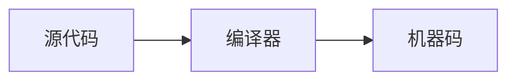
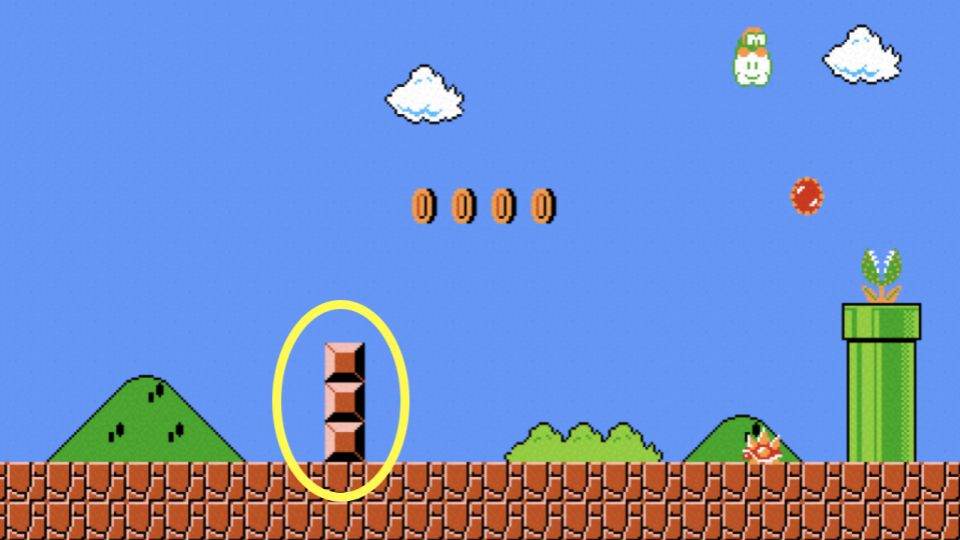
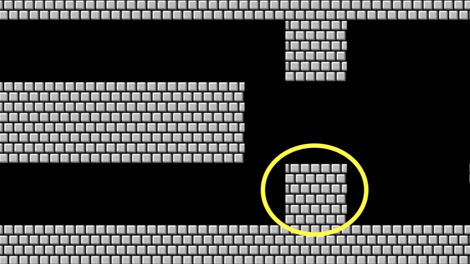

# week_1_note.md（CS50x 2026 第1讲中文笔记）
---

# [第1讲](https://cs50.harvard.edu/x/notes/1/#lecture-1)

- [欢迎](#welcome)
- [源代码](#source-code)
- [CS50专属Visual Studio Code](#visual-studio-code-for-cs50)
- [Hello World程序](#hello-world)
- [从Scratch过渡到C语言](#from-scratch-to-c)
- [头文件与CS50手册页](#header-files-and-cs50-manual-pages)
- [打招呼程序](#hello-you)
- [Linux基础命令](#linux)
- [条件判断语句](#conditionals)
- [数据类型](#types)
- [格式占位符](#format-codes)
- [变量](#variables)
- [compare.c（数值比较程序）](#comparec)
- [agree.c（同意确认程序）](#agreec)
- [循环与meow.c（喵叫程序）](#loops-and-meowc)
- [函数](#functions)
- [正确性、设计、风格](#correctness-design-style)
- [马里奥砖块程序](#mario)
- [运算符](#operators)
- [总结](#summing-up)

---

<h2 id="welcome">欢迎</h2>
- 上节课我们学习了可视化编程语言Scratch。
- 学习计算机科学的概念可能会非常有挑战性，你甚至会觉得信息量爆炸，像对着消防水龙喝水一样应接不暇。请记住：**真正重要的是未来几周乃至几个月里，你通过课程的努力学习获得的成长**。
- 我们在Scratch中学到的所有核心编程概念，在任何编程语言中都适用：函数、条件判断、循环、变量这些基础模块，是所有编程语言共通的基石。

---

<h2 id="source-code">源代码</h2>
- 我们之前提过，计算机只懂二进制。人类编写的**源代码**是人类可读的计算机指令列表，而计算机只能理解**机器码**——由0和1组成的、能实现预期功能的序列。
- 我们可以用一种叫做**编译器**的特殊软件，把源代码转换成机器码。今天我们就会学习用编译器，把C语言写的源代码转换成机器可以执行的机器码。


- 今天我们除了学习如何编程，还会学习如何写出高质量的代码。

---

<h2 id="visual-studio-code-for-cs50">CS50专属Visual Studio Code</h2>
- 本课程使用的文本编辑器是*Visual Studio Code*，简称*VS Code*，我们也将其定制为课程专属的在线环境[cs50.dev](https://cs50.dev/)，直接访问该网址即可使用。
- 我们使用VS Code最重要的原因之一是：它已经预装了课程所需的全部软件，课程的所有操作说明都是基于这个环境设计的。
- 手动在自己的电脑上安装课程所需的软件非常繁琐，极易出问题，因此完成课程作业时请务必使用cs50.dev的VS Code环境。
- 你可以直接访问[cs50.dev](https://cs50.dev/)打开VS Code。
- 这个集成开发环境（IDE）可以分为几个区域：
  
  左侧是**文件资源管理器**，可以找到你所有的文件；中间区域是**文本编辑器**，用来编写程序；最下方是`命令行界面`，简称*CLI*、命令行或终端窗口，我们可以在这里向云端的计算机发送指令。
- 左侧边栏的图形化界面（GUI）中还有各类工具和文件浏览器。
- 因为这个IDE已经预装了所有必要的软件，你应该用它完成本课程的所有作业。

---

<h2 id="hello-world">Hello World程序</h2>
我们会用三个命令来编写、编译、运行第一个程序：
```bash
code hello.c  # 创建并打开hello.c文件
make hello    # 编译源代码生成可执行文件
./hello       # 运行可执行程序
```
第一条命令`code hello.c`会创建一个新文件，你可以在里面编写程序指令。第二条命令`make hello`会把你写的C语言代码**编译**成名为`hello`的可执行文件。最后一条命令`./hello`会运行这个`hello`程序。

我们来写第一个C语言程序：在终端输入`code hello.c`，注意文件名全小写且后缀为`.c`。在打开的文本编辑器中写入以下代码：
```c
// 向世界打招呼的程序
#include <stdio.h>

int main(void)
{
    printf("hello, world\n");
}
```
注意上面的每一个字符都有其作用，写错任何一个程序都无法运行。`printf`是用来输出文本的函数，注意引号和分号的位置，`\n`的作用是在`hello, world`输出后换行。

回到终端窗口，执行`make hello`编译代码（注意省略了后缀`.c`）。`make`是一个构建工具，会把`hello.c`编译成可执行程序`hello`。如果执行命令后没有报错，就可以继续下一步；如果报错，请检查代码是否和上面的完全一致。

现在输入`./hello`，程序就会运行，输出`hello, world`。

打开左侧的文件资源管理器，你会看到现在有两个文件：`hello.c`和`hello`。`hello.c`是人类和编译器都能读的源代码，`hello`是包含机器码的可执行文件，计算机可以直接运行。

---

<h2 id="from-scratch-to-c">从Scratch过渡到C语言</h2>
- 在Scratch中我们用`说`模块在屏幕上显示文本，在C语言中，`printf`函数的作用和它完全一样。
- 我们的代码已经调用了这个函数：
  ```c
  printf("hello, world\n");
  ```
  这里我们调用了printf函数，传入的参数是被双引号包裹的`hello, world\n`，代码语句以分号`;`结尾。
- 代码报错很常见，尤其是分号、引号这类语法细节问题。我们修改代码，故意去掉`\n`：
  ```c
  // 缺少\n
  #include <stdio.h>
  
  int main(void)
  {
      printf("hello, world");
  }
  ```
- 在终端运行`make hello`重新编译（修改程序后必须重新编译才能生效），然后执行`./hello`，看看输出有什么变化？`\`是**转义字符**，会告诉编译器`\n`是换行的特殊指令，而不是普通字符。
- 其他常用的转义字符包括：
  ```
  \n  换行
  \r  回车（回到当前行的行首）
  \"  输出双引号
  \'  输出单引号
  \\  输出反斜杠本身
  ```
- 我们把代码恢复成原来的版本：
  ```c
  // 向世界打招呼的程序
  #include <stdio.h>
  
  int main(void)
  {
      printf("hello, world\n");
  }
  ```
  现在分号和`\n`都恢复了。

---

<h2 id="header-files-and-cs50-manual-pages">头文件与CS50手册页</h2>
- 代码开头的`#include <stdio.h>`是特殊指令，告诉编译器你要使用`stdio.h`这个**头文件**对应的库的功能，这个库提供了包括`printf`在内的很多能力。注意它不是studio，是`stdio.h`（standard input output的缩写）。
- **库**是他人已经写好的代码集合，包含了预编写的函数和功能，我们可以直接在自己的代码中调用，不用重复造轮子。
- 你可以在[CS50手册页](https://manual.cs50.io/)上查看所有库的功能，手册页会详细说明各个命令的作用和使用方法。
- CS50提供了自己的库`cs50.h`，里面包含了很多为C语言入门者设计的「辅助轮」函数：
  ```
  get_char    获取一个字符
  get_double  获取一个双精度浮点数
  get_float   获取一个单精度浮点数
  get_int     获取一个整数
  get_long    获取一个长整数
  get_string  获取一个字符串
  ```
- 这些库已经在[cs50.dev](https://cs50.dev/)上预装好了，如果你要在自己的电脑上使用这些库，需要额外安装，这也是我们推荐你用cs50.dev完成作业的原因。
- 我们现在就在程序中使用这个库。

---

<h2 id="hello-you">打招呼程序</h2>
- 回忆一下，在Scratch中我们可以询问用户「你叫什么名字？」，然后输出带名字的打招呼内容。
- 在C语言中我们也能实现同样的功能，修改代码如下：
  ```c
  // 错误示例：get_string和printf用了错误的占位方式
  #include <cs50.h>
  #include <stdio.h>
  
  int main(void)
  {
      string answer = get_string("What's your name? ");
      printf("hello, answer\n");
  }
  ```
  `get_string`函数用来获取用户输入的字符串，我们把它存在变量`answer`里，然后尝试传给`printf`函数。
- 在终端运行`make hello`，你会看到报错：编译器不认识`string`和`get_string`（不过我们已经引入了cs50.h，这里的错误是printf的用法不对），而且程序不会按我们预期输出名字，只会输出`hello, answer`。我们修改代码：
  ```c
  // 正确示例：get_string和printf使用%s占位符
  #include <cs50.h>
  #include <stdio.h>
  
  int main(void)
  {
      string answer = get_string("你叫什么名字？ ");
      printf("hello, %s\n", answer);
  }
  ```
  `get_string`用来获取用户输入的字符串，存入变量`answer`。`%s`是`printf`的占位符，告诉函数这里要接收一个字符串，我们把`answer`作为参数传入即可。
- 现在重新运行`make hello`，再执行`./hello`，程序就会按预期询问你的名字，然后输出带名字的打招呼内容。
- `answer`是我们称之为**变量**的存储容器，它的类型是`string`（字符串），可以存储任意字符串。C语言还有很多其他**数据类型**，比如`int`（整数）、`bool`（布尔值）、`char`（字符）等等。
- `%s`是叫做**格式占位符**的特殊标记，告诉`printf`这里要接收一个字符串，`answer`就是要传给`%s`的字符串内容。

---

<h2 id="linux">Linux基础命令</h2>
- 我们一直在用CLI执行`make`和运行程序。
- 执行命令、管理文件时，CLI通常比图形化界面（GUI）更高效。
- 终端（CLI）的常用命令包括：
  - `cd`：切换当前目录（文件夹）
  - `cp`：复制文件或目录
  - `ls`：列出当前目录下的所有文件
  - `mkdir`：创建新目录
  - `mv`：移动（或重命名）文件和目录
  - `rm`：删除（移除）文件
  - `rmdir`：删除（移除）目录
- 最常用的是`ls`，输入`ls`按回车，就能看到当前文件夹下的所有文件。

---

<h2 id="conditionals">条件判断语句</h2>
- Scratch里的另一个基础模块是**条件判断**：比如如果x大于y，就执行某件事；如果条件不满足，就执行另一件事。
- 我们可以对比Scratch的逻辑，在C语言中这样比较两个值：
  ```c
  // 互斥的条件判断
  if (x < y)
  {
      printf("x小于y\n");
  }
  else
  {
      printf("x不小于y\n");
  }
  ```
  如果`x < y`成立，就执行第一个代码块；否则执行第二个代码块。
- 同理，我们可以实现三种可能的判断逻辑：
  ```c
  // 存在冗余的条件判断
  if (x < y)
  {
      printf("x小于y\n");
  }
  else if (x > y)
  {
      printf("x大于y\n");
  }
  else if (x == y)
  {
      printf("x等于y\n");
  }
  ```
  注意这段代码不是最精简的，你能想到怎么去掉冗余的判断吗？
- 你可能已经想到了，我们可以把代码优化成这样：
  ```c
  // 优化后的整数比较逻辑
  if (x < y)
  {
      printf("x小于y\n");
  }
  else if (x > y)
  {
      printf("x大于y\n");
  }
  else
  {
      printf("x等于y\n");
  }
  ```
  最后一个判断可以直接用`else`，因为前两个条件都不满足时，x必然等于y。

---

<h2 id="types">数据类型</h2>
C语言支持很多数据类型，常见的包括：
```
bool    布尔型（真/假）
char    字符型（单个字符）
float   单精度浮点型（带小数的数）
int     整型（整数）
long    长整型（更大范围的整数）
string  字符串（多个字符组成的序列）
...
```

---

<h2 id="format-codes">格式占位符</h2>
- 之前我们用`%s`作为`printf`中字符串的占位符，这类占位符统称为**格式占位符**。
- `printf`支持很多格式占位符，课程中常用的包括：
  ```
  %c  对应char（字符）类型
  %f  对应float（浮点数）类型
  %i  对应int（整数）类型
  %li 对应long（长整数）类型
  %s  对应string（字符串）类型
  ```
  你可以在[CS50手册页](https://manual.cs50.io/)上查看更多格式占位符的用法。
- 整个课程中我们会用到大量C语言的数据类型。

---

<h2 id="variables">变量</h2>
- 在C语言中，你可以这样给int（整数）类型的变量赋值：
  ```c
  int counter = 0;
  ```
  这里我们创建了一个名为`counter`的int类型变量，赋值为0。
- 要给`counter`加1，可以这样写：
  ```c
  counter = counter + 1;
  ```
  表示把`counter`当前的值加1后，再存回`counter`。
- 也可以简写成：
  ```c
  counter += 1;
  ```
- 还可以进一步简化成自增语法：
  ```c
  counter++;
  ```
  `++`运算符的作用就是给变量加1。
- 同理，给`counter`减1可以用自减语法：
  ```c
  counter--;
  ```

---

<h2 id="comparec">compare.c（数值比较程序）</h2>
- 有了变量赋值的基础知识，我们可以写第一个条件判断程序。
- 在终端输入`code compare.c`，写入以下代码：
  ```c
  // 条件判断、布尔表达式、关系运算符示例
  #include <cs50.h>
  #include <stdio.h>
  
  int main(void)
  {
      // 提示用户输入整数
      int x = get_int("x的值是？ ");
      int y = get_int("y的值是？ ");
  
      // 比较两个整数
      if (x < y)
      {
          printf("x小于y\n");
      }
  }
  ```
  我们创建了两个int类型的变量`x`和`y`，用`get_int`获取用户输入的值存入变量。
- 执行`make compare`编译代码，再运行`./compare`测试。如果报错，请检查代码是否有拼写错误。
- 我们可以优化程序，覆盖所有可能的判断结果：
  ```c
  // 覆盖所有情况的条件判断
  #include <cs50.h>
  #include <stdio.h>
  
  int main(void)
  {
      // 提示用户输入整数
      int x = get_int("x的值是？ ");
      int y = get_int("y的值是？ ");
  
      // 比较两个整数
      if (x < y)
      {
          printf("x小于y\n");
      }
      else if (x > y)
      {
          printf("x大于y\n");
      }
      else
      {
          printf("x等于y\n");
      }
  }
  ```
  现在所有可能的比较结果都有对应的处理逻辑了。
- 重新编译运行程序，测试不同的输入值。
- 你可以把代码逻辑转换成流程图，就能直观看到我们的代码设计效率，几乎所有代码块都可以转换成可视化的逻辑图。

---

<h2 id="agreec---
<h2 id="agreec">agree.c（同意确认程序）</h2>
我们来学习另一种数据类型`char`（字符），在终端输入`code agree.c`创建新程序。
`string`是由多个字符组成的序列，而`char`只能存储单个字符。

在文本编辑器中写入以下代码：
```c
// 仅匹配小写字符的判断逻辑
#include <cs50.h>
#include <stdio.h>

int main(void)
{
    // 提示用户确认是否同意
    char c = get_char("你是否同意？ ");

    // 判断用户选择
    if (c == 'y')
    {
        printf("已同意。\n");
    }
    else if (c == 'n')
    {
        printf("已拒绝。\n");
    }
}
```
注意：C语言中**单引号仅用于单个字符（`char`类型）**，双引号才用于字符串。另外要特别区分：`==`是判断「是否相等」的比较运算符，而单个等号`=`是赋值运算符，二者作用完全不同，新手很容易在这里出错。

你可以在终端执行`make agree`编译，再运行`./agree`测试程序。

我们可以优化代码，同时支持大小写输入：
```c
// 同时匹配大小写字符的判断逻辑（仍有冗余）
#include <cs50.h>
#include <stdio.h>

int main(void)
{
    // 提示用户确认是否同意
    char c = get_char("你是否同意？ ");

    // 判断用户选择
    if (c == 'y')
    {
        printf("已同意。\n");
    }
    else if (c == 'Y')
    {
        printf("已同意。\n");
    }
    else
    {
        printf("已拒绝。\n");
    }
}
```
这段代码覆盖了大小写的情况，但逻辑存在重复，可以进一步优化：
```c
// 用逻辑运算符简化代码
#include <cs50.h>
#include <stdio.h>

int main(void)
{
    // 提示用户确认是否同意
    char c = get_char("你是否同意？ ");

    // 判断用户选择
    if (c == 'Y' || c == 'y')
    {
        printf("已同意。\n");
    }
    else
    {
        printf("已拒绝。\n");
    }
}
```
这里的`||`是逻辑运算符，代表「或」的意思，只要满足任意一个条件就会进入对应分支。

---
<h2 id="loops-and-meowc">循环与meow.c（喵叫程序）</h2>
我们在Scratch中学到的循环模块，在C语言中同样可以实现。
在终端输入`code meow.c`，先写一个最基础的版本：
```c
// 功能正常，但设计存在优化空间
#include <stdio.h>

int main(void)
{
    printf("喵\n");
    printf("喵\n");
    printf("喵\n");
}
```
这段代码能实现输出三次喵叫的功能，但设计上有明显缺陷：我们在重复写完全相同的代码。

我们可以用`while`循环优化：
```c
// 用while循环优化的版本
#include <stdio.h>

int main(void)
{
    int i = 3;
    while (i > 0)
    {
        printf("喵\n");
        i--;
    }
}
```
这里我们创建了int类型的变量`i`并赋值为3，`while`循环会在`i > 0`的条件成立时反复执行代码块，每次循环结束后用`i--`把`i`减1，直到`i`不大于0时停止循环。

我们也可以改成递增计数的逻辑：
```c
// 递增计数的while循环
#include <stdio.h>

int main(void)
{
    int i = 1;
    while (i <= 3)
    {
        printf("喵\n");
        i++;
    }
}
```
这里计数器`i`从1开始，每次循环加1，直到`i`大于3时停止循环。

但在计算机科学领域，我们通常习惯**从0开始计数**，因此可以进一步调整代码：
```c
// 符合计数习惯的优化版本
#include <stdio.h>

int main(void)
{
    int i = 0;
    while (i < 3)
    {
        printf("喵\n");
        i++;
    }
}
```

除了`while`循环，我们还有更适合固定次数循环的`for`循环，可以进一步简化代码：
```c
// 用for循环的优化版本
#include <stdio.h>

int main(void)
{
    for (int i = 0; i < 3; i++)
    {
        printf("喵\n");
    }
}
```
`for`循环的括号里包含三个部分：第一部分`int i = 0`是初始化计数器；第二部分`i < 3`是循环的判断条件；第三部分`i++`是每次循环结束后执行的操作，这里是计数器加1。

我们还可以写出无限循环的代码：
```c
// 无限循环示例
#include <cs50.h>
#include <stdio.h>

int main(void)
{
    while (true)
    {
        printf("喵\n");
    }
}
```
因为`true`永远为真，所以这段代码会永远执行，导致终端失去响应。如果不小心运行了无限循环，可以按下键盘上的`Ctrl+C`强制终止程序（这个快捷键会发送SIGINT信号结束运行中的进程）。

我们可以让程序更灵活，让用户自己决定喵叫的次数：
```c
// 由用户输入次数的版本
#include <cs50.h>
#include <stdio.h>

int main(void)
{
    int n = get_int("要叫几次？ ");

    for (int i = 0; i < n; i++)
    {
        printf("喵\n");
    }
}
```
这里用户输入的数字`n`会作为循环的上限，程序就会输出对应次数的喵叫。

但如果用户输入负数怎么办？我们可以先做一次判断：
```c
// 单次拦截负数输入（设计仍有缺陷）
#include <cs50.h>
#include <stdio.h>

int main(void)
{
    int n = get_int("要叫几次？ ");
    if (n < 0)
    {
        n = get_int("请输入非负数：");
    }

    for (int i = 0; i < n; i++)
    {
        printf("喵\n");
    }
}
```
这段代码只能拦截一次负数输入，如果用户第二次还是输入负数，程序还是会出问题。我们可以用循环优化：
```c
// 用循环+continue/break拦截负数输入
#include <cs50.h>
#include <stdio.h>

int main(void)
{
    int n;
    while (true)
    {
        n = get_int("要叫几次？ ");
        if (n < 0)
        {
            continue; // 跳过本次循环，重新输入
        }
        else
        {
            break; // 输入合法，跳出循环
        }
    }

    for (int i = 0; i < n; i++)
    {
        printf("喵\n");
    }
}
```
这里的`while`循环会一直运行，直到用户输入非负整数为止。我们还可以进一步简化代码，去掉冗余的`continue`：
```c
// 简化循环逻辑的版本
#include <cs50.h>
#include <stdio.h>

int main(void)
{
    int n;
    while (true)
    {
        n = get_int("要叫几次？ ");
        if (n >= 0)
        {
            break;
        }
    }

    for (int i = 0; i < n; i++)
    {
        printf("喵\n");
    }
}
```

对于这种「至少要执行一次操作，再判断是否继续循环」的场景，我们可以用`do-while`循环实现更简洁的逻辑：
```c
// 用do-while循环实现的最优版本
#include <cs50.h>
#include <stdio.h>

int main(void)
{
    int n;
    do
    {
        n = get_int("要叫几次？ ");
    }
    while (n < 0);

    for (int i = 0; i < n; i++)
    {
        printf("喵\n");
    }
}
```
`do`代码块的内容会**至少执行一次**，之后再判断`while`后的条件，如果条件成立就继续循环，否则跳出。

现在我们的代码逻辑已经很完善了，还可以更进一步：把喵叫的逻辑抽象成独立的函数。

---
<h2 id="functions">函数</h2>
后面我们会更深入地讲解函数，现在你可以先了解在C语言中自定义函数的基本写法：
```c
void meow(void)
{
    printf("喵\n");
}
```
开头的`void`表示这个函数没有返回值，括号里的`void`表示这个函数不需要接收任何参数。

我们可以在主函数中调用这个自定义函数：
```c
// 抽象出喵叫函数的版本
#include <stdio.h>

void meow(void); // 函数原型声明

int main(void)
{
    for (int i = 0; i < 3; i++)
    {
        meow(); // 调用自定义函数
    }
}

// 函数的具体实现：输出一次喵叫
void meow(void)
{
    printf("喵\n");
}
```
注意：C语言要求函数必须先声明才能调用，因此我们在代码顶部写了`void meow(void);`作为**函数原型**，哪怕函数的具体实现写在`main`函数的下方，也能正常调用。

我们还可以给函数添加参数，让它支持自定义喵叫次数：
```c
// 带参数的函数版本
#include <stdio.h>

void meow(int n); // 函数原型修改为接收一个int类型参数

int main(void)
{
    meow(3); // 调用时传入次数3
}

// 函数实现：接收次数n，输出n次喵叫
void meow(int n)
{
    for (int i = 0; i < n; i++)
    {
        printf("喵\n");
    }
}
```

使用变量和函数时，需要特别注意**变量的作用域**：
```c
// 演示变量作用域
#include <stdio.h>

void meow(int n);

int main(void)
{
    int n = 3; // 这里的n是main函数的局部变量
    meow(n);
}

void meow(int n) // 这里的n是meow函数的局部变量，和上面的n只是同名，不是同一个变量
{
    for (int i = 0; i < n; i++)
    {
        printf("喵\n");
    }
}
```
在`main`函数里定义的`n`，作用域仅限`main`函数内部。我们调用`meow(n)`时，传递的是`n`的**副本**，`meow`函数里修改这个参数不会影响`main`里的原始变量。

我们可以结合之前的用户输入逻辑，完善程序：
```c
// 结合用户输入的版本
#include <cs50.h>
#include <stdio.h>

void meow(int n);

int main(void)
{
    int n;
    do
    {
        n = get_int("请输入正数：");
    }
    while (n < 1);
    meow(n);
}

void meow(int n)
{
    for (int i = 0; i < n; i++)
    {
        printf("喵\n");
    }
}
```

我们还可以把「获取正整数」的逻辑也抽象成独立的函数，让代码复用性更高：
```c
// 抽象出获取正整数的函数
#include <cs50.h>
#include <stdio.h>

int get_positive_int(void);
void meow(int n);

int main(void)
{
    int n = get_positive_int(); // 调用自定义函数获取合法的正整数
    meow(n);
}

// 函数实现：循环提示用户输入，直到获得正整数后返回
int get_positive_int(void)
{
    int n;
    do
    {
        n = get_int("请输入正数：");
    }
    while (n < 1);
    return n; // 把获取到的正整数返回给调用者
}

void meow(int n)
{
    for (int i = 0; i < n; i++)
    {
        printf("喵\n");
    }
}
```
这里的`get_positive_int`函数有返回值，函数类型声明为`int`，通过`return`语句把结果返回给调用它的`main`函数。

---
<h2 id="correctness-design-style">正确性、设计、风格</h2>
我们可以从三个维度评估代码的质量：
1. **正确性**：指「代码是否按预期运行？」，你可以用CS50提供的`check50`工具自动检查代码的正确性。
2. **设计**：指「代码的架构设计是否合理？是否易扩展、易维护？」，你可以用`design50`工具评估代码的设计质量。
3. **风格**：指「代码的格式是否统一、可读性是否良好？」，你可以用`style50`工具检查代码的风格规范，比如缩进、空格、命名等是否符合标准。

---
<h2 id="mario">马里奥砖块程序</h2>
我们今天学习的所有基础模块，都是你作为计算机科学从业者的核心工具。接下来我们用一个小案例练习：如何用代码实现《超级马里奥》里的砖块效果，帮你熟悉编程问题的解决思路。

首先，我们要打印4个横向排列的问号砖块：

在终端输入`code mario.c`，写入以下代码：

```c
// 打印一行4个问号
#include <stdio.h>

int main(void)
{
    printf("????\n");
}
```
我们可以用循环更灵活地实现这个效果：
```c
// 用循环打印一行4个问号
#include <stdio.h>

int main(void)
{
    for (int i = 0; i < 4; i++)
    {
        printf("?");
    }
    printf("\n");
}
```

接下来我们打印3个垂直排列的砖块：

修改代码如下：

```c
// 用循环打印一列3个砖块
#include <stdio.h>

int main(void)
{
    for (int i = 0; i < 3; i++)
    {
        printf("#\n");
    }
}
```

如果我们要打印3×3的砖块网格呢？

我们可以用**嵌套循环**实现：

```c
// 用嵌套循环打印3x3的砖块网格
#include <stdio.h>

int main(void)
{
    for (int i = 0; i < 3; i++) // 外层循环控制行数
    {
        for (int j = 0; j < 3; j++) // 内层循环控制每行的砖块数
        {
            printf("#");
        }
        printf("\n"); // 每行打印完后换行
    }
}
```
这里的外层循环负责控制一共打印几行，内层循环负责在每一行打印对应数量的砖块，每行结束后输出换行符。

如果我们希望网格的大小是固定不可修改的，可以用`const`关键字定义常量：
```c
// 用常量定义网格大小
#include <stdio.h>

int main(void)
{
    const int n = 3; // const表示这个变量是常量，值不能被修改
    for (int i = 0; i < n; i++)
    {
        for (int j = 0; j < n; j++)
        {
            printf("#");
        }
        printf("\n");
    }
}
```

我们还可以把「打印一行砖块」的逻辑抽象成独立函数，让代码更清晰：
```c
// 抽象出打印行的辅助函数
#include <stdio.h>

void print_row(int width); // 函数原型：接收宽度参数，打印对应长度的一行砖块

int main(void)
{
    const int n = 3;
    for (int i = 0; i < n; i++)
    {
        print_row(n); // 每行打印n个砖块
    }
}

// 函数实现：打印指定宽度的砖块行
void print_row(int width)
{
    for (int i = 0; i < width; i++)
    {
        printf("#");
    }
    printf("\n");
}
```

---


<h2 id="operators">运算符</h2>
**运算符**是编译器支持的数学运算符号，C语言的基础算术运算符包括：
  - `+` 加法
  - `-` 减法
  - `*` 乘法
  - `/` 除法
  - `%` 取余（模运算，返回除法的余数）

本课程会用到上述所有运算符。

我们来写一个简单的计算器，在终端输入`code calculator.c`，写入以下代码：
```c
// 整数加法示例
#include <cs50.h>
#include <stdio.h>

int main(void)
{
    // 提示用户输入x
    int x = get_int("x的值是？ ");

    // 提示用户输入y
    int y = get_int("y的值是？ ");

    // 计算两数之和
    int z = x + y;

    // 输出结果
    printf("%i\n", z);
}
```
这里我们创建了第三个变量`z`来存储`x`和`y`的和，然后用`%i`（整数的格式占位符）输出结果。

我们可以把代码写得更简洁，不需要中间变量`z`：
```c
// 简化版整数加法，无需中间变量
#include <cs50.h>
#include <stdio.h>

int main(void)
{
    // 提示用户输入x
    int x = get_int("x的值是？ ");

    // 提示用户输入y
    int y = get_int("y的值是？ ");

    // 直接在printf中完成加法运算
    printf("%i\n", x + y);
}
```
我们直接在`printf`的参数中完成加法运算，省去了中间变量，代码更加精简。

我们也可以实现乘法运算，比如把输入的数字翻倍：
```c
// 数字翻倍示例
#include <cs50.h>
#include <stdio.h>

int main(void)
{
    // 提示用户输入x
    int x = get_int("x的值是？ ");

    // 输出翻倍后的结果
    printf("%i\n", x * 2);
}
```
这里我们用乘法运算符`*`将输入值翻倍，演示了加法之外的算术运算。

但要注意：C语言中`int`类型的数值范围是有限的。我们看下面这个例子：
```c
// 整数溢出示例
#include <cs50.h>
#include <stdio.h>

int main(void)
{
    int dollars = 1;
    while (true)
    {
        char c = get_char("当前金额：%i美元，要翻倍后传给下一个人吗？ ", dollars);
        if (c == 'y')
        {
            dollars *= 2; // 等价于 dollars = dollars * 2
        }
        else
        {
            break;
        }
    }
    printf("最终金额：%i美元。\n", dollars);
}
```
这个程序会不断将金额翻倍，当数值超过`int`能存储的最大值时，就会发生**整数溢出**：超出的部分会被截断，数值会变成负数或者0，结果完全不符合预期。

整数溢出是指计算结果超过了对应数据类型的最大存储上限，导致数值被意外截断的问题，属于C语言的常见陷阱之一。C语言的优势是给了程序员极大的内存控制权，但代价是需要程序员主动关注内存管理的潜在风险。

数据类型决定了变量能存储的内容范围：比如`char`类型是用来存储单个字符的，比如`a`或者`2`。不同类型的存储上限有明确的限制：在大多数系统中，有符号`int`的最大值是`2147483647`（即2^31-1），无符号`int`的最大值是`4294967295`（即2^32-1），如果试图存储超过上限的数值，就会触发整数溢出。
> 注：数据类型的范围由它占用的比特数决定，比特数越多，能表示的数值范围就越大。

整数溢出在现实中可能引发极其严重的事故，历史上有很多系统故障、安全漏洞都是由溢出导致的。

我们可以用`long`类型（长整型）来缓解这个问题，它的存储范围比`int`大得多：
```c
// 用long类型缓解溢出问题
#include <cs50.h>
#include <stdio.h>

int main(void)
{
    long dollars = 1;
    while (true)
    {
        char c = get_char("当前金额：%li美元，要翻倍后传给下一个人吗？ ", dollars);
        if (c == 'y')
        {
            dollars *= 2;
        }
        else
        {
            break;
        }
    }
    printf("最终金额：%li美元。\n", dollars);
}
```
注意我们把变量类型从`int`改成了`long`，对应的格式占位符也从`%i`改成了`%li`。`long`能存储比`int`大得多的数值，但它的范围仍然是有限的，只是推迟了溢出的发生，并没有彻底解决溢出问题。

你应该知道，整数和浮点数的核心区别是浮点数能表示小于1的小数。我们看下面这个整数除法的例子：
```c
// 整数除法的截断特性示例
#include <cs50.h>
#include <stdio.h>

int main(void)
{
    // 提示用户输入x
    int x = get_int("x的值是？ ");

    // 提示用户输入y
    int y = get_int("y的值是？ ");

    // 输出两数相除的结果
    printf("%i\n", x / y);
}
```
当你用两个整数做除法时，C语言会执行**整数除法**，直接舍弃小数部分（截断），比如输入7和2，得到的结果是3而不是3.5。

另外浮点数也存在**精度误差**：计算机用二进制存储浮点数，无法完全精确地表示所有十进制小数，计算时会有微小的误差。
> 注：编程时要特别注意变量的类型选择，避免因为类型不匹配引发逻辑错误，历史上有很多重大事故都是类型相关的错误导致的。

我们可以通过**类型强制转换**，把整数转换成浮点数再做除法，就能得到小数结果：
```c
// 类型强制转换示例
#include <cs50.h>
#include <stdio.h>

int main(void)
{
    // 提示用户输入x
    int x = get_int("x的值是？ ");

    // 提示用户输入y
    int y = get_int("y的值是？ ");

    // 先把x强制转换成float类型，再做除法
    printf("%f\n", (float) x / y);
}
```
这里的`(float) x`就是强制类型转换，把`x`从`int`转换成`float`，这样除法就会按浮点数规则执行，保留小数部分。

我们也可以直接用`float`类型处理输入：
```c
// 浮点数精度示例
#include <cs50.h>
#include <stdio.h>

int main(void)
{
    // 提示用户输入x（浮点数）
    float x = get_float("x的值是？ ");

    // 提示用户输入y（浮点数）
    float y = get_float("y的值是？ ");

    // 输出除法结果，保留50位小数
    printf("%.50f\n", x / y);
}
```
这里我们用`get_float`获取浮点数输入，用`%.50f`指定输出50位小数，你会看到结果的末尾出现很多意料之外的数字，这就是浮点数精度误差的体现——二进制无法精确表示所有十进制小数。

---
<h2 id="summing-up">总结</h2>
本节课你学会了把Scratch中学到的编程基础模块应用到C语言中，掌握了以下内容：
* 如何编写、编译、运行你的第一个C语言程序
* 如何使用命令行完成基础操作
* C语言原生提供的常用预定义函数的用法
* 如何使用变量、条件判断和循环实现基础逻辑
* 如何自定义函数，简化代码、提升可复用性
* 如何从正确性、设计、风格三个维度评估代码质量
* 如何在代码中添加注释，提升可读性
* 如何选择合适的数据类型和运算符，以及不同选择的潜在影响

下次课见！


> 本文转自 [https://cs50.harvard.edu/x/notes/0/](https://cs50.harvard.edu/x/notes/0/)，如有侵权，请联系删除。