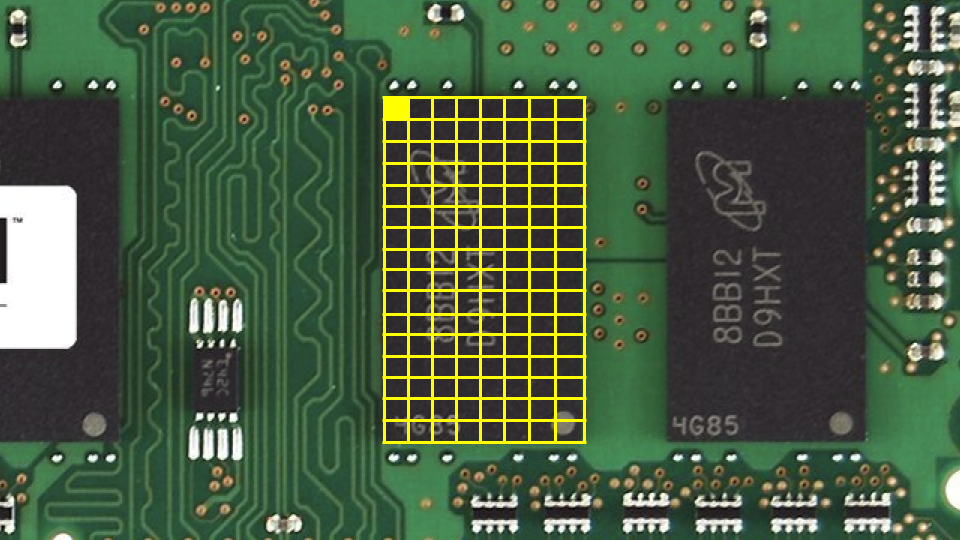
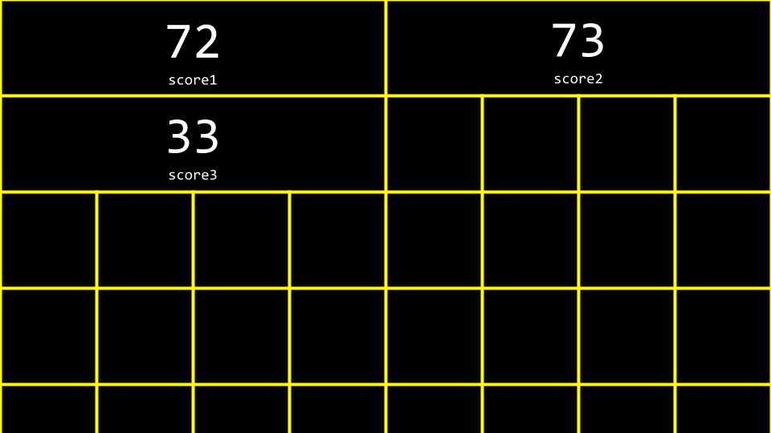

# CS50x 2026 第2讲

---

[许可协议](https://cs50.harvard.edu/license/)

# 第2讲
*   [欢迎](##欢迎)
*   [阅读难度分级](##阅读难度分级)
*   [调试](##调试)
*   [编译过程](##编译过程)
*   [数组](##数组)
*   [字符串](##字符串)
*   [字符串长度](##字符串长度)
*   [命令行参数](##命令行参数)
*   [退出状态](##退出状态)
*   [总结](##总结)

---
## 欢迎
- 上节课我们学习了文本编程语言C语言。
- 这周我们会深入更多底层编程的基础模块，帮我们从底层理解编程逻辑。
- 本课程的核心除了编程基础，更重要的是解决问题的能力，因此我们会进一步重点讲解计算机科学问题的解决思路。
- 到课程结束时，你将学会用上述基础模块解决各类计算机科学问题。
- 我们现在习以为常的很多计算机解决方案，本质都是基于这些基础模块实现的。

---
## 阅读难度分级
- 本节课我们要解决的一个现实问题是「评估文本的阅读难度等级」。
- 我们和其他同学一起准备了不同难度等级的阅读材料。
- 这周的编程挑战之一就是实现阅读难度的量化计算。

---
## 调试
- 所有人写代码都会出错。
- **调试（Debugging）** 就是定位并修复代码中错误（Bug）的过程。
- 本课程会教你一种调试方法叫做 **小黄鸭调试法**：你可以对着无生命的物体（甚至你自己）逐行解释代码逻辑，梳理为什么代码没有按预期运行。遇到卡壳的时候，你甚至可以真的对着一只小黄鸭讲解问题；不想对着塑料鸭的话，找身边的人讲解也是一样的效果。
- 我们提供了CS50调试鸭和[CS50.ai](https://cs50.ai/)作为辅助调试工具。
- 我们来看几个错误代码的例子：
  ```c
  // 缺少stdio.h的#include引入
  int main(void)
  {
      printf("hello, world\n");
  }
  ```
  这段代码缺少了`stdio.h`头文件的引入，而`printf`函数依赖这个头文件才能正常运行。没有引入的话，编译器识别不了`printf`函数，会抛出错误。
- 再看另一个例子：
  ```c
  // stdio.h拼写错误
  #include <studio.h>
  int main(void)
  {
      printf("hello, world\n");
  }
  ```
  这里把`stdio.h`错拼成了`studio.h`，编译器找不到名为`studio.h`的文件，会报编译错误。正确的头文件名是`stdio.h`，是「标准输入输出（standard input/output）」的缩写。
- 我们还可能忘记声明变量类型：
  ```c
  // 缺少cs50.h、未声明变量类型、缺分号、缺%s占位符、printf缺第二个参数
  #include <stdio.h>
  int main(void)
  {
      name = get_string("What's your name? ")
      printf("hello, world\n");
  }
  ```
  这段代码有多处错误：首先没有声明`name`的类型；其次缺少`cs50.h`库的引入，无法使用`string`类型和`get_string`函数；第三，`get_string`语句末尾缺少分号；最后`printf`没有用到`name`变量，无法实现打招呼的功能。
- 有些错误会直接触发编译器的报错提示，另一些则是**逻辑错误**：不会触发报错，但程序运行结果不符合预期。
- `printf`语句本身就可以用来调试代码，我们来看上节课的马里奥砖块例子：
  
- 我们故意在代码里加一个Bug：
  ```c
  // printf调试的错误示例
  #include <stdio.h>
  int main(void)
  {
      for (int i = 0; i <= 3; i++)
      {
          printf("#\n");
      }
  }
  ```
  运行这段代码会发现，它打印了4块砖，而不是我们预期的3块。
- 在终端输入`code buggy.c`写入上述代码，运行后确实多输出了一块砖。
- 我们可以用`printf`打印中间变量来调试，修改代码如下：
  ```c
  // 用printf打印变量调试
  #include <stdio.h>
  int main(void)
  {
      for (int i = 0; i <= 3; i++)
      {
          printf("当前i的值是%i\n", i);
          printf("#\n");
      }
  }
  ```
  这段代码会在每次循环时打印`i`的当前值，方便我们定位问题。
- 运行后你会看到输出了`i is 0`、`i is 1`、`i is 2`、`i is 3`，一共4次循环。看到这个结果你就能发现问题：循环条件应该是`i < 3`而不是`i <= 3`，修改后代码就正常了：
  ```c
  #include <stdio.h>
  int main(void)
  {
      for (int i = 0; i < 3; i++)
      {
          printf("#\n");
      }
  }
  ```
- 我们再看一个复杂一点的错误示例：
  ```c
  // debug50调试的错误示例
  #include <cs50.h>
  #include <stdio.h>
  void print_column(int height);
  
  int main(void)
  {
      int h = get_int("高度：");
      print_column(h);
  }
  
  void print_column(int height)
  {
      for (int i = 0; i <= height; i++)
      {
          printf("#\n");
      }
  }
  ```
  编译运行这段代码仍然有逻辑错误。
- 要解决这个问题，我们可以用第二种调试工具：**调试器（Debugger）**，这是程序员专门开发的用来追踪代码错误的软件工具。
- VS Code中已经预装了CS50专属的调试器`debug50`。
- 要使用调试器，首先需要设置**断点（Breakpoint）**：点击代码行号左侧的空白处，会出现一个红色圆点，相当于一个停止标志，让调试器运行到这一行时暂停，方便你观察代码此时的运行状态。
  
- 第二步，在终端运行`debug50 ./buggy`，调试器启动后，代码会在断点行高亮显示（通常是金色），说明程序已经在这一行暂停。左上角会显示所有局部变量的当前值，比如此时`h`还没有被赋值。窗口顶部有调试按钮，点击「单步跳过（step over）」可以逐行运行代码，你会看到循环中`i`的值随着单步运行逐渐变化。
- 调试器不会直接告诉你Bug在哪，但它能让你慢下来，逐行观察代码的运行过程和变量变化。你也可以用「单步步入（step into）」按钮深入函数内部查看细节。
- 第三种调试方法就是我们前面提到的小黄鸭调试法：对着无生命物体或者他人描述你遇到的问题，以及你尝试解决的步骤，在描述的过程中往往就能自己发现错误。
- 最后，你也可以用CS50调试鸭（CS50 Duck）辅助调试。

---
## 编译过程
- 回忆上节课的内容：**编译器**是一种特殊的程序，能把人类可读的**源代码**转换成计算机能理解的**机器码**。
  ```mermaid
  flowchart LR
      in["源代码"] --> BOX["编译器"]
      BOX --> out["机器码"]
  ```
- 比如我们有这样一段源代码：
  ```c
  #include <stdio.h>
  int main(void)
  {
      printf("hello, world\n");
  }
  ```
- 编译器会把上述代码转换成类似这样的机器码（以下仅为示例，实际机器码会长得多）：
  ```
  01010100 01001000 01001001 01010011
  00100000 01001001 01010011 00100000
  01000011 01010011 00110101 00110000
  ```
- CS50提供的VS Code环境使用的编译器叫做`clang`，全称是「C语言家族前端（C Language Family Frontend）」。
- 你可以在终端输入以下命令手动编译代码：`clang -o hello hello.c`。
- 这里的`-o hello hello.c`就是传给`clang`的**命令行参数**，`-o`用来指定输出的可执行文件名。
- 编译完成后运行`./hello`，程序就会按预期运行。
- 再看上节课用到CS50库的代码：
  ```c
  #include <cs50.h>
  #include <stdio.h>
  int main(void)
  {
      string name = get_string("你叫什么名字？ ");
      printf("hello, %s\n", name);
  }
  ```
- 编译这段代码需要额外链接CS50库，命令是`clang -o hello hello.c -lcs50`。
- 如果你用`make hello`命令，它会自动执行完整的clang命令，生成可执行文件。
- VS Code已经预先配置好了`make`的参数，会自动添加所有需要的编译选项，使用起来非常方便。
- 以上手动编译的内容是为了让你深入理解编译的原理和过程，在CS50课程中直接用`make`命令即可，这也是我们推荐的方式。
- 完整的编译流程包含四个核心步骤：
  1. **预处理（Preprocessing）**：处理代码中以`#`开头的指令，比如`#include <cs50.h>`，本质是把对应头文件的内容复制粘贴到你的代码中。比如`cs50.h`和`stdio.h`的代码会被插入到你的程序里，预处理后的代码大致是这样的：
     ```c
      string get_string(string prompt);
      int printf(string format, ...);
     
      int main(void)
      {
          string name = get_string("What's your name? ");
          printf("hello, %s\n", name);
      }
     ```
  2. **编译（Compiling）**：把预处理后的C代码转换成汇编代码，结果大致如下：
     ```
     ...
     main:
         .cfi_startproc
     # BB#0:
         pushq    %rbp
     .Ltmp0:
         .cfi_def_cfa_offset 16
     .Ltmp1:
         .cfi_offset %rbp, -16
         movq    %rsp, %rbp
     .Ltmp2:
         .cfi_def_cfa_register %rbp
         subq    $16, %rsp
         xorl    %eax, %eax
         movl    %eax, %edi
         movabsq    $.L.str, %rsi
         movb    $0, %al
         callq    get_string
         movabsq    $.L.str.1, %rdi
         movq    %rax, -8(%rbp)
         movq    -8(%rbp), %rsi
         movb    $0, %al
         callq    printf
         ...
     ```
  3. **汇编（Assembling）**：用汇编器把汇编代码转换成纯机器码（二进制），结果大致如下：
     ```
     01111111010001010100110001000110
     00000010000000010000000100000000
     00000000000000000000000000000000
     00000000000000000000000000000000
     00000001000000000011111000000000
     00000001000000000000000000000000
     00000000000000000000000000000000
     ...
     ```
  4. **链接（Linking）**：把你代码用到的库的预编译机器码（比如`printf`、`get_string`的实现）和你自己的代码的机器码合并，最终生成完整的可执行文件，结果大致如下：
     ```
     01111111010001010100110001000110
     00000010000000010000000100000000
     00000000000000000000000000000000
     00000000000000000000000000000000
     00000001000000000011111000000000
     00000001000000000000000000000000
     00000000000000000000000000000000
     00000000000000000000000000000000
     00000000000000000000000000000000
     00000000000000000000000000000000
     10100000000000100000000000000000
     00000000000000000000000000000000
     00000000000000000000000000000000
     01000000000000000000000000000000
     00000000000000000100000000000000
     00001010000000000000000100000000
     01010101010010001000100111100101
     01001000100000111110110000010000
     00110001110000001000100111000111
     01001000101111100000000000000000
     00000000000000000000000000000000
     00000000000000001011000000000000
     11101000000000000000000000000000
     00000000010010001011111100000000
     00000000000000000000000000000000
     00000000000000000000000001001000
     ...
     ```

---
## 数组
- 第0周我们提到过各种数据类型，比如`bool`、`int`、`char`、`string`等。
- 每种数据类型占用固定大小的系统资源（以下是CS50环境下的典型占用大小）：
  - `bool` 1字节
  - `int` 4字节
  - `long` 8字节
  - `float` 4字节
  - `double` 8字节
  - `char` 1字节
  - `string` 大小不固定
- 计算机的内存是有限的：
  
- 你可以把数据的物理存储想象成内存里的一个个小格子：比如占1字节的`char`，存储起来是这样的：
  
- 同理，占4字节的`int`存储起来是这样的：
  
- 我们来写一个程序理解这个概念，在终端输入`code scores.c`，写入以下代码：
  ```c
  // 计算三个硬编码分数的平均值
  #include <stdio.h>
  int main(void)
  {
      // 定义三个分数
      int score1 = 72;
      int score2 = 73;
      int score3 = 33;
  
      // 打印平均值
      printf("平均分：%f\n", (score1 + score2 + score3) / 3.0);
  }
  ```
  注意这里除以的是浮点数`3.0`，这样最终结果会按浮点数计算，保留小数部分。
- 运行`make scores`编译程序，再运行`./scores`即可执行。
- 你可以想象这三个变量在内存里的存储方式：
  
- **数组（Array）** 是内存中连续存储的同类型值的序列。
- 声明`int scores[3]`就是告诉编译器，在内存中分配3个连续的`int`大小的空间，用来存储3个分数。我们可以把代码修改成数组版本：
  ```c
  // 用数组计算三个硬编码分数的平均值
  #include <cs50.h>
  #include <stdio.h>
  int main(void)
  {
      // 定义长度为3的int数组存储分数
      int scores[3];
      scores[0] = 72;
      scores[1] = 73;
      scores[2] = 33;
  
      // 打印平均值
      printf("平均分：%f\n", (scores[0] + scores[1] + scores[2]) / 3.0);
  }
  ```
  这里的`scores[0]`是**下标访问**：通过索引（从0开始计数）获取数组对应位置的元素。
- 上面的代码虽然能运行，但还有优化空间，我们可以结合循环让用户手动输入分数：
  ```c
  // 用数组+循环计算三个用户输入分数的平均值
  #include <cs50.h>
  #include <stdio.h>
  int main(void)
  {
      // 存储分数的数组
      int scores[3];
      for (int i = 0; i < 3; i++)
      {
          scores[i] = get_int("请输入分数：");
      }
  
      // 打印平均值
      printf("平均分：%f\n", (scores[0] + scores[1] + scores[2]) / 3.0);
  }
  ```
  注意这里用循环变量`i`作为数组下标，依次给`scores[0]`、`scores[1]`、`scores[2]`赋值。
- 我们可以进一步把求平均值的逻辑抽象成独立函数，代码更简洁：
  ```c
  // 用数组、常量、辅助函数计算平均分
  #include <cs50.h>
  #include <stdio.h>
  // 定义常量：分数总个数（const表示值不可修改）
  const int N = 3;
  
  // 函数原型声明
  float average(int length, int array[]);
  
  int main(void)
  {
      // 获取用户输入的分数
      int scores[N];
      for (int i = 0; i < N; i++)
      {
          scores[i] = get_int("请输入分数：");
      }
  
      // 打印平均值
      printf("平均分：%f\n", average(N, scores));
  }
  
  // 计算平均分的辅助函数：接收数组长度和数组本身作为参数
  float average(int length, int array[])
  {
      int sum = 0;
      for (int i = 0; i < length; i++)
      {
          sum += array[i];
      }
      // 总和除以长度时先把长度转成float，避免整数截断
      return sum / (float) length;
  }
  ```
  这里我们声明了一个新的`average`函数，还定义了`const`常量`N`表示分数总数（常量的值在程序运行中不能被修改）。最关键的是，`average`函数的参数`int array[]`表示这个函数可以接收一个int数组作为输入。
- 数组不仅可以作为存储容器，还可以作为参数在函数之间传递。

---
## 字符串

- 本质上，`string`就是`char`类型的数组：一个由字符组成的数组。
- 我们来写代码理解`char`和`string`的关系，在终端输入`code hi.c`，写入以下代码：
  ```c
  // 打印单个字符
  #include <stdio.h>
  int main(void)
  {
      char c1 = 'H';
      char c2 = 'I';
      char c3 = '!';
  
      printf("%c%c%c\n", c1, c2, c3);
  }
  ```
  运行后会输出由三个字符拼接成的字符串`HI!`。
- 我们修改一下代码，打印字符对应的ASCII码：
  ```c
  // 打印字符对应的ASCII码
  #include <stdio.h>
  int main(void)
  {
      char c1 = 'H';
      char c2 = 'I';
      char c3 = '!';
  
      printf("%i %i %i\n", c1, c2, c3);
  }
  ```
  这里把格式占位符从`%c`改成`%i`，就会输出每个字符对应的ASCII数值，运行结果是`72 73 33`。
- 如下图所示，字符串本质是字符数组，从第一个字符开始，到一个特殊的**NUL字符**结束（注意：NUL只有一个L，就是`\0`字符，和两个L的NULL指针是完全不同的概念）：
  
- 用十进制数值表示的话，这个数组的存储是这样的：
  
- 我们可以直接用`string`类型声明这个字符串，代码更简洁：
  ```c
  // 打印字符串
  #include <cs50.h>
  #include <stdio.h>
  int main(void)
  {
      string s = "HI!";
      printf("%s\n", s);
  }
  ```
  这里的`string`其实就是字符数组的别名，所有字符（包括末尾的`\0`结束符）都会被自动处理。
- 我们可以用数组下标的方式访问字符串里的单个字符，修改代码如下：
  ```c
  // 把字符串当作数组访问
  #include <cs50.h>
  #include <stdio.h>
  int main(void)
  {
      string s = "HI!";
      printf("%c%c%c\n", s[0], s[1], s[2]);
  }
  ```
  这里我们分别访问数组`s`的第0、1、2位字符，拼接起来就是`HI!`。
- 和之前一样，我们可以把占位符改成`%i`，打印每个字符的ASCII码，包括末尾的结束符：
  ```c
  // 打印字符串每个字符的ASCII码，包括末尾的NUL结束符
  #include <cs50.h>
  #include <stdio.h>
  int main(void)
  {
      string s = "HI!";
      printf("%i %i %i %i\n", s[0], s[1], s[2], s[3]);
  }
  ```
  运行后你会看到最后一个值是`0`，就是`\0`结束符的ASCII码。
- 如果我们想同时存储`HI!`和`BYE!`两个字符串，可以这样写：
  ```c
  // 定义多个字符串
  #include <cs50.h>
  #include <stdio.h>
  int main(void)
  {
      string s = "HI!";
      string t = "BYE!";
  
      printf("%s\n", s);
      printf("%s\n", t);
  }
  ```
  两个字符串在内存中的存储是这样的：
  
- 我们可以进一步优化，用**字符串数组**存储多个字符串：
  ```c
  // 字符串数组
  #include <cs50.h>
  #include <stdio.h>
  int main(void)
  {
      // 定义长度为2的字符串数组
      string words[2];
  
      words[0] = "HI!";
      words[1] = "BYE!";
  
      printf("%s\n", words[0]);
      printf("%s\n", words[1]);
  }
  ```
  这里的`words`是一个数组，每个元素都是`string`类型。
- 我们还可以用二维下标的方式访问字符串数组中某个字符串的单个字符：
  ```c
  // 二维下标访问字符串数组的单个字符
  #include <cs50.h>
  #include <stdio.h>
  int main(void)
  {
      string words[2];
  
      words[0] = "HI!";
      words[1] = "BYE!";
  
      // 访问第一个字符串的第0、1、2位字符
      printf("%c%c%c\n", words[0][0], words[0][1], words[0][2]);
      // 访问第二个字符串的第0、1、2、3位字符
      printf("%c%c%c%c\n", words[1][0], words[1][1], words[1][2], words[1][3]);
  }
  ```
  这里`words[0][0]`表示「words数组第0个字符串的第0个字符」，也就是`H`。

---
## 字符串长度

- 编程中（尤其是C语言）非常常见的一个需求是获取字符串的长度。我们怎么自己实现这个功能？在终端输入`code length.c`，写入以下代码：
  ```c
  // 手动计算字符串长度
  #include <cs50.h>
  #include <stdio.h>
  int main(void)
  {
      // 获取用户输入的名字
      string name = get_string("请输入姓名：");
  
      // 计数直到遇到'\0'（NUL结束符）
      int n = 0;
      while (name[n] != '\0')
      {
          n++;
      }
      printf("长度：%i\n", n);
  }
  ```
  这段代码会循环遍历字符串，直到遇到`\0`结束符为止，统计的字符数就是字符串的长度。
- 我们可以把计数逻辑抽象成独立函数：
  ```c
  // 用自定义函数计算字符串长度
  #include <cs50.h>
  #include <stdio.h>
  int string_length(string s);
  
  int main(void)
  {
      // 获取用户输入的名字
      string name = get_string("请输入姓名：");
      int length = string_length(name);
      printf("长度：%i\n", length);
  }
  
  int string_length(string s)
  {
      // 计数直到遇到'\0'（NUL结束符）
      int n = 0;
      while (s[n] != '\0')
      {
          n++;
      }
      return n;
  }
  ```
  这里自定义的`string_length`函数会遍历传入的字符串，直到找到结束符后返回长度。
- 因为获取字符串长度是非常通用的需求，前辈程序员已经在`string.h`标准库中实现了这个功能。我们可以直接调用库函数简化代码：
  ```c
  // 用标准库函数strlen计算字符串长度
  #include <cs50.h>
  #include <stdio.h>
  #include <string.h>
  int main(void)
  {
      // 获取用户输入的名字
      string name = get_string("请输入姓名：");
      int length = strlen(name);
      printf("长度：%i\n", length);
  }
  ```
  注意代码顶部引入了`string.h`库，这个库提供了`strlen`函数，传入字符串就能直接返回它的长度，不需要我们自己手动实现，这就是站在前辈程序员的肩膀上开发。
- 另一个非常实用的标准库是`ctype.h`。比如我们想写一个程序，把输入的字符串全部转成大写，在终端输入`code uppercase.c`，写入以下代码：
  ```c
  // 手动实现字符串转大写
  #include <cs50.h>
  #include <stdio.h>
  #include <string.h>
  int main(void)
  {
      string s = get_string("转换前：");
      printf("转换后：");
      for (int i = 0, n = strlen(s); i < n; i++)
      {
          // 如果是小写字母，ASCII码减32转成大写
          if (s[i] >= 'a' && s[i] <= 'z')
          {
              printf("%c", s[i] - 32);
          }
          else
          {
              printf("%c", s[i]);
          }
      }
      printf("\n");
  }
  ```
  这段代码会遍历字符串的每个字符，如果是小写字母，就把它的ASCII码减去32得到对应的大写字母。
- 回忆一下ASCII码表，小写字母a-z的ASCII码比对应的大写字母A-Z刚好大32：
  <table><tbody><tr><td><strong>0</strong></td><td>NUL</td><td><strong>16</strong></td><td>DLE</td><td><strong>32</strong></td><td>SP</td><td><strong>48</strong></td><td>0</td><td><strong>64</strong></td><td>@</td><td><strong>80</strong></td><td>P</td><td><strong>96</strong></td><td>`</td><td><strong>112</strong></td><td>p</td></tr><tr><td><strong>1</strong></td><td>SOH</td><td><strong>17</strong></td><td>DC1</td><td><strong>33</strong></td><td>!</td><td><strong>49</strong></td><td>1</td><td><strong>65</strong></td><td>A</td><td><strong>81</strong></td><td>Q</td><td><strong>97</strong></td><td>a</td><td><strong>113</strong></td><td>q</td></tr><tr><td><strong>2</strong></td><td>STX</td><td><strong>18</strong></td><td>DC2</td><td><strong>34</strong></td><td>”</td><td><strong>50</strong></td><td>2</td><td><strong>66</strong></td><td>B</td><td><strong>82</strong></td><td>R</td><td><strong>98</strong></td><td>b</td><td><strong>114</strong></td><td>r</td></tr><tr><td><strong>3</strong></td><td>ETX</td><td><strong>19</strong></td><td>DC3</td><td><strong>35</strong></td><td>#</td><td><strong>51</strong></td><td>3</td><td><strong>67</strong></td><td>C</td><td><strong>83</strong></td><td>S</td><td><strong>99</strong></td><td>c</td><td><strong>115</strong></td><td>s</td></tr>
  <tr><td><strong>4</strong></td><td>EOT</td><td><strong>20</strong></td><td>DC4</td><td><strong>36</strong></td><td>$</td><td><strong>52</strong></td><td>4</td><td><strong>68</strong></td><td>D</td><td><strong>84</strong></td><td>T</td><td><strong>100</strong></td><td>d</td><td><strong>116</strong></td><td>t</td></tr>
  <tr><td><strong>5</strong></td><td>ENQ</td><td><strong>21</strong></td><td>NAK</td><td><strong>37</strong></td><td>%</td><td><strong>53</strong></td><td>5</td><td><strong>69</strong></td><td>E</td><td><strong>85</strong></td><td>U</td><td><strong>101</strong></td><td>e</td><td><strong>117</strong></td><td>u</td></tr>
  <tr><td><strong>6</strong></td><td>ACK</td><td><strong>22</strong></td><td>SYN</td><td><strong>38</strong></td><td>&amp;</td><td><strong>54</strong></td><td>6</td><td><strong>70</strong></td><td>F</td><td><strong>86</strong></td><td>V</td><td><strong>102</strong></td><td>f</td><td><strong>118</strong></td><td>v</td></tr>
  <tr><td><strong>7</strong></td><td>BEL</td><td><strong>23</strong></td><td>ETB</td><td><strong>39</strong></td><td>’</td><td><strong>55</strong></td><td>7</td><td><strong>71</strong></td><td>G</td><td><strong>87</strong></td><td>W</td><td><strong>103</strong></td><td>g</td><td><strong>119</strong></td><td>w</td></tr>
  <tr><td><strong>8</strong></td><td>BS</td><td><strong>24</strong></td><td>CAN</td><td><strong>40</strong></td><td>(</td><td><strong>56</strong></td><td>8</td><td><strong>72</strong></td><td>H</td><td><strong>88</strong></td><td>X</td><td><strong>104</strong></td><td>h</td><td><strong>120</strong></td><td>x</td></tr>
  <tr><td><strong>9</strong></td><td>HT</td><td><strong>25</strong></td><td>EM</td><td><strong>41</strong></td><td>)</td><td><strong>57</strong></td><td>9</td><td><strong>73</strong></td><td>I</td><td><strong>89</strong></td><td>Y</td><td><strong>105</strong></td><td>i</td><td><strong>121</strong></td><td>y</td></tr>
  <tr><td><strong>10</strong></td><td>LF</td><td><strong>26</strong></td><td>SUB</td><td><strong>42</strong></td><td>*</td><td><strong>58</strong></td><td>:</td><td><strong>74</strong></td><td>J</td><td><strong>90</strong></td><td>Z</td><td><strong>106</strong></td><td>j</td><td><strong>122</strong></td><td>z</td></tr>
  <tr><td><strong>11</strong></td><td>VT</td><td><strong>27</strong></td><td>ESC</td><td><strong>43</strong></td><td>+</td><td><strong>59</strong></td><td>;</td><td><strong>75</strong></td><td>K</td><td><strong>91</strong></td><td>[</td><td><strong>107</strong></td><td>k</td><td><strong>123</strong></td><td>{</td></tr>
  <tr><td><strong>12</strong></td><td>FF</td><td><strong>28</strong></td><td>FS</td><td><strong>44</strong></td><td>,</td><td><strong>60</strong></td><td>&lt;</td><td><strong>76</strong></td><td>L</td><td><strong>92</strong></td><td>\</td><td><strong>108</strong></td><td>l</td><td><strong>124</strong></td><td>|</td></tr>
  <tr><td><strong>13</strong></td><td>CR</td><td><strong>29</strong></td><td>GS</td><td><strong>45</strong></td><td>-</td><td><strong>61</strong></td><td>=</td><td><strong>77</strong></td><td>M</td><td><strong>93</strong></td><td>]</td><td><strong>109</strong></td><td>m</td><td><strong>125</strong></td><td>}</td></tr>
  <tr><td><strong>14</strong></td><td>SO</td><td><strong>30</strong></td><td>RS</td><td><strong>46</strong></td><td>.</td><td><strong>62</strong></td><td>&gt;</td><td><strong>78</strong></td><td>N</td><td><strong>94</strong></td><td>^</td><td><strong>110</strong></td><td>n</td><td><strong>126</strong></td><td>~</td></tr>
  <tr><td><strong>15</strong></td><td>SI</td><td><strong>31</strong></td><td>US</td><td><strong>47</strong></td><td>/</td><td><strong>63</strong></td><td>?</td><td><strong>79</strong></td><td>O</td><td><strong>95</strong></td><td>_</td><td><strong>111</strong></td><td>o</td><td><strong>127</strong></td><td>DEL</td></tr></tbody></table>

- 小写ASCII字母（a-z）的数值减去32，就能得到对应大写字母的ASCII值，注意这个规则只适用于ASCII编码的a-z字母，对带重音的字符或非ASCII字符不生效。
- 虽然上面的程序能实现需求，但用`ctype.h`标准库可以写得更简洁，修改代码如下：
  ```c
  // 用ctype库实现字符串转大写（含多余判断）
  #include <cs50.h>
  #include <ctype.h>
  #include <stdio.h>
  #include <string.h>
  int main(void)
  {
      string s = get_string("转换前：");
      printf("转换后：");
      for (int i = 0, n = strlen(s); i < n; i++)
      {
          if (islower(s[i]))
          {
              printf("%c", toupper(s[i]));
          }
          else
          {
              printf("%c", s[i]);
          }
      }
      printf("\n");
  }
  ```
  这段代码仍然遍历字符串的每个字符，`islower`函数会判断字符是否为小写，`toupper`函数会把小写字符转成大写。
- 实际上`toupper`函数会自动处理非小写字符：如果传入的不是小写字母，会直接返回原字符，因此我们可以去掉多余的if判断，进一步简化代码：
  ```c
  // 用ctype库实现字符串转大写（简化版，移除多余判断）
  #include <cs50.h>
  #include <ctype.h>
  #include <stdio.h>
  #include <string.h>
  int main(void)
  {
      string s = get_string("转换前：");
      printf("转换后：");
      for (int i = 0, n = strlen(s); i < n; i++)
      {
          printf("%c", toupper(s[i]));
      }
      printf("\n");
  }
  ```
- 你可以在[CS50在线手册](https://manual.cs50.io/#ctype.h)查看`ctype`库的全部功能。

---
## 命令行参数
- **命令行参数（Command-line Arguments）** 是在运行程序时直接在命令行传给程序的参数。比如你之前编译时`clang`后面跟的所有内容都是命令行参数，你也可以在自己的程序里使用这些参数！
- 在终端输入`code greet.c`，写入以下代码：
  ```c
  // 使用get_string获取用户输入打招呼
  #include <cs50.h>
  #include <stdio.h>
  int main(void)
  {
      string answer = get_string("你叫什么名字？ ");
      printf("hello, %s\n", answer);
  }
  ```
  这段程序会先询问用户姓名，再打招呼。
- 如果能在程序启动时就直接传入参数，会更高效。我们可以修改代码如下：
  ```c
  // 读取命令行参数打招呼
  #include <cs50.h>
  #include <stdio.h>
  int main(int argc, string argv[])
  {
      // 检查是否传入了1个额外参数（程序名本身是第0个参数）
      if (argc == 2)
      {
          printf("hello, %s\n", argv[1]);
      }
      else
      {
          printf("hello, world\n");
      }
  }
  ```
  这里的`argc`是**参数计数（argument count）**，表示命令行传入的参数总个数；`argv`是**参数数组（argument vector）**，是存储所有参数的字符串数组。
- 按照这个程序的逻辑，如果你运行`./greet David`，程序就会输出`hello, David`；如果直接运行`./greet`没有传参数，就会输出`hello, world`。
- 你也可以打印所有传入的命令行参数：
  ```c
  // 打印所有命令行参数
  #include <cs50.h>
  #include <stdio.h>
  int main(int argc, string argv[])
  {
      for (int i = 0; i < argc; i++)
      {
          printf("%s\n", argv[i]);
      }
  }
  ```
  运行后你会看到，第一个参数`argv[0]`永远是程序本身的名字，后面跟着你运行时传入的所有参数。

---
## 退出状态

- 程序运行结束时，会给操作系统返回一个特殊的**退出状态码**。
- 程序无错误正常退出时，返回的状态码是`0`；如果运行出错导致程序终止，通常会返回状态码`1`。
- 我们可以写一个程序演示这个特性，输入`code status.c`写入以下代码：
  ```c
  // main函数显式返回退出状态码
  #include <cs50.h>
  #include <stdio.h>
  int main(int argc, string argv[])
  {
      if (argc != 2)
      {
          printf("缺少命令行参数\n");
          // 出错时返回1
          return 1;
      }
      printf("hello, %s\n", argv[1]);
      // 正常运行返回0
      return 0;
  }
  ```
  如果运行`./status`没有传参数，程序会输出错误提示，返回状态码`1`；如果运行`./status David`传入参数，程序正常运行，返回状态码`0`。
- 你可以在终端输入`echo $?`查看上一条运行命令的退出状态码。
- 这个特性通常用来校验用户是否输入了正确数量、格式的命令行参数。

---
## 总结
本节课你学习了编译的详细流程，以及数据在计算机中的存储方式，具体包括：
- 编译器的基本工作原理
- 四种调试代码的方法
- 如何在代码中使用数组
- 数组在内存中连续存储的特性
- 字符串本质就是以`\0`结尾的字符数组
- 如何在代码中操作数组和字符串
- 如何给程序传递命令行参数，以及如何读取参数

下次课见！

---
> 本文转自 [https://cs50.harvard.edu/x/notes/2/](https://cs50.harvard.edu/x/notes/2/)，如有侵权，请联系删除。