# 第4讲

---
## 目录
* [欢迎！](#welcome)
* [像素艺术](#pixel-art)
* [十六进制](#hexadecimal)
* [内存](#memory)
* [指针](#pointers)
* [字符串](#strings)
* [指针运算](#pointer-arithmetic)
* [字符串比较](#string-comparison)
* [字符串复制与malloc](#copying-and-malloc)
* [Valgrind内存检测工具](#valgrind)
* [垃圾值](#garbage-values)
* [Binky的指针趣味演示](#pointer-fun-with-binky)
* [变量交换](#swapping)
* [溢出](#overflow)
* [`scanf`函数](#scanf)
* [文件输入输出](#file-io)
* [总结](#summing-up)
---
## 欢迎！
* 今天，我们将去掉课程入门阶段为大家提供的诸多简化辅助（即“辅助轮”）。
* 前几周我们提到，图像由名为像素的最小单元组成。
* 本周我们将深入了解组成图像的0和1的底层逻辑，尤其是构成文件（包括图像文件）的基础存储单元。
* 此外，我们还将学习如何访问存储在计算机内存中的底层数据。
* 开始学习前需要说明：本节课涵盖的概念可能需要一段时间才能完全理解、融会贯通，不用急于求成。
---
## 像素艺术
* 像素是排列在上下左右网格中的彩色正方形小点，是图像的最小构成单元。
* 你可以把图像想象成一个位图，其中0代表黑色，1代表白色。

  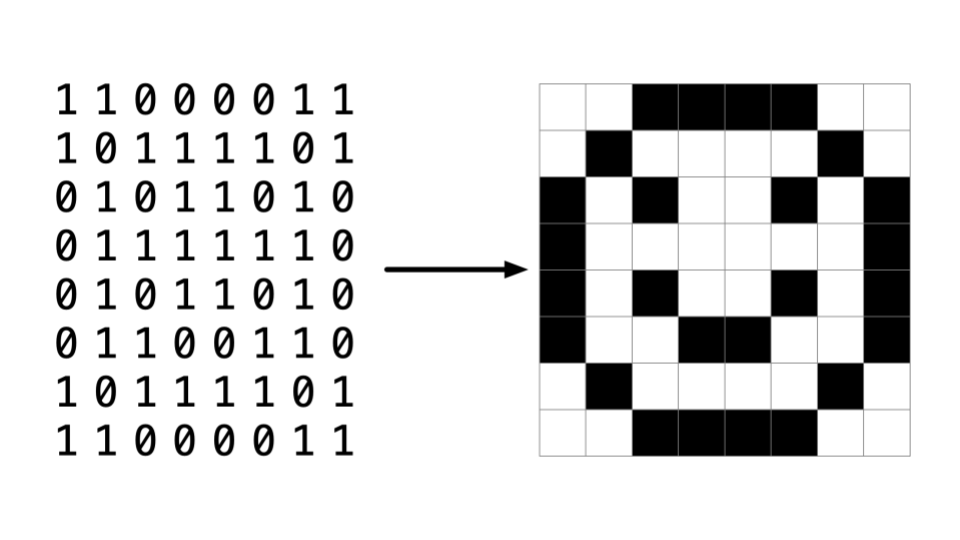
---
## 十六进制
* RGB（红、绿、蓝）是表示三种颜色通道亮度的数值，在Adobe Photoshop中可以看到如下设置面板：

  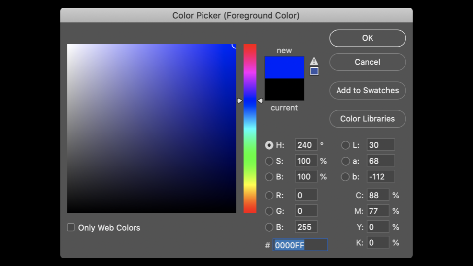
  可以看到调整红、绿、蓝的数值会改变选中的颜色。
* 从上图可以发现，颜色不仅可以用三个数值表示，窗口底部还有一个由数字和字母组成的特殊值，比如`255`在这里表示为`FF`，这是为什么呢？
* 十六进制是一种基数为16的计数系统，计数符号如下：
  ```
  0 1 2 3 4 5 6 7 8 9 A B C D E F
  ```
  其中`F`代表十进制的`15`。
* 十六进制也称为`base-16`（基数为16），计数时每一位的权值是16的幂次。
* 十进制`0`的十六进制表示为`00`，`1`为`01`，`9`为`09`，`10`为`0A`，`15`为`0F`，`16`为`10`。
* 十进制`255`的十六进制表示为`FF`，因为`16×15（即F）=240`，再加上15就是255，这是两位十六进制数能表示的最大值。
* 十六进制的优势在于可以用更少的位数表示信息，让数据展示更简洁。
---
## 内存
* 前几周你可能见过我们绘制的连续内存块示意图，给每个内存块标注十六进制编号后，可视化效果如下：

  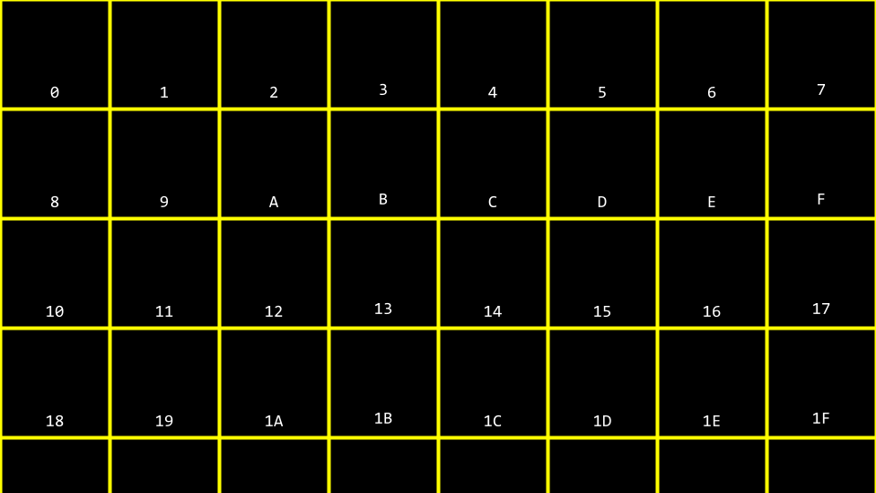
* 你可能会混淆图中的`10`是代表内存地址还是数值10，因此按照惯例，十六进制数通常会加`0x`前缀，如下所示：

  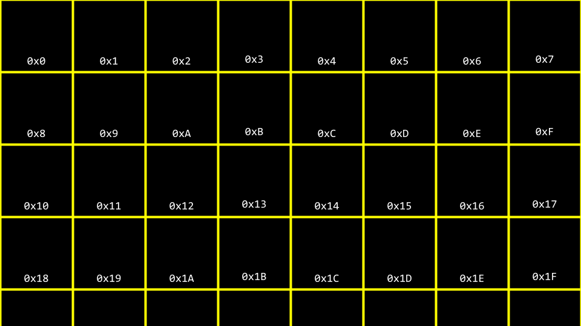
* 在终端窗口输入`code addresses.c`，编写如下代码：
  ```c
  // 打印一个整数
  #include <stdio.h>
  int main(void)
  {
      int n = 50;
      printf("%i\n", n);
  }
  ```
  这段代码中，`n`以值`50`存储在内存中，存储逻辑可视化如下：

  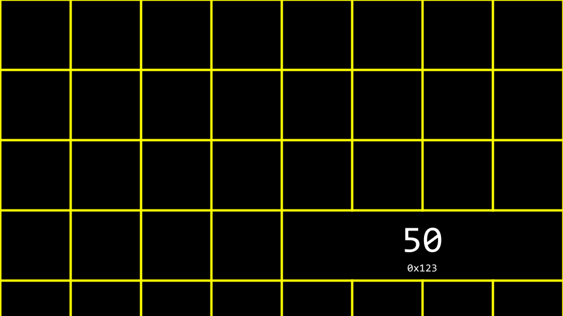
---
## 指针
* C语言有两个和内存相关的强大运算符：
  ```
  & 取地址运算符，返回存储在内存中的某个数据的地址。
  * 解引用运算符，指示编译器访问指针指向的内存地址中的数据。
  ```
* 我们可以修改代码来理解这两个运算符的作用：
  ```c
  // 打印整数的内存地址
  #include <stdio.h>
  int main(void)
  {
      int n = 50;
      printf("%p\n", &n);
  }
  ```
  这里的`%p`是用于打印内存地址的格式占位符，`&n`可以直译为“`n`的地址”。运行这段代码会返回一个以`0x`开头的内存地址。[代码下载地址](https://cdn.cs50.net/2025/fall/lectures/4/src4/addresses0.c?download)
* **指针**是存储某个数据内存地址的变量，最简洁的定义是：指针就是计算机内存中的一个地址。
* 参考以下代码：
  ```c
  int n = 50;
  int *p = &n;
  ```
  这里的`p`是一个指针，存储了整数`n`的内存地址。我们可以修改代码验证这一点：
  ```c
  // 存储并打印整数的内存地址
  #include <stdio.h>
  int main(void)
  {
      int n = 50;
      int *p = &n;
      printf("%p\n", p);
  }
  ```
  这段代码的运行效果和上一段完全相同，只是利用了`&`和`*`运算符的特性。[代码下载地址](https://cdn.cs50.net/2025/fall/lectures/4/src4/addresses1.c?download)
* 指针本身也需要占用内存空间（64位系统下通常为8字节），其存储逻辑可视化如下：

  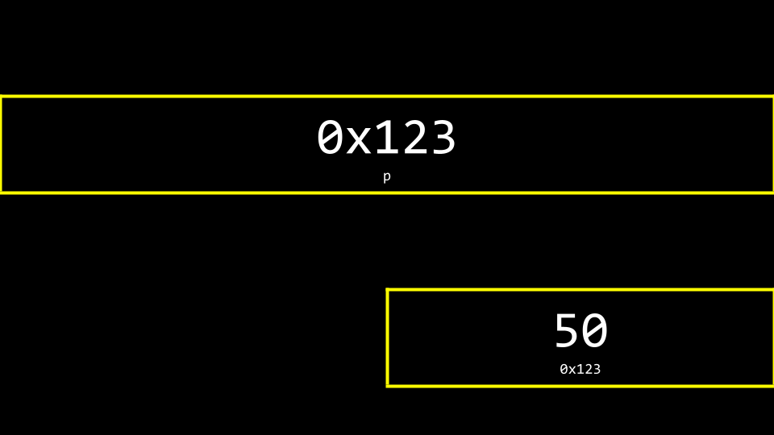
* 更形象的指针可视化效果是：一个地址作为箭头指向另一个地址，如下所示：

  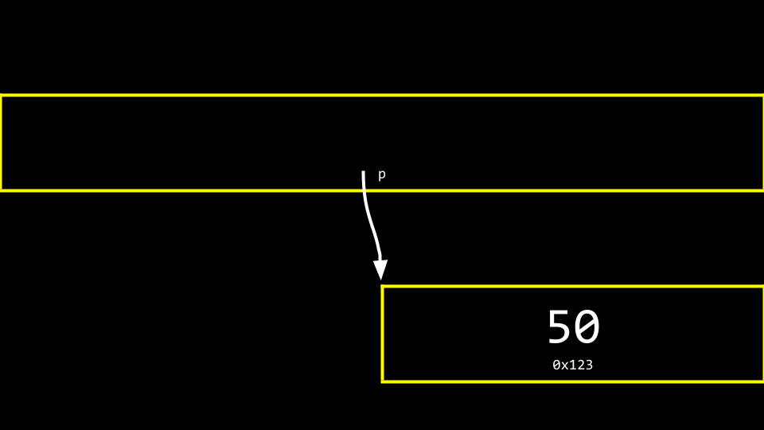
---
## 字符串
* 现在我们理解了指针的概念，就可以揭开课程前期对字符串的简化封装的真面目了。
* 参考以下代码：
  ```c
  // 打印一个字符串
  #include <cs50.h>
  #include <stdio.h>
  int main(void)
  {
      string s = "HI!";
      printf("%s\n", s);
  }
  ```
  这段代码会打印字符串`s`。[代码下载地址](https://cdn.cs50.net/2025/fall/lectures/4/src4/addresses4.c?download)
* 回忆一下，字符串本质是字符数组，例如`string s = "HI!"`的内存存储结构如下：

  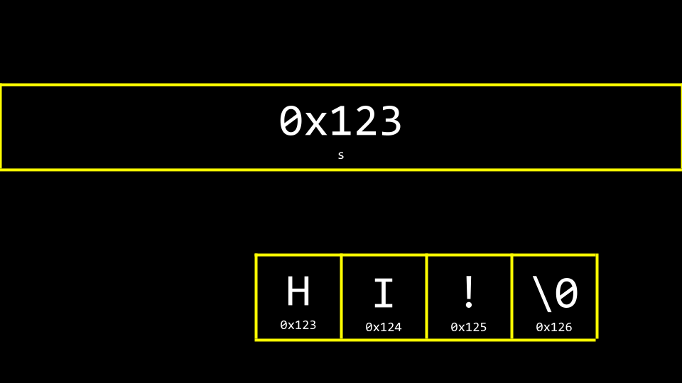
* 但`s`本身也需要存储，它和字符串的关系如下：

  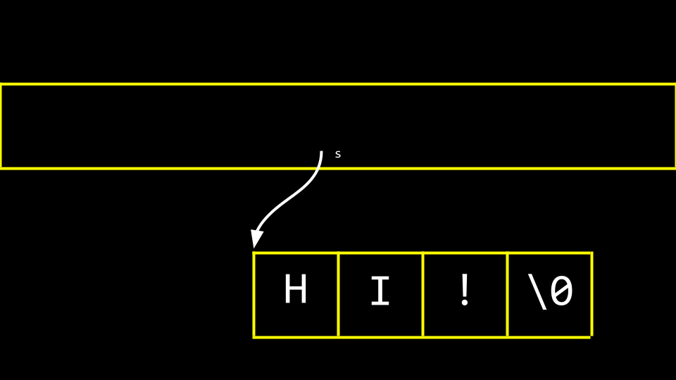
  名为`s`的指针存储了字符串第一个字节在内存中的起始地址，编译器通过这个地址找到整个字符串。
* 修改代码可以验证字符串的内存连续性：
  ```c
  // 打印字符串的首地址以及每个字符的地址
  #include <cs50.h>
  #include <stdio.h>
  int main(void)
  {
      string s = "HI!";
      printf("%p\n", s);
      printf("%p\n", &s[0]);
      printf("%p\n", &s[1]);
      printf("%p\n", &s[2]);
      printf("%p\n", &s[3]);
  }
  ```
  运行后可以发现，元素`0`、`1`、`2`、`3`（最后一位是空终止符`\0`）在内存中是连续排列的。[代码下载地址](https://cdn.cs50.net/2025/fall/lectures/4/src4/addresses5.c?download)
* 现在我们去掉CS50的辅助轮，直接用原生C语言声明字符串：
  ```c
  // 不使用CS50库声明字符串
  #include <stdio.h>
  int main(void)
  {
      char *s = "HI!";
      printf("%s\n", s);
  }
  ```
  字符串在原生C语言中就是`char *`类型，这段代码没有依赖任何CS50的封装。[代码下载地址](https://cdn.cs50.net/2025/fall/lectures/4/src4/addresses7.c?download)
* 实际上CS50库的`string`类型只是一个封装：`typedef char *string`，通过类型定义简化了字符串的声明逻辑。
---
## 指针运算
* 指针运算是指对内存地址进行算术运算的能力。
* 我们可以通过两种方式访问字符串中的字符：
  ```c
  // 方式1：通过数组下标访问
  #include <stdio.h>
  int main(void)
  {
      char *s = "HI!";
      printf("%c\n", s[0]);
      printf("%c\n", s[1]);
      printf("%c\n", s[2]);
  }
  ```
  [代码下载地址](https://cdn.cs50.net/2025/fall/lectures/4/src4/addresses8.c?download)
  ```c
  // 方式2：通过指针运算访问
  #include <stdio.h>
  int main(void)
  {
      char *s = "HI!";
      printf("%c\n", *s);
      printf("%c\n", *(s + 1));
      printf("%c\n", *(s + 2));
  }
  ```
  这里的`s + 1`会自动偏移`1`个`char`类型的长度（即1字节），指向第二个字符的地址。[代码下载地址](https://cdn.cs50.net/2025/fall/lectures/4/src4/addresses9.c?download)
* 利用指针运算还可以直接获取子字符串：
  ```c
  // 通过指针运算打印子字符串
  #include <stdio.h>
  int main(void)
  {
      char *s = "HI!";
      printf("%s\n", s);    // 输出HI!
      printf("%s\n", s + 1); // 输出I!
      printf("%s\n", s + 2); // 输出!
  }
  ```
  [代码下载地址](https://cdn.cs50.net/2025/fall/lectures/4/src4/addresses10.c?download)
---
## 字符串比较
* 字符串本质是字符数组，由其第一个字节的地址唯一标识。
* 整数可以直接用`==`比较，但字符串不行：尝试用`==`比较字符串，实际比较的是两个字符串的首地址，而非字符串存储的字符内容。
* 参考以下错误示例：
  ```c
  // 错误：比较两个字符串的地址而非内容
  #include <cs50.h>
  #include <stdio.h>
  int main(void)
  {
      char *s = get_string("s: ");
      char *t = get_string("t: ");
      if (s == t)
      {
          printf("相同\n");
      }
      else
      {
          printf("不同\n");
      }
  }
  ```
  即使两次输入都是`HI!`，输出仍然是`不同`，因为两个字符串存储在不同的内存地址中，如下所示：

  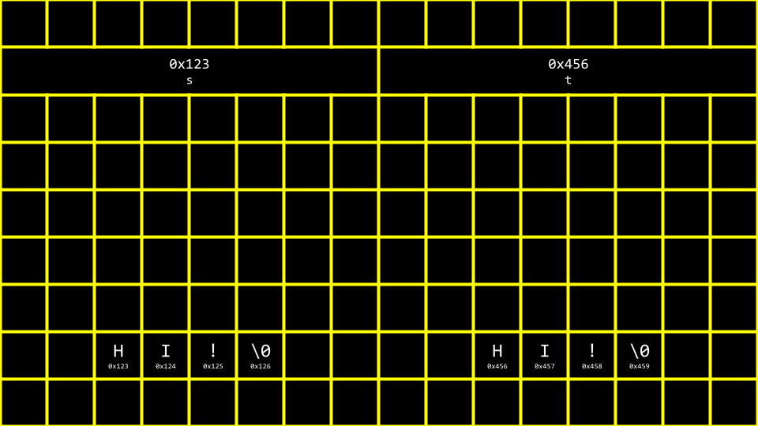
  [代码下载地址](https://cdn.cs50.net/2025/fall/lectures/4/src4/compare1.c?download)
* 正确的字符串比较需要使用`string.h`库提供的`strcmp`函数：
  ```c
  // 正确：使用strcmp比较两个字符串
  #include <cs50.h>
  #include <stdio.h>
  #include <string.h>
  int main(void)
  {
      char *s = get_string("s: ");
      char *t = get_string("t: ");
      if (strcmp(s, t) == 0) // 两字符串完全相同时strcmp返回0
      {
          printf("相同\n");
      }
      else
      {
          printf("不同\n");
      }
  }
  ```
  [代码下载地址](https://cdn.cs50.net/2025/fall/lectures/4/src4/compare2.c?download)
---
## 字符串复制与malloc
* 编程中一个非常常见的需求是将一个字符串复制到另一个独立的内存位置。
* 直接复制指针无法实现真正的字符串复制：
  ```c
  // 错误示例：仅复制指针地址，未复制字符串内容
  #include <cs50.h>
  #include <ctype.h>
  #include <stdio.h>
  #include <string.h>
  int main(void)
  {
      string s = get_string("s: ");
      string t = s; // 仅复制地址，s和t指向同一块内存
      t[0] = toupper(t[0]);
      printf("s: %s\n", s); // 输出HI!变为HI!
      printf("t: %s\n", t); // 输出HI!
  }
  ```
  两个指针指向同一块内存时，修改任意一个都会影响另一个，内存逻辑如下：

  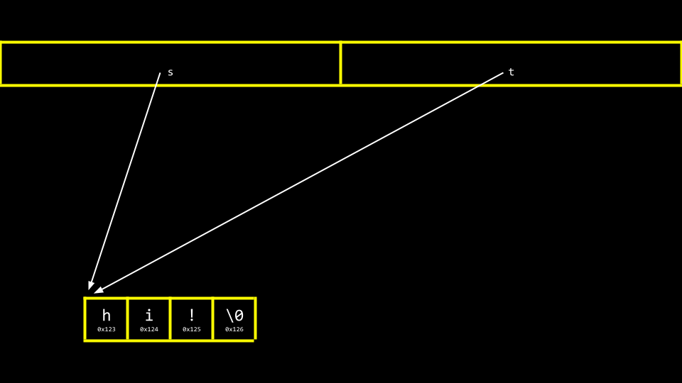
  [代码下载地址](https://cdn.cs50.net/2025/fall/lectures/4/src4/copy0.c?download)
* 要实现真正的字符串复制，需要用到两个新工具：
  1. `malloc`：`<stdlib.h>`库提供的动态内存分配函数，可在堆区分配指定大小的连续内存，返回内存首地址，分配失败时返回`NULL`。
  2. `free`：`<stdlib.h>`库提供的内存释放函数，用于释放之前通过`malloc`分配的堆内存，避免内存泄漏。
* 正确的字符串复制实现如下：
  ```c
  // 正确：实现独立的字符串复制
  #include <cs50.h>
  #include <ctype.h>
  #include <stdio.h>
  #include <stdlib.h>
  #include <string.h>
  int main(void)
  {
      char *s = get_string("s: ");
      if (s == NULL) return 1; // 检查输入是否合法
      // 分配内存：长度为字符串长度+1，留出空终止符的位置
      char *t = malloc(strlen(s) + 1);
      if (t == NULL) return 1; // 检查内存分配是否成功
      // 逐位复制字符串（包括空终止符）
      for (int i = 0, n = strlen(s); i <= n; i++)
      {
          t[i] = s[i];
      }
      t[0] = toupper(t[0]);
      printf("s: %s\n", s); // 原字符串不变
      printf("t: %s\n", t); // 副本首字母大写
      free(t); // 释放分配的内存
      return 0;
  }
  ```
  也可以用`<string.h>`库提供的`strcpy`函数替代手动循环，实现相同效果。[代码下载地址](https://cdn.cs50.net/2025/fall/lectures/4/src4/copy3.c?download)
---
## Valgrind内存检测工具

* Valgrind是开源的C/C++内存调试工具，可检测程序的内存泄漏、野指针、数组越界、释放后使用等内存相关错误。
* 参考以下存在内存问题的`memory.c`代码：
  ```c
  // 用于演示valgrind检测内存错误的示例
  #include <stdio.h>
  #include <stdlib.h>
  int main(void)
  {
      int *x = malloc(3 * sizeof(int));
      x[1] = 72;
      x[2] = 73;
      x[3] = 33;
  }
  ```
  这段代码运行时不会直接抛出可见错误，但存在两个严重问题：一是`malloc`仅分配了3个int类型的内存空间，数组下标最大为`x[2]`，访问`x[3]`属于非法越界；二是动态分配的内存未通过`free`释放，会造成内存泄漏。[代码下载地址](https://cdn.cs50.net/2025/fall/lectures/4/src4/memory.c?download)
* 输入`make memory`编译后，执行`valgrind ./memory`，Valgrind会生成详细的检测报告，明确标注越界访问和内存泄漏的代码位置。
* 修复后的代码如下：
  ```c
  // 修复内存问题后的示例
  #include <stdio.h>
  #include <stdlib.h>
  int main(void)
  {
      int *x = malloc(3 * sizeof(int));
      x[0] = 72;
      x[1] = 73;
      x[2] = 33;
      free(x);
  }
  ```
  修复后再次用Valgrind检测，就不会报内存错误或泄漏了。
---
## 垃圾值
* 当你向系统申请一块内存时，操作系统不会自动将这块内存的内容清零，其中可能残留着之前其他程序使用过的无意义遗留数据，这类数据被称为**垃圾值（garbage value）**。
* 参考`garbage.c`的示例：
  ```c
  #include <stdio.h>
  #include <stdlib.h>
  int main(void)
  {
      int scores[1024];
      for (int i = 0; i < 1024; i++)
      {
          printf("%i\n", scores[i]);
      }
  }
  ```
  这段代码声明了长度为1024的int数组，但未做初始化，运行后打印的数值基本都是无意义的随机垃圾值。因此编程的最佳实践是：申请内存后如果需要立即使用，一定要先初始化，避免垃圾值导致逻辑错误。[代码下载地址](https://cdn.cs50.net/2025/fall/lectures/4/src4/garbage.c?download)
---
## Binky的指针趣味演示
* 课程中观看了斯坦福大学的[经典指针教学视频](https://www.youtube.com/watch?v=5VnDaHBi8dM)，通过动画形象地演示了指针的工作原理，帮助学习者理解抽象的指针概念。
---
## 变量交换
* 编程中非常常见的需求是交换两个变量的值。尽管逻辑上只需要一个临时变量即可完成，但在C语言中如果写法错误也会导致交换失败，参考以下错误示例`swap0.c`：
  ```c
  // 错误示例：无法完成整数交换
  #include <stdio.h>
  void swap(int a, int b);
  
  int main(void)
  {
      int x = 1;
      int y = 2;
  
      printf("交换前：x是%i，y是%i\n", x, y);
      swap(x, y);
      printf("交换后：x是%i，y是%i\n", x, y);
  }
  
  void swap(int a, int b)
  {
      int tmp = a;
      a = b;
      b = tmp;
  }
  ```
  运行后会发现x和y的值并没有发生交换，这是C语言的参数传递机制导致的。[代码下载地址](https://cdn.cs50.net/2025/fall/lectures/4/src4/swap0.c?download)
* C语言默认采用**值传递**：向函数传递参数时，实际是把变量的值复制一份传给函数的形参，形参和实参是存储在不同内存位置的独立变量。`x`和`y`的作用域仅局限于`main`函数的栈帧内，`swap`函数内部修改的只是`x`和`y`的副本，不会影响`main`中的原变量。
* 我们可以通过内存布局理解这一机制：

  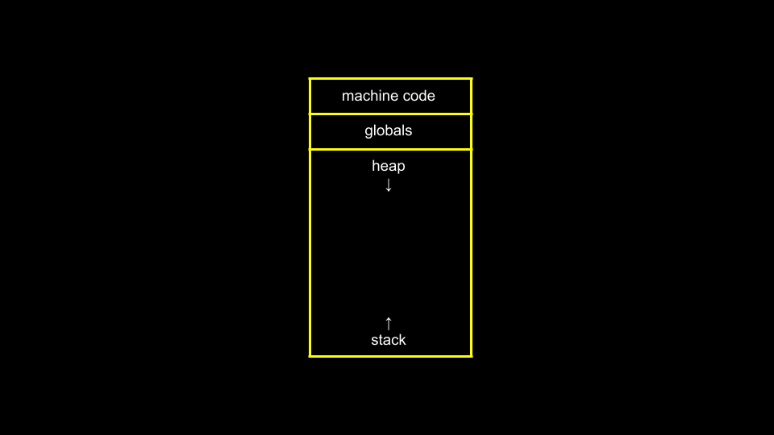
  全局变量存储在内存的全局区，函数调用时的参数、局部变量都存储在**栈（stack）**区，每个函数运行时会在栈上分配独立的内存块，称为**栈帧（stack frame）**。
* `main`和`swap`的栈帧是完全独立的，如下所示：

  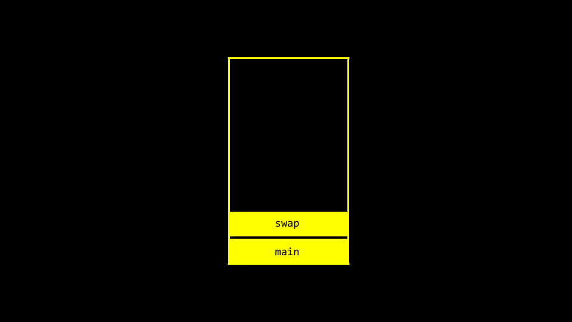
  因此直接传递值无法修改原函数的变量，我们需要通过**引用传递**（即传递变量的内存地址）实现交换，正确代码如下`swap1.c`：
  ```c
  // 正确示例：通过指针实现整数交换
  #include <stdio.h>
  void swap(int *a, int *b);
  
  int main(void)
  {
      int x = 1;
      int y = 2;
  
      printf("交换前：x是%i，y是%i\n", x, y);
      swap(&x, &y); // 传入x和y的内存地址
      printf("交换后：x是%i，y是%i\n", x, y);
  }
  
  void swap(int *a, int *b)
  {
      int tmp = *a; // 取出a指向的地址中存储的值
      *a = *b;      // 将b指向地址中的值写入a指向的地址
      *b = tmp;     // 将临时存储的值写入b指向的地址
  }
  ```
  这样`swap`函数直接操作`main`中x和y的内存地址，就能真正完成变量交换。[代码下载地址](https://cdn.cs50.net/2025/fall/lectures/4/src4/swap1.c?download)
  内存逻辑可视化如下：

  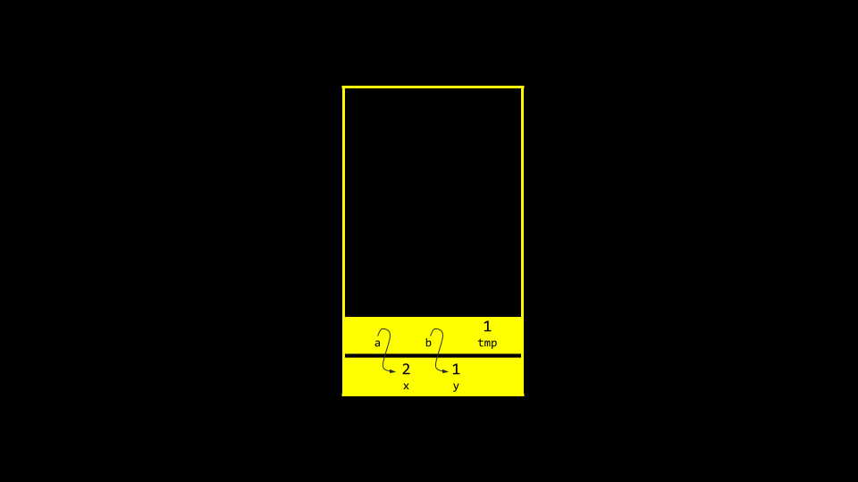
---
## 溢出
* **堆溢出（heap overflow）**：指操作动态分配的堆内存时发生越界访问，触碰了不属于当前程序合法权限的内存区域。
* **栈溢出（stack overflow）**：指函数调用层级过多、栈上局部变量过大或数组越界，超出了栈区的分配容量。
* 这两种情况都属于**缓冲区溢出（buffer overflow）**，是非常常见的安全漏洞，可能导致程序崩溃、数据被篡改甚至被恶意代码执行攻击。
---
## `scanf`函数
* CS50库中提供的`get_int`、`get_string`等便捷输入函数，本质是对C语言原生输入函数`scanf`的安全封装，`scanf`是标准库提供的通用格式化输入函数。
* 我们可以用`scanf`很容易地实现整数输入功能：
  ```c
  // 用scanf实现获取用户输入的整数
  #include <stdio.h>
  int main(void)
  {
      int n;
      printf("请输入n：");
      scanf("%i", &n); // 把输入的整数存入n对应的内存地址中
      printf("n的值是：%i\n", n);
  }
  ```
  [代码下载地址](https://cdn.cs50.net/2025/fall/lectures/4/src4/get1.c?download)
* 但用`scanf`直接获取字符串存在极高的安全风险，参考以下示例：
  ```c
  // 危险示例：用scanf获取字符串存在缓冲区溢出风险
  #include <stdio.h>
  int main(void)
  {
      char s[4]; // 只分配了4字节的内存空间
      printf("请输入s：");
      scanf("%s", s); // 数组名本身就是首地址，不需要加&运算符
      printf("s的值是：%s\n", s);
  }
  ```
  这段代码仅预先分配了4字节的内存，最多只能存储3个有效字符+1个空终止符，如果用户输入超过3个字符，就会发生缓冲区溢出，覆盖栈上其他内存区域的数据，轻则导致程序崩溃，重则被恶意利用执行任意代码。[代码下载地址](https://cdn.cs50.net/2025/fall/lectures/4/src4/get3.c?download)
* 即使改用`malloc`动态分配内存，也无法从根本上解决问题：因为你无法预知用户会输入多长的字符串，预先分配的内存永远存在不足的可能。这也是CS50封装`get_string`函数的核心原因，它会自动处理动态内存分配和边界检查，避免缓冲区溢出风险。
---
## 文件输入输出（File I/O）
* C语言内置了完善的文件读写、修改操作接口，我们先通过一个简单的通讯录示例了解基础的文件操作：
  ```c
  // 将姓名和电话号码保存到CSV文件中
  #include <cs50.h>
  #include <stdio.h>
  #include <string.h>
  int main(void)
  {
      // 打开CSV文件，"a"表示以追加模式打开，写入的内容会追加到文件末尾
      FILE *file = fopen("phonebook.csv", "a");
      // 获取用户输入的姓名和电话
      char *name = get_string("姓名：");
      char *number = get_string("电话：");
      // 将格式化内容写入文件
      fprintf(file, "%s,%s\n", name, number);
      // 关闭文件，释放系统资源
      fclose(file);
  }
  ```
  这里的`FILE`是标准库定义的文件抽象类型，`fopen`返回指向文件实例的指针，`fprintf`是向文件写入格式化内容的函数。[代码下载地址](https://cdn.cs50.net/2025/fall/lectures/4/src4/phonebook0.c?download)
* 运行程序前你可以预先创建`phonebook.csv`文件，或直接运行程序自动生成，输入姓名和电话后，数据会永久保存在CSV文件中。
* 最佳实践是打开文件后立即检查是否成功，避免空指针错误：
  ```c
  // 优化版：增加文件打开失败的错误判断
  #include <cs50.h>
  #include <stdio.h>
  #include <string.h>
  int main(void)
  {
      FILE *file = fopen("phonebook.csv", "a");
      if (file == NULL) // 文件打开失败（比如权限不足、路径不存在）时返回错误码
      {
          return 1;
      }
      char *name = get_string("姓名：");
      char *number = get_string("电话：");
      fprintf(file, "%s,%s\n", name, number);
      fclose(file);
      return 0;
  }
  ```
  [代码下载地址](https://cdn.cs50.net/2025/fall/lectures/4/src4/phonebook1.c?download)
* 我们还可以实现一个简易的文件复制程序，功能类似系统的`cp`命令：
  ```c
  // 实现任意文件的逐字节复制功能
  #include <stdio.h>
  typedef unsigned char BYTE; // 自定义BYTE类型，对应1字节的无符号字符，方便逐字节操作
  
  int main(int argc, char *argv[])
  {
      // 以二进制只读模式打开源文件，二进制写模式打开目标文件
      FILE *src = fopen(argv[1], "rb");
      FILE *dst = fopen(argv[2], "wb");
  
      BYTE b;
      // 逐字节读取源文件，写入目标文件，直到读取完成（fread返回0表示到达文件末尾）
      while (fread(&b, sizeof(b), 1, src) != 0)
      {
          fwrite(&b, sizeof(b), 1, dst);
      }
  
      fclose(dst);
      fclose(src);
      return 0;
  }
  ```
  运行时传入源文件路径和目标文件路径即可完成任意类型文件的逐字节复制。[代码下载地址](https://cdn.cs50.net/2025/fall/lectures/4/src4/cp.c?download)
* BMP图像文件本质也是按特定格式存储的二进制数据，本周的作业就会要求大家操作BMP文件，实现滤镜、图像旋转等修改功能。
---
## 总结
本节课我们学习了指针的核心概念，以及如何通过指针访问、操作特定内存位置的数据，具体涵盖的知识点包括：
* 像素艺术的底层存储逻辑
* 十六进制计数系统
* 计算机内存的分层存储结构
* 指针的定义、运算符与基本使用
* 字符串的底层实现（char指针+空终止符）
* 指针运算的规则与应用
* 字符串比较的正确方式与底层原理
* 字符串复制与动态内存分配（malloc/free）
* Valgrind内存检测工具的使用场景与方法
* 垃圾值的成因与规避方式
* 变量交换的实现与值传递、引用传递的区别
* 缓冲区溢出的类型与安全风险
* `scanf`函数的用法与安全隐患
* 文件输入输出的基础操作
下次课再见！
---
本文转自 [https://cs50.harvard.edu/x/notes/4/](https://cs50.harvard.edu/x/notes/4/)，如有侵权，请联系删除。

| 英文原文                  | 标准译法         | 概念说明                                                     |
| ------------------------- | ---------------- | ------------------------------------------------------------ |
| Hexadecimal               | 十六进制         | 基数为16的计数系统，使用0-9和A-F表示0-15，每个十六进制位对应4个二进制位，常用于内存地址、颜色值的表示。 |
| Pointer                   | 指针             | 存储内存地址的变量，64位系统下占8字节，是C语言直接操作内存的核心工具。 |
| & (Address-of Operator)   | 取地址运算符     | 用于获取变量在内存中的起始地址。                             |
| * (Dereference Operator)  | 解引用运算符     | 用于访问指针指向的内存地址中存储的数据。                     |
| NULL                      | 空指针           | 特殊的指针值，表示指针不指向任何有效的内存地址，常用于错误判断。 |
| Dynamic Memory Allocation | 动态内存分配     | 在程序运行时按需分配堆内存的机制，C语言中通过malloc、calloc等函数实现。 |
| malloc                    | 动态内存分配函数 | stdlib.h提供的内存分配函数，接收分配字节数作为参数，返回分配内存的首地址，失败返回NULL。 |
| free                      | 内存释放函数     | stdlib.h提供的内存释放函数，用于释放之前通过动态分配得到的堆内存，避免内存泄漏。 |
| Memory Leak               | 内存泄漏         | 程序动态分配的内存未被释放，且无法再被访问，导致系统内存被持续占用的问题。 |
| Valgrind                  | Valgrind         | 开源的C/C++内存调试工具，可检测内存泄漏、越界访问、野指针等内存相关错误，是C语言开发的常用工具。 |
| Garbage Value             | 垃圾值           | 未初始化的内存中残留的无意义历史数据，可能导致程序逻辑错误。 |
| Stack                     | 栈               | 内存的一个区域，用于存储函数的栈帧、局部变量、函数参数，由系统自动分配和释放，内存连续，访问速度快。 |
| Heap                      | 堆               | 内存的一个区域，用于动态内存分配，由程序员手动管理分配和释放，内存不连续，容量更大但访问速度稍慢。 |
| Stack Frame               | 栈帧             | 每个函数运行时在栈上分配的独立内存块，存储函数的局部变量、参数、返回地址，函数执行结束后自动释放。 |
| Pass by Value             | 值传递           | C语言默认的参数传递方式，传递的是变量值的副本，修改形参不会影响原变量。 |
| Pass by Reference         | 引用传递         | 通过传递变量的内存地址实现参数传递，修改形参指向的内存会直接影响原变量，C语言中通过指针实现。 |
| Buffer Overflow           | 缓冲区溢出       | 向缓冲区写入的数据超过其容量，导致数据溢出到相邻内存区域的问题，是常见的安全漏洞。 |
| scanf                     | scanf函数        | C标准库提供的格式化输入函数，用于从标准输入获取用户输入，直接使用存在缓冲区溢出风险。 |
| FILE                      | 文件类型         | C标准库定义的文件抽象类型，用于表示打开的文件实例，所有文件操作都通过FILE指针完成。 |
---