# 第5讲

## 目录
- [欢迎](#welcome)
- [《杰克了解真相》](#jack-learns-the-facts)
- [数据结构](#data-structures)
- [队列](#queues)
- [栈](#stacks)
- [数组](#arrays)
- [链表](#linked-lists)
- [树](#trees)
- [哈希与哈希表](#hashing-and-hash-tables)
- [前缀树](#tries)
- [总结](#summing-up)

---

### 欢迎
前几周的课程已经介绍了编程的基础构建模块，你在C语言中学到的所有知识，都可以用来在Python等更高层级的编程语言中实现这些模块。
每周的课程概念难度都在逐步提升，就像爬坡的坡度越来越陡，而本周我们将学习数据结构，难度会趋于平缓。
到目前为止，你已经学习了数组（array）如何在内存中组织数据。今天我们将探讨内存中数据组织的更多方式，以及随着知识积累可以实现的各种设计可能性。

---

### 《杰克了解真相》
我们观看了伊隆大学Shannon Duvall教授制作的视频[《杰克了解真相》](https://www.youtube.com/watch?v=ItAG3s6KIEI)（Jack Learns the Facts）。

---

### 数据结构
数据结构（data structure）本质上是内存中数据的组织形式，内存中数据的组织方式有很多种。
抽象数据类型（abstract data type）是我们可以从概念层面定义的一类模型。学习计算机科学时，从这些概念层面的数据结构入手通常更高效，掌握这些内容后，再理解更具体的数据结构的实现方式就会容易很多。

---

### 队列
队列（queue）是一种抽象数据结构，具有特定的属性：它遵循**先进先出（FIFO, First In First Out）**的原则。你可以想象在游乐园排队等待游乐设施的场景：排在队伍最前面的人最先游玩，排在最后的人最后游玩。
队列有两种核心操作：
- 入队（enqueue）：将元素加入队列末尾
- 出队（dequeue）：将队列最前面的元素移除

你可以通过如下代码实现队列：
```c
const int CAPACITY = 50;
typedef struct
{
    person people[CAPACITY];
    int size;
}
queue;
```
注意上述代码中定义了一个`person`类型的数组`people`，`CAPACITY`是队列的最大容量，整数`size`表示队列当前实际存储的元素数量，与队列的最大容量无关。

---

### 栈
与队列相对的是栈（stack），它的核心属性与队列完全不同，遵循**后进先出（LIFO, Last In First Out）**的原则。就像食堂里堆叠的托盘：最后放上去的托盘，会被最先取走。
栈有两种核心操作：
- 压栈（push）：将元素放到栈顶
- 弹栈（pop）：将栈顶的元素移除

你可以通过如下代码实现栈：
```c
const int CAPACITY = 50;
typedef struct
{
    person people[CAPACITY];
    int size;
}
stack;
```
注意这里的代码和队列的实现代码完全一致：定义了`person`类型的数组`people`，`CAPACITY`是栈的最大容量，整数`size`表示栈当前实际存储的元素数量，与栈的最大容量无关。

你可能已经发现了上述实现的局限性：数组的容量是预先定义的，可能会造成空间浪费——比如栈的最大容量设为5000，但实际只用到了1个位置。
因此我们需要栈可以动态扩容：随着元素的加入自动调整占用的内存大小。

---

### 数组
回到第2周的内容，我们学习的第一种数据结构就是数组。数组是一段**连续的内存空间**，你可以将数组想象为如下形式：
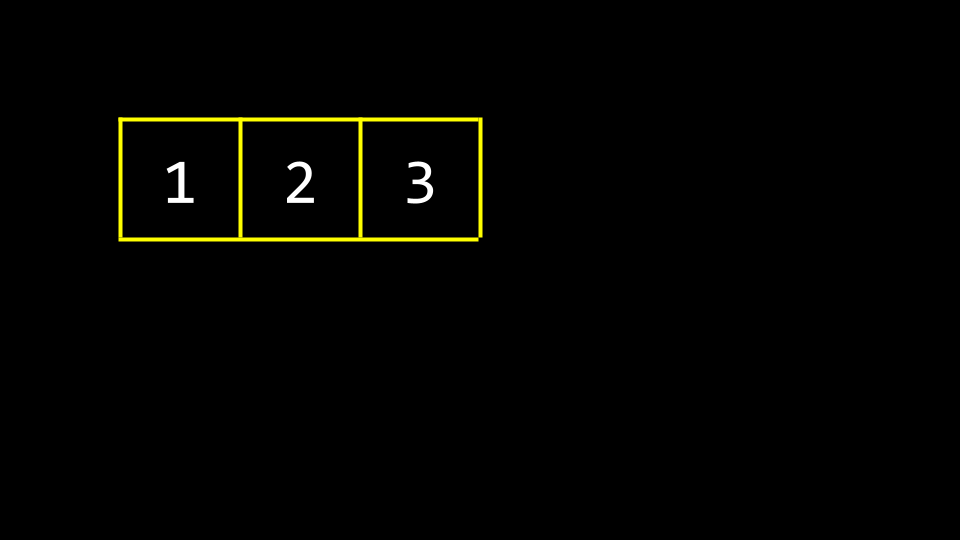

在终端中输入`code list.c`，编写如下代码：
```c
// 用固定大小的数组实现数字列表
#include <stdio.h>
int main(void)
{
    // 大小为3的列表
    int list[3];

    // 初始化列表元素
    list[0] = 1;
    list[1] = 2;
    list[2] = 3;

    // 打印列表
    for (int i = 0; i < 3; i++)
    {
        printf("%i\n", list[i]);
    }
}
```
这段代码和我们之前学习的内容非常相似：预先分配了可存储3个整数的内存。你可以在[这里](https://cdn.cs50.net/2025/fall/lectures/5/src5/list0.c?download)下载代码。

如果我们想把数字`4`加入列表，但这块连续内存的后面已经被其他程序、函数或变量占用了怎么办？这些位置很多是之前使用过的垃圾值，现在已经空闲可用。
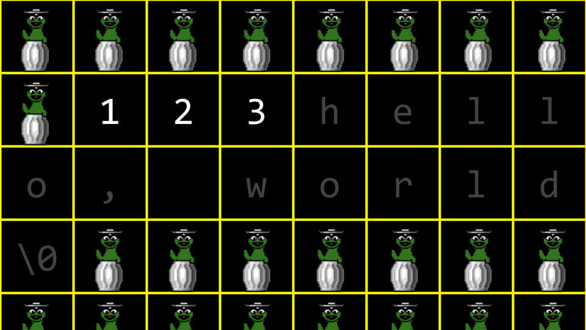

如果我们想给数组添加第四个元素`4`，就需要重新分配一块更大的内存，把旧数组的内容复制到新的内存区域。新分配的内存初始时会充满垃圾值。
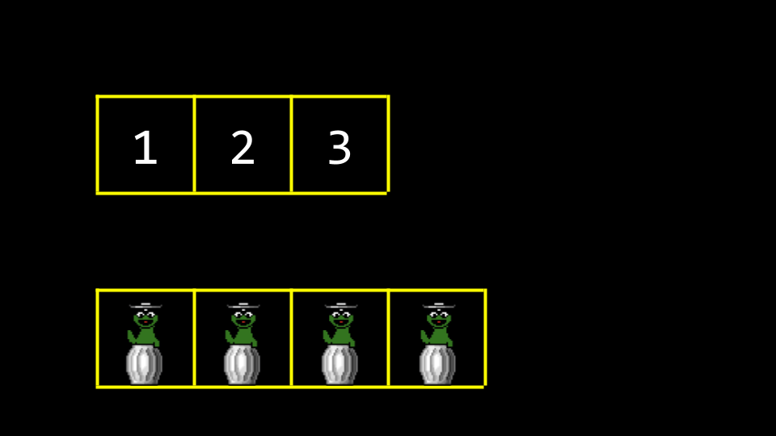

将旧数组的内容复制到新内存区域时，原有的垃圾值会被覆盖。


最终所有垃圾值都会被新数据覆盖。
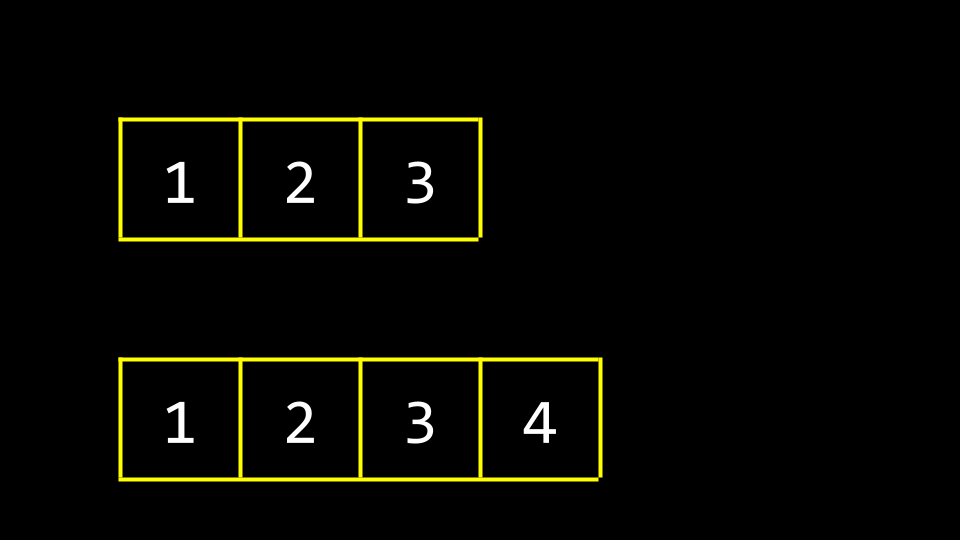

这种实现方式的一个缺点是设计效率低：每次添加新元素都需要逐个复制原数组的所有元素。
利用我们最近学到的指针知识，可以优化这个设计。修改代码如下：
```c
// 用动态大小的数组实现数字列表
#include <stdio.h>
#include <stdlib.h>
int main(void)
{
    // 大小为3的列表
    int *list = malloc(3 * sizeof(int));
    if (list == NULL)
    {
        return 1;
    }

    // 初始化大小为3的列表
    list[0] = 1;
    list[1] = 2;
    list[2] = 3;

    // 大小为4的列表
    int *tmp = malloc(4 * sizeof(int));
    if (tmp == NULL)
    {
        free(list);
        return 1;
    }

    // 将大小为3的列表内容复制到大小为4的列表
    for (int i = 0; i < 3; i++)
    {
        tmp[i] = list[i];
    }

    // 向大小为4的列表添加新元素
    tmp[3] = 4;

    // 释放大小为3的列表占用的内存
    free(list);

    // 让list指向大小为4的列表
    list = tmp;

    // 打印列表
    for (int i = 0; i < 4; i++)
    {
        printf("%i\n", list[i]);
    }

    // 释放列表占用的内存
    free(list);
    return 0;
}
```
注意这段代码首先创建了一个可存储3个整数的列表，为三个内存地址分别赋值1、2、3；之后创建了一个可存储4个整数的临时列表`tmp`，将原列表的内容复制到`tmp`中，并在末尾添加值4。由于`list`原指向的内存块不再使用，通过`free(list)`释放该内存，最后将`list`指针指向`tmp`指向的内存块。最后打印`list`的内容并释放内存。注意代码中引入了`stdlib.h`头文件。你可以在[这里](https://cdn.cs50.net/2025/fall/lectures/5/src5/list1.c?download)下载代码。

你可以把`list`和`tmp`想象成两个指向内存块的路标：一开始`list`指向大小为3的数组，最后`list`被重新指向大小为4的内存块，此时`tmp`和`list`指向同一块内存。
我们可以用`realloc`函数代替手动循环复制数组，代码如下：
```c
// 用realloc实现动态大小的数字列表
#include <stdio.h>
#include <stdlib.h>
int main(void)
{
    // 大小为3的列表
    int *list = malloc(3 * sizeof(int));
    if (list == NULL)
    {
        return 1;
    }

    // 初始化大小为3的列表
    list[0] = 1;
    list[1] = 2;
    list[2] = 3;

    // 将列表重分配为大小4
    int *tmp = realloc(list, 4 * sizeof(int));
    if (tmp == NULL)
    {
        free(list);
        return 1;
    }
    list = tmp;

    // 向列表添加新元素
    list[3] = 4;

    // 打印列表
    for (int i = 0; i < 4; i++)
    {
        printf("%i\n", list[i]);
    }

    // 释放列表占用的内存
    free(list);
    return 0;
}
```
注意这里通过`realloc`直接将数组扩容为新的大小。你可以在[这里](https://cdn.cs50.net/2025/fall/lectures/5/src5/list2.c?download)下载代码。

有人可能会想直接预先分配远大于实际需要的内存，比如直接分配30个元素的空间而不是3或4个，但这是糟糕的设计：会不必要地占用系统资源，而且也无法保证后续不会需要超过30个元素的空间。

---

### 链表
最近几周我们学习了三个非常有用的基础概念：
1. 结构体（struct）：可以自定义的复合数据类型
2. 点表示法（dot notation）：通过`.`运算符访问结构体内部的变量
3. `*`运算符：用于声明指针或解引用变量

今天我们将学习箭头运算符（`->` operator）：它可以通过指针直接访问指向的结构体内部的成员。

链表（linked list）是C语言中最强大的数据结构之一，它可以存储分布在内存不同位置的元素，并且可以根据需要动态扩容或缩容。
你可以想象三个值分别存储在内存的不同位置：


我们如何把这些分散的元素拼接成一个列表？
可以给每个元素额外添加一块内存，用来存储下一个元素的地址（指针）：
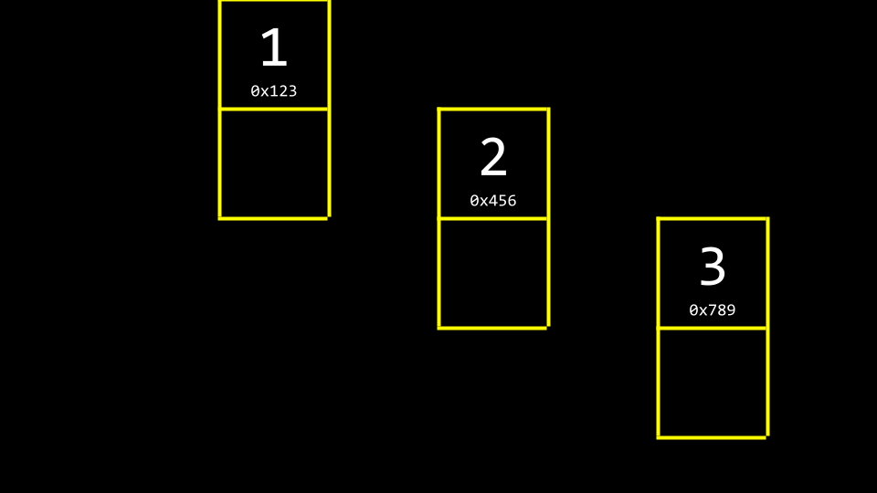

我们用额外的内存存储下一个元素的指针：

注意最后一个元素的指针为`NULL`，表示列表没有后续元素。

按照惯例，我们会额外用一个指针存储链表第一个元素的地址，称为链表的头结点（head）：
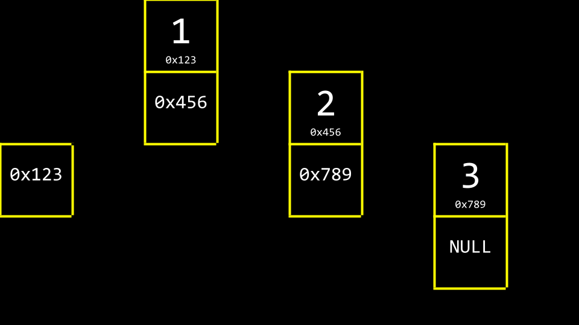

忽略具体的内存地址，链表的抽象结构如下：
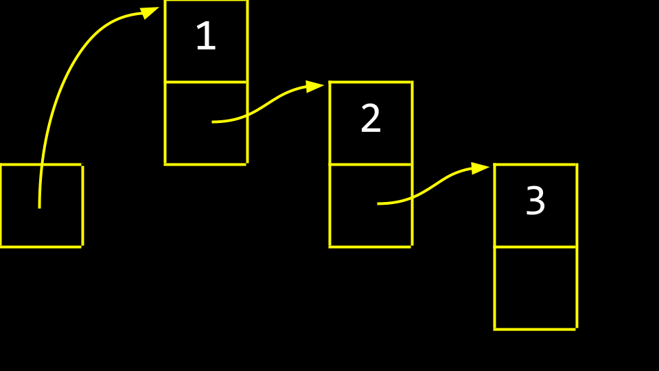

这些存储数据和指针的块称为节点（node），每个节点包含一个数据项和一个指向下一个节点的`next`指针。节点的代码定义如下：
```c
typedef struct node
{
    int number;
    struct node *next;
}
node;
```
注意这个节点的结构体中，`number`是存储的整数数据，`next`是指向另一个节点的指针，指向内存中其他位置的节点。

我们可以用链表重写之前的`list.c`：
```c
// 通过头插法构建链表
#include <cs50.h>
#include <stdio.h>
#include <stdlib.h>
typedef struct node
{
    int number;
    struct node *next;
} node;

int main(void)
{
    // 存储数字的链表，初始为空
    node *list = NULL;

    // 构建链表
    for (int i = 0; i < 3; i++)
    {
        // 为新数字分配节点内存
        node *n = malloc(sizeof(node));
        if (n == NULL)
        {
            return 1;
        }
        n->number = get_int("请输入数字: ");
        n->next = NULL;

        // 将节点插入链表头部
        n->next = list;
        list = n;
    }
    return 0;
}
```
首先我们定义了`node`结构体，每次添加元素时，用`malloc`分配一个节点大小的内存，将输入的整数存入节点的`number`字段，`next`字段初始化为`NULL`，然后将新节点插入链表的头部。你可以在[这里](https://cdn.cs50.net/2025/fall/lectures/5/src5/list3.c?download)下载代码。

我们可以从概念层面理解链表的构建过程：首先声明`node *list`，初始值为NULL（空指针）。
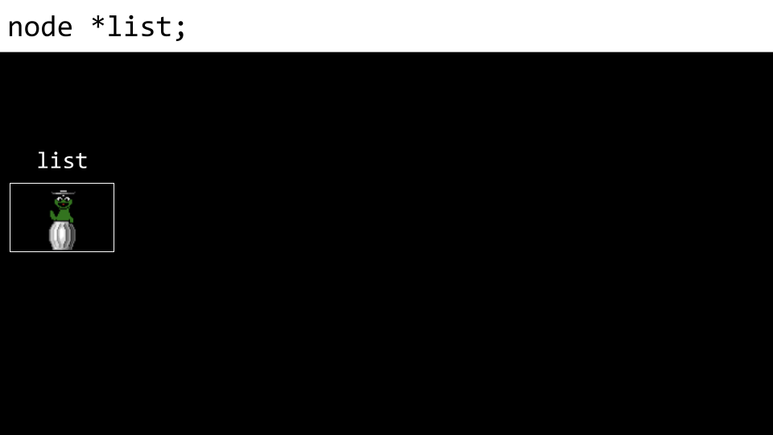

接下来分配一个新节点，用指针`n`指向它：


将节点的`number`字段赋值为`1`：
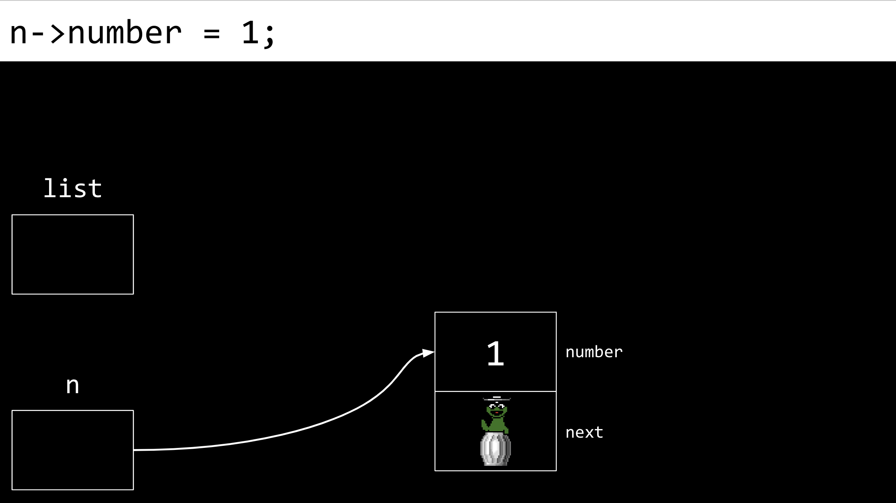

将节点的`next`字段赋值为`NULL`：


将`list`指向`n`指向的节点，此时`n`和`list`指向同一块内存：


再创建一个新节点，初始的`number`和`next`字段都是垃圾值：


将新节点的`number`字段赋值为`2`：


再将新节点的`next`字段赋值为`NULL`：


最重要的一步：我们不能丢失已经存在的链表的引用，因此先将新节点的`next`字段指向`list`指向的节点（也就是原链表的头节点）：


最后将`list`更新为指向新节点`n`，此时我们就有了一个包含两个元素的链表：
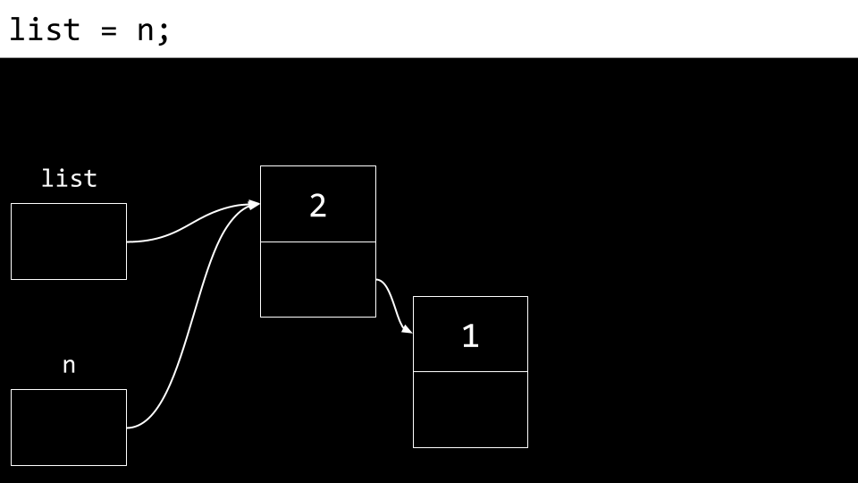

从上面的过程可以看到，最后添加的元素会出现在链表的最前面，如果我们从头节点开始打印链表，元素顺序会和输入顺序相反。
我们可以通过如下代码遍历打印链表：
```c
// 用while循环打印链表的节点
#include <cs50.h>
#include <stdio.h>
#include <stdlib.h>
typedef struct node
{
    int number;
    struct node *next;
} node;

int main(void)
{
    // 存储数字的链表，初始为空
    node *list = NULL;

    // 构建链表
    for (int i = 0; i < 3; i++)
    {
        // 为新数字分配节点内存
        node *n = malloc(sizeof(node));
        if (n == NULL)
        {
            return 1;
        }
        n->number = get_int("请输入数字: ");
        n->next = NULL;

        // 将节点插入链表头部
        n->next = list;
        list = n;
    }

    // 打印所有数字
    node *ptr = list;
    while (ptr != NULL)
    {
        printf("%i\n", ptr->number);
        ptr = ptr->next;
    }
    return 0;
}
```
注意这里的`node *ptr = list`创建了一个临时指针，指向和`list`相同的内存位置。`while`循环会打印`ptr`当前指向节点的数值，然后将`ptr`更新为指向链表的下一个节点。你可以在[这里](https://cdn.cs50.net/2025/fall/lectures/5/src5/list4.c?download)下载代码。

*   在这个示例中，向链表插入元素的时间复杂度为\(O(1)\)（常数时间），因为在链表头部插入只需要极少的固定步骤。
*   而查找链表中元素的时间复杂度为\(O(n)\)（线性时间），因为最坏情况下需要遍历整个链表才能找到目标元素。向链表添加新元素的时间复杂度取决于插入的位置，我们会在下面的示例中说明这一点。
*   链表的元素不存储在连续的内存块中，只要系统资源充足，链表可以无限扩容。但它的缺点是比数组占用更多内存：每个元素除了存储自身的值之外，还需要额外存储指向下一个节点的指针。此外，链表不能像数组一样通过下标随机访问，要找到第\(n\)个元素必须先遍历前\(n-1\)个元素，因此只能进行线性查找，无法使用二分查找。

*   你也可以将新元素插入链表的尾部，示例代码如下：
```c
// 向链表尾部追加元素
#include <cs50.h>
#include <stdio.h>
#include <stdlib.h>
typedef struct node
{
    int number;
    struct node *next;
} node;

int main(void)
{
    // 存储数字的链表，初始为空
    node *list = NULL;

    // 构建链表
    for (int i = 0; i < 3; i++)
    {
        // 为新数字分配节点内存
        node *n = malloc(sizeof(node));
        if (n == NULL)
        {
            return 1;
        }
        n->number = get_int("请输入数字: ");
        n->next = NULL;

        // 如果链表为空
        if (list == NULL)
        {
            // 新节点就是整个链表
            list = n;
        }

        // 如果链表已有元素
        else
        {
            // 遍历链表的所有节点
            for (node *ptr = list; ptr != NULL; ptr = ptr->next)
            {
                // 如果到达链表尾部
                if (ptr->next == NULL)
                {
                    // 追加新节点
                    ptr->next = n;
                    break;
                }
            }
        }
    }

    // 打印所有数字
    for (node *ptr = list; ptr != NULL; ptr = ptr->next)
    {
        printf("%i\n", ptr->number);
    }

    // 释放内存
    node *ptr = list;
    while (ptr != NULL)
    {
        node *next = ptr->next;
        free(ptr);
        ptr = next;
    }
    return 0;
}
```
注意这段代码会“遍历”整个链表找到尾部。向链表尾部追加元素的时间复杂度为\(O(n)\)，因为必须先遍历整个链表才能找到尾部位置。此外注意代码中使用了临时变量`next`来暂存`ptr->next`的地址。你可以在[这里](https://cdn.cs50.net/2025/fall/lectures/5/src5/list7.c?download)下载代码。

*   你也可以在插入元素时保持链表有序，示例代码如下：
```c
// 实现有序的数字链表
#include <cs50.h>
#include <stdio.h>
#include <stdlib.h>
typedef struct node
{
    int number;
    struct node *next;
} node;

int main(void)
{
    // 存储数字的链表，初始为空
    node *list = NULL;

    // 构建链表
    for (int i = 0; i < 3; i++)
    {
        // 为新数字分配节点内存
        node *n = malloc(sizeof(node));
        if (n == NULL)
        {
            return 1;
        }
        n->number = get_int("请输入数字: ");
        n->next = NULL;

        // 如果链表为空
        if (list == NULL)
        {
            list = n;
        }

        // 如果新数字应该放在链表头部
        else if (n->number < list->number)
        {
            n->next = list;
            list = n; 
        }

        // 如果新数字应该放在链表的其他位置
        else
        {
            // 遍历链表的所有节点
            for (node *ptr = list; ptr != NULL; ptr = ptr->next)
            {
                // 如果到达链表尾部
                if (ptr->next == NULL)
                {
                    // 追加新节点
                    ptr->next = n;
                    break;
                }

                // 如果应该插入中间位置
                if (n->number < ptr->next->number)
                {
                    n->next = ptr->next;
                    ptr->next = n;
                    break;
                }
            }
        }
    }

    // 打印所有数字
    for (node *ptr = list; ptr != NULL; ptr = ptr->next)
    {
        printf("%i\n", ptr->number);
    }

    // 释放内存
    node *ptr = list;
    while (ptr != NULL)
    {
        node *next = ptr->next;
        free(ptr);
        ptr = next;
    }
    return 0;
}
```
注意这段代码在构建链表的过程中始终保持有序。要按顺序插入元素，最坏情况下仍然需要遍历所有现有节点，因此单次插入的时间复杂度仍为\(O(n)\)。你可以在[这里](https://cdn.cs50.net/2025/fall/lectures/5/src5/list8.c?download)下载代码。

*   最后我们可以优化代码，封装一个专门释放链表内存的函数：
```c
// 统一释放内存，包含异常场景的处理
#include <cs50.h>
#include <stdio.h>
#include <stdlib.h>
typedef struct node
{
    int number;
    struct node *next;
} node;

void unload(node *list);

int main(void)
{
    // 存储数字的链表，初始为空
    node *list = NULL;

    // 构建链表
    for (int i = 0; i < 3; i++)
    {
        // 为新数字分配节点内存
        node *n = malloc(sizeof(node));
        if (n == NULL)
        {
            unload(list);
            return 1;
        }
        n->number = get_int("请输入数字: ");
        n->next = NULL;

        // 如果链表为空
        if (list == NULL)
        {
            list = n;
        }

        // 如果新数字应该放在链表头部
        else if (n->number < list->number)
        {
            n->next = list;
            list = n; 
        }

        // 如果新数字应该放在链表的其他位置
        else
        {
            // 遍历链表的所有节点
            for (node *ptr = list; ptr != NULL; ptr = ptr->next)
            {
                // 如果到达链表尾部
                if (ptr->next == NULL)
                {
                    // 追加新节点
                    ptr->next = n;
                    break;
                }

                // 如果应该插入中间位置
                if (n->number < ptr->next->number)
                {
                    n->next = ptr->next;
                    ptr->next = n;
                    break;
                }
            }
        }
    }

    // 打印所有数字
    for (node *ptr = list; ptr != NULL; ptr = ptr->next)
    {
        printf("%i\n", ptr->number);
    }

    // 释放内存
    unload(list);
    return 0;
}

void unload(node *list)
{
    node *ptr = list;
    while (ptr != NULL)
    {
        node *next = ptr->next;
        free(ptr);
        ptr = next;
    }
}
```
注意这里的`unload`函数会释放整个链表占用的所有内存。你可以在[这里](https://cdn.cs50.net/2025/fall/lectures/5/src5/list9.c?download)下载代码。

这段代码看起来可能比较复杂，但本质上我们只是利用指针和相关语法，将内存中不同位置的数据拼接在了一起。

---

### 树
数组的元素存储在连续内存中，可以快速访问，也支持二分查找。我们能不能结合数组和链表的优势？
二叉搜索树（binary search tree）就是这样一种数据结构，它可以更高效地存储数据，支持快速查找和检索。
你可以想象一组有序的数字：


我们把中间值作为树的根节点，比根节点小的值放在左子树，比根节点大的值放在右子树：


我们可以用指针连接这些节点，指向每个节点的内存地址：
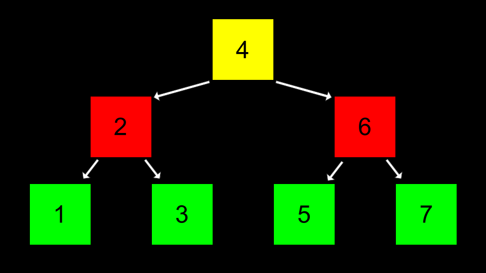

搜索二叉搜索树的代码实现如下：
```c
bool search(node *tree, int number)
{
    if (tree == NULL)
    {
        return false;
    }
    else if (number < tree->number)
    {
        return search(tree->left, number);
    }
    else if (number > tree->number)
    {
        return search(tree->right, number);
    }
    else if (number == tree->number)
    {
        return true;
    }
}
```
注意这个搜索函数通过递归的方式遍历树：如果目标值小于当前节点的值，就搜索左子树；如果大于当前节点的值，就搜索右子树。当树保持平衡时，这种递归搜索的时间复杂度为\(O(\log n)\)（对数时间）。

树具备数组没有的动态特性，可以根据需要自由扩容或缩容，同时在平衡状态下的查找时间复杂度为\(O(\log n)\)。

---

### 哈希与哈希表
算法时间复杂度的“圣杯”是\(O(1)\)，也就是常数时间：访问元素的耗时是固定的，和数据规模无关。
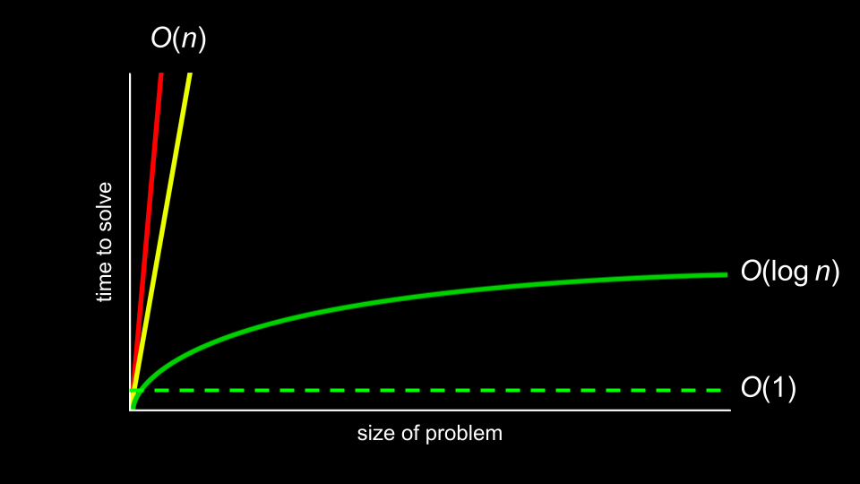

哈希（hashing）的核心思想是将输入值转换为一个固定的输出值，作为后续访问该值的快捷索引。例如，对`apple`（苹果）做哈希可能得到值`1`，对`berry`（浆果）做哈希可能得到值`2`，那么要查找`apple`时，只需要通过哈希算法计算出它的存储位置即可。虽然这种按首字母分桶的设计比较基础，但它体现了哈希的核心思想：通过哈希值快速定位数据的存储位置。

哈希函数（hash function）是一种将任意大小的输入转换为固定大小的小型可预测值的算法。通常它接收要存入哈希表的元素，返回一个整数，代表该元素应该存储在数组的哪个下标位置。

哈希表（hash table）是数组和链表的完美结合：代码实现中，哈希表本质是一个存储节点指针的数组。
你可以将哈希表想象为如下结构：

注意这是一个长度为26的数组，每个位置对应字母表的一个字母。

数组的每个位置都挂载一个链表，存储所有哈希值为该下标的元素：


哈希冲突（collision）指的是向哈希表添加元素时，该元素的哈希值对应的位置已经存储了其他元素。在上面的示例中，冲突的元素会直接追加到对应链表的尾部。
我们可以通过优化哈希表和哈希算法来减少冲突，比如下面这种按多字符分桶的优化方式：
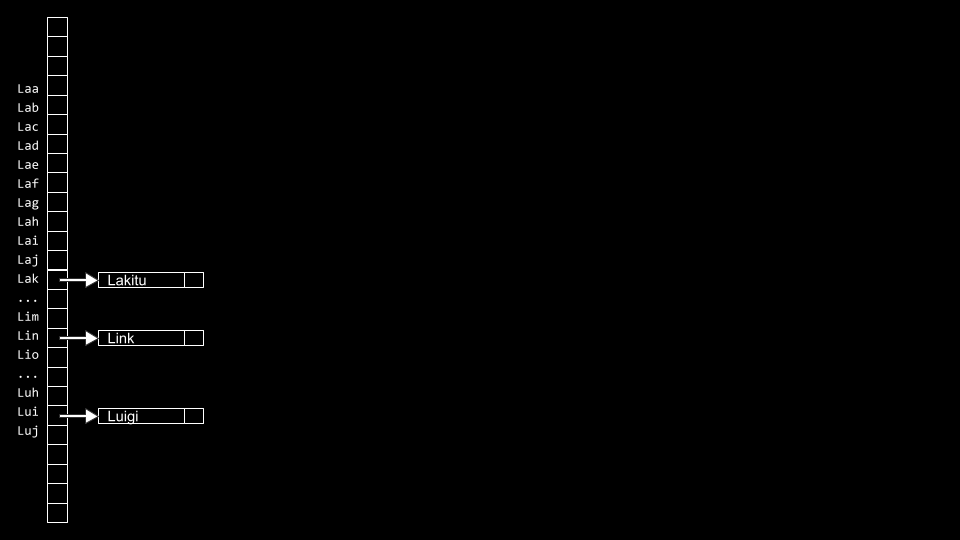

下面是一个简单的哈希算法示例：
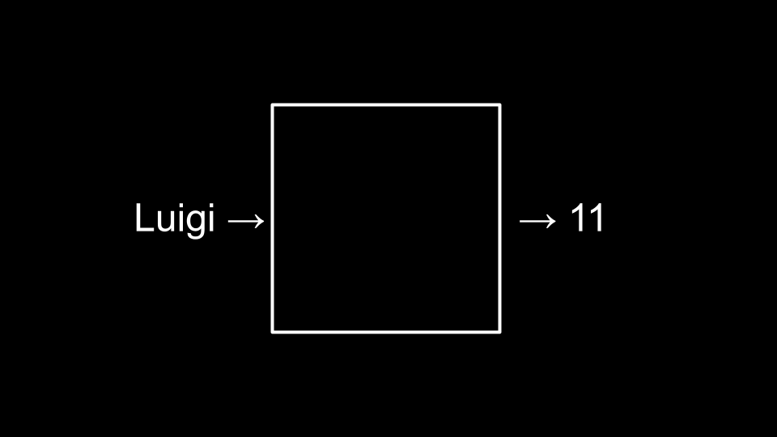

代码实现如下：
```c
#include <ctype.h>
unsigned int hash(const char *word)
{
    return toupper(word[0]) - 'A';
}
```
注意这个哈希函数返回的是单词首字母大写后减去'A'的ASCII值，得到0-25的下标。

作为开发者，你需要权衡内存和查找效率：用更大的哈希表可以减少冲突、降低查找时间，但会占用更多内存；反之更小的哈希表占用内存更少，但冲突概率更高，查找时间更长。
哈希表的最坏查找时间复杂度为\(O(n)\)，但在哈希函数设计合理、冲突较少的情况下，平均查找时间接近\(O(1)\)。

---

### 前缀树
前缀树（trie，又称字典树）是另一种数据结构，它是由数组构成的树形结构。
前缀树的查找时间复杂度始终为常数\(O(1)\)，但缺点是内存占用非常高：比如存储单词`Toad`就需要\(26 \times 4 = 104\)个节点。
`Toad`的存储结构如下：


单词`Tom`的存储结构如下，它和`Toad`共享前两层的T和O节点：
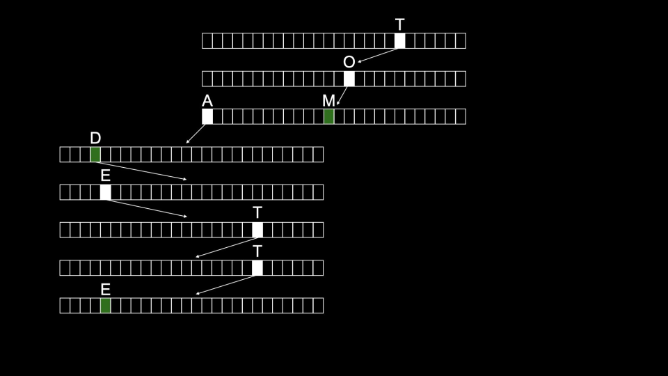

前缀树的查找时间复杂度为\(O(1)\)，代价是需要占用大量内存资源。

---

### 总结
本节课我们学习了如何利用指针构建新的数据结构，具体包括：
- 数据结构的基本概念
- 栈和队列
- 链表
- 哈希与哈希表
- 前缀树
下次课再见！

本文转自 [./week_5_note_English.assets/x/notes/5/](./week_5_note_English.assets/x/notes/5/)，如有侵权，请联系删除。

---

【核心术语对照表】
| 英文原文 | 标准译法 | 概念说明 |
|----------|----------|----------|
| Data Structure | 数据结构 | 内存中组织、存储数据的特定形式，是算法实现的基础，不同数据结构适用于不同的业务场景。 |
| Abstract Data Type | 抽象数据类型 | 从逻辑层面定义的一组数据及操作的集合，不关注具体的实现细节，只定义行为规范。 |
| Queue | 队列 | 遵循先进先出（FIFO）原则的抽象数据类型，支持入队、出队两种核心操作，常用于任务调度、消息队列等场景。 |
| FIFO (First In First Out) | 先进先出 | 队列的核心特性，最早进入队列的元素会被最先取出。 |
| Enqueue | 入队 | 队列的操作之一，指向队列尾部添加新元素。 |
| Dequeue | 出队
