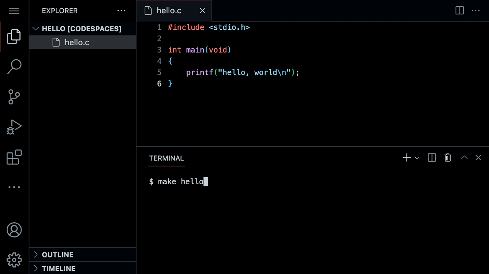

# [Lecture 1](https://cs50.harvard.edu/x/notes/1/#lecture-1)

- [Welcome!](https://cs50.harvard.edu/x/notes/1/#welcome)
- [Source Code](https://cs50.harvard.edu/x/notes/1/#source-code)
- [Visual Studio Code for CS50](https://cs50.harvard.edu/x/notes/1/#visual-studio-code-for-cs50)
- [Hello World](https://cs50.harvard.edu/x/notes/1/#hello-world)
- [From Scratch to C](https://cs50.harvard.edu/x/notes/1/#from-scratch-to-c)
- [Header Files and CS50 Manual Pages](https://cs50.harvard.edu/x/notes/1/#header-files-and-cs50-manual-pages)
- [Hello, You](https://cs50.harvard.edu/x/notes/1/#hello-you)
- [Linux](https://cs50.harvard.edu/x/notes/1/#linux)
- [Conditionals](https://cs50.harvard.edu/x/notes/1/#conditionals)
- [Types](https://cs50.harvard.edu/x/notes/1/#types)
- [Format Codes](https://cs50.harvard.edu/x/notes/1/#format-codes)
- [Variables](https://cs50.harvard.edu/x/notes/1/#variables)
- [compare.c](https://cs50.harvard.edu/x/notes/1/#comparec)
- [agree.c](https://cs50.harvard.edu/x/notes/1/#agreec)
- [Loops and meow.c](https://cs50.harvard.edu/x/notes/1/#loops-and-meowc)
- [Functions](https://cs50.harvard.edu/x/notes/1/#functions)
- [Correctness, Design, Style](https://cs50.harvard.edu/x/notes/1/#correctness-design-style)
- [Mario](https://cs50.harvard.edu/x/notes/1/#mario)
- [Operators](https://cs50.harvard.edu/x/notes/1/#operators)
- [Summing Up](https://cs50.harvard.edu/x/notes/1/#summing-up)


## [Welcome!](https://cs50.harvard.edu/x/notes/1/#welcome)

- In our previous session, we learned about Scratch, a visual programming language.
- Learning computer science concepts can be quite challenging. Indeed, it can feel like you are drinking from a firehose. Remember: What is ultimately important is the gains you experience over these coming weeks and months through your hard work and study in this course.
- Indeed, all the essential programming concepts presented in Scratch will be utilized as you learn how to program any programming language. Functions, conditionals, loops, and variables found in Scratch are fundamental building blocks that you will find in any programming language.


## [Source Code](https://cs50.harvard.edu/x/notes/1/#source-code)

- Recall that machines only understand binary. Where humans write *source code*, a list of instructions for the computer that is human readable, machines only understand what we can now call *machine code*. This machine code is a pattern of ones and zeros that produces a desired effect.

- It turns out that we can convert *source code* into machine code using a very special piece of software called a *compiler*. Today, we will be introducing you to a compiler that will allow you to convert source code in the programming language *C* into machine code.

  <svg id="mermaid-1773883896758" width="100%" xmlns="http://www.w3.org/2000/svg" xmlns:xlink="http://www.w3.org/1999/xlink" class="flowchart" style="max-width: 543.9305419921875px;" viewBox="0 0 543.9305419921875 70" role="graphics-document document" aria-roledescription="flowchart-v2"><g><marker id="mermaid-1773883896758_flowchart-v2-pointEnd" class="marker flowchart-v2" viewBox="0 0 10 10" refX="5" refY="5" markerUnits="userSpaceOnUse" markerWidth="8" markerHeight="8" orient="auto"><path d="M 0 0 L 10 5 L 0 10 z" class="arrowMarkerPath" style="stroke-width: 1; stroke-dasharray: 1, 0;"></path></marker><marker id="mermaid-1773883896758_flowchart-v2-pointStart" class="marker flowchart-v2" viewBox="0 0 10 10" refX="4.5" refY="5" markerUnits="userSpaceOnUse" markerWidth="8" markerHeight="8" orient="auto"><path d="M 0 5 L 10 10 L 10 0 z" class="arrowMarkerPath" style="stroke-width: 1; stroke-dasharray: 1, 0;"></path></marker><marker id="mermaid-1773883896758_flowchart-v2-circleEnd" class="marker flowchart-v2" viewBox="0 0 10 10" refX="11" refY="5" markerUnits="userSpaceOnUse" markerWidth="11" markerHeight="11" orient="auto"><circle cx="5" cy="5" r="5" class="arrowMarkerPath" style="stroke-width: 1; stroke-dasharray: 1, 0;"></circle></marker><marker id="mermaid-1773883896758_flowchart-v2-circleStart" class="marker flowchart-v2" viewBox="0 0 10 10" refX="-1" refY="5" markerUnits="userSpaceOnUse" markerWidth="11" markerHeight="11" orient="auto"><circle cx="5" cy="5" r="5" class="arrowMarkerPath" style="stroke-width: 1; stroke-dasharray: 1, 0;"></circle></marker><marker id="mermaid-1773883896758_flowchart-v2-crossEnd" class="marker cross flowchart-v2" viewBox="0 0 11 11" refX="12" refY="5.2" markerUnits="userSpaceOnUse" markerWidth="11" markerHeight="11" orient="auto"><path d="M 1,1 l 9,9 M 10,1 l -9,9" class="arrowMarkerPath" style="stroke-width: 2; stroke-dasharray: 1, 0;"></path></marker><marker id="mermaid-1773883896758_flowchart-v2-crossStart" class="marker cross flowchart-v2" viewBox="0 0 11 11" refX="-1" refY="5.2" markerUnits="userSpaceOnUse" markerWidth="11" markerHeight="11" orient="auto"><path d="M 1,1 l 9,9 M 10,1 l -9,9" class="arrowMarkerPath" style="stroke-width: 2; stroke-dasharray: 1, 0;"></path></marker><g class="root"><g class="clusters"></g><g class="edgePaths"><path d="M153.646,35L157.812,35C161.979,35,170.312,35,177.979,35C185.646,35,192.646,35,196.146,35L199.646,35" id="L_in_BOX_0" class="edge-thickness-normal edge-pattern-solid edge-thickness-normal edge-pattern-solid flowchart-link" style=";" data-edge="true" data-et="edge" data-id="L_in_BOX_0" data-points="W3sieCI6MTUzLjY0NTgyODI0NzA3MDMsInkiOjM1fSx7IngiOjE3OC42NDU4MjgyNDcwNzAzLCJ5IjozNX0seyJ4IjoyMDMuNjQ1ODI4MjQ3MDcwMywieSI6MzV9XQ==" marker-end="url(#mermaid-1773883896758_flowchart-v2-pointEnd)"></path><path d="M326.576,35L330.743,35C334.91,35,343.243,35,350.91,35C358.576,35,365.576,35,369.076,35L372.576,35" id="L_BOX_out_0" class="edge-thickness-normal edge-pattern-solid edge-thickness-normal edge-pattern-solid flowchart-link" style=";" data-edge="true" data-et="edge" data-id="L_BOX_out_0" data-points="W3sieCI6MzI2LjU3NjM4NTQ5ODA0NjksInkiOjM1fSx7IngiOjM1MS41NzYzODU0OTgwNDY5LCJ5IjozNX0seyJ4IjozNzYuNTc2Mzg1NDk4MDQ2OSwieSI6MzV9XQ==" marker-end="url(#mermaid-1773883896758_flowchart-v2-pointEnd)"></path></g><g class="edgeLabels"><g class="edgeLabel"><g class="label" data-id="L_in_BOX_0" transform="translate(0, 0)"><foreignObject width="0" height="0"><div xmlns="http://www.w3.org/1999/xhtml" class="labelBkg" style="box-sizing: border-box; word-break: break-word; user-select: auto !important; margin-bottom: 0px; background-color: rgba(88, 88, 88, 0.5); display: table-cell; white-space: nowrap; line-height: 1.5; max-width: 200px; text-align: center;"><span class="edgeLabel" style="box-sizing: border-box; word-break: break-word; user-select: auto !important; margin-bottom: 0px; fill: rgb(204, 204, 204); color: rgb(204, 204, 204); background-color: rgb(88, 88, 88); text-align: center;"></span></div></foreignObject></g></g><g class="edgeLabel"><g class="label" data-id="L_BOX_out_0" transform="translate(0, 0)"><foreignObject width="0" height="0"><div xmlns="http://www.w3.org/1999/xhtml" class="labelBkg" style="box-sizing: border-box; word-break: break-word; user-select: auto !important; margin-bottom: 0px; background-color: rgba(88, 88, 88, 0.5); display: table-cell; white-space: nowrap; line-height: 1.5; max-width: 200px; text-align: center;"><span class="edgeLabel" style="box-sizing: border-box; word-break: break-word; user-select: auto !important; margin-bottom: 0px; fill: rgb(204, 204, 204); color: rgb(204, 204, 204); background-color: rgb(88, 88, 88); text-align: center;"></span></div></foreignObject></g></g></g><g class="nodes"><g class="node default" id="flowchart-in-0" transform="translate(80.82291412353516, 35)"><rect class="basic label-container" style="" x="-72.82291793823242" y="-27" width="145.64583587646484" height="54"></rect><g class="label" style="" transform="translate(-42.82291793823242, -12)"><rect></rect><foreignObject width="85.64583587646484" height="24"><div xmlns="http://www.w3.org/1999/xhtml" style="box-sizing: border-box; word-break: break-word; user-select: auto !important; margin-bottom: 0px; display: table-cell; white-space: nowrap; line-height: 1.5; max-width: 200px; text-align: center;"><span class="nodeLabel" style="box-sizing: border-box; word-break: break-word; user-select: auto !important; margin-bottom: 0px; fill: rgb(204, 204, 204); color: rgb(204, 204, 204);"><p style="box-sizing: border-box; word-break: break-word; margin: 0px; user-select: auto !important;">source code</p></span></div></foreignObject></g></g><g class="node default" id="flowchart-BOX-1" transform="translate(265.1111068725586, 35)"><rect class="basic label-container" style="" x="-61.46527862548828" y="-27" width="122.93055725097656" height="54"></rect><g class="label" style="" transform="translate(-31.46527862548828, -12)"><rect></rect><foreignObject width="62.93055725097656" height="24"><div xmlns="http://www.w3.org/1999/xhtml" style="box-sizing: border-box; word-break: break-word; user-select: auto !important; margin-bottom: 0px; display: table-cell; white-space: nowrap; line-height: 1.5; max-width: 200px; text-align: center;"><span class="nodeLabel" style="box-sizing: border-box; word-break: break-word; user-select: auto !important; margin-bottom: 0px; fill: rgb(204, 204, 204); color: rgb(204, 204, 204);"><p style="box-sizing: border-box; word-break: break-word; margin: 0px; user-select: auto !important;">compiler</p></span></div></foreignObject></g></g><g class="node default" id="flowchart-out-3" transform="translate(456.2534713745117, 35)"><rect class="basic label-container" style="" x="-79.67708206176758" y="-27" width="159.35416412353516" height="54"></rect><g class="label" style="" transform="translate(-49.67708206176758, -12)"><rect></rect><foreignObject width="99.35416412353516" height="24"><div xmlns="http://www.w3.org/1999/xhtml" style="box-sizing: border-box; word-break: break-word; user-select: auto !important; margin-bottom: 0px; display: table-cell; white-space: nowrap; line-height: 1.5; max-width: 200px; text-align: center;"><span class="nodeLabel" style="box-sizing: border-box; word-break: break-word; user-select: auto !important; margin-bottom: 0px; fill: rgb(204, 204, 204); color: rgb(204, 204, 204);"><p style="box-sizing: border-box; word-break: break-word; margin: 0px; user-select: auto !important;">machine code</p></span></div></foreignObject></g></g></g></g></g></svg>

- Today, in addition to learning how to program, you will be learning how to write good code.


## [Visual Studio Code for CS50](https://cs50.harvard.edu/x/notes/1/#visual-studio-code-for-cs50)

- The text editor that is utilized for this course is *Visual Studio Code*, aka *VS Code*, affectionately referred to as [cs50.dev](https://cs50.dev/), which can be accessed via that same URL.

- One of the most important reasons we utilize VS Code is that it has all the software required for the course already pre-loaded on it. This course and the instructions herein were designed with VS Code in mind.

- Manually installing the necessary software for the course on your own computer is a cumbersome headache. Best always to utilize VS Code for assignments in this course.

- You can open VS Code at [cs50.dev](https://cs50.dev/).

- The IDE can be divided into a number of regions:

   Notice that there is a *file explorer* on the left side where you can find your files. Further, notice that there is a region in the middle called a *text editor* where you can edit your program. Finally, there is a `command line interface`, known as a *CLI*, *command line*, or *terminal window*, where we can send commands to the computer in the cloud.

- You will also notice in the graphical user interface (GUI) on the left-hand bar, various tools and a file explorer.

- Because this IDE is pre-configured with all the necessary software, you should use it to complete all assignments for this course.


## [Hello World](https://cs50.harvard.edu/x/notes/1/#hello-world)

- We will be using three commands to write, compile, and run our first program:

  ```
  code hello.c
  
  make hello
  
  ./hello
  ```

  The first command, `code hello.c` creates a file and allows us to type instructions for this program. The second command, `make hello`, *compiles* the file from our instructions in C and creates an executable file called `hello`. The last command, `./hello`, runs the program called `hello`.

- We can build your first program in C by typing `code hello.c` into the terminal window. Notice that we deliberately lowercased the entire filename and included the `.c` extension. Then, in the text editor that appears, write code as follows:

  ```
  // A program that says hello to the world
  
  #include <stdio.h>
  
  int main(void)
  {
      printf("hello, world\n");
  }
  ```

  Note that every single character above serves a purpose. If you type it incorrectly, the program will not run. `printf` is a function that can output a line of text. Notice the placement of the quotes and the semicolon. Further, notice that the `\n` creates a new line after the words `hello, world`.

- Clicking back in the terminal window, you can compile your code by executing `make hello`. Notice that we are omitting `.c`. `make` is a build tool that will compile our `hello.c` file and turn it into a program called `hello`. If executing this command results in no errors, you can proceed. If not, double-check your code to ensure it matches the above.

- Now, type `./hello` and your program will execute saying `hello, world`.

- Now, open the file explorer on the left. You will notice that there is now both a file called `hello.c` and another file called `hello`. `hello.c` contains your source code that can be read by humans and the compiler. `hello` is an executable file containing machine code that the computer can run directly.


## [From Scratch to C](https://cs50.harvard.edu/x/notes/1/#from-scratch-to-c)

- In Scratch, we utilized the `say` block to display any text on the screen. Indeed, in C, we have a function called `printf` that does exactly this.

- Notice our code already invokes this function:

  ```
  printf("hello, world\n");
  ```

  Notice that the printf function is called. The argument passed to printf is `hello, world\n` surrounded by double quotes. The statement of code is closed with a `;`.

- Errors in code are common, especially in regards to syntax like semicolons and quotes. Modify your code as follows:

  ```
  // \n is missing
  
  #include <stdio.h>
  
  int main(void)
  {
      printf("hello, world");
  }
  ```

  Notice the `\n` is now gone.

- In your terminal window, run `make hello`. Because you changed your program, you have to re-compile your program.

- Typing `./hello` in the terminal window, how did your program change? This `\` character is called an *escape character* that tells the compiler that `\n` is a special instruction to create a line break.

- There are other escape characters you can use:

  ```
  \n  create a new line
  \r  return to the start of a line
  \"  print a double quote
  \'  print a single quote
  \\  print a backslash
  ```

- Restore your program to the following:

  ```
  // A program that says hello to the world
  
  #include <stdio.h>
  
  int main(void)
  {
      printf("hello, world\n");
  }
  ```

  Notice the semicolon and `\n` have been restored.


## [Header Files and CS50 Manual Pages](https://cs50.harvard.edu/x/notes/1/#header-files-and-cs50-manual-pages)

- The statement at the start of the code `#include <stdio.h>` is a very special command that tells the compiler that you want to use the capabilities of a *library* called `stdio.h`, a *header file*. This allows you, among many other things, to utilize the `printf` function. Notice, it’s not called *studio*: it’s `stdio.h`.

- A *library* is a collection of code created by someone. Libraries are collections of pre-written code and functions that others have written in the past that we can utilize in our code.

- You can read about all the capabilities of this library on the [Manual Pages](https://manual.cs50.io/). The Manual Pages provide a means by which to better understand what various commands do and how they function.

- It turns out that CS50 has its own library called `cs50.h`. There are numerous functions that are included that provide *training wheels* while you get started in C:

  ```
  get_char
  get_double
  get_float
  get_int
  get_long
  get_string
  ```

- These libraries have been pre-installed for you at [cs50.dev](https://cs50.dev/). If you were attempting to use these libraries on your own computer, you would likely have to install them. This is why you should use [cs50.dev](https://cs50.dev/) in this course, as it has all necessary software installed for you.

- Let’s use this library in your program.


## [Hello, You](https://cs50.harvard.edu/x/notes/1/#hello-you)

- Recall that in Scratch we had the ability to ask the user, “What’s your name?” and say “hello” with that name appended to it.

- In C, we can do the same. Modify your code as follows:

  ```
  // get_string and printf with incorrect placeholder
  
  #include <cs50.h>
  #include <stdio.h>
  
  int main(void)
  {
      string answer = get_string("What's your name? ");
      printf("hello, answer\n");
  }
  ```

  The `get_string` function is used to get a string from the user. Then, the variable `answer` is passed to the `printf` function.

- Running `make hello` again in the terminal window, notice that numerous errors appear.

- Looking at the errors, `string` and `get_string` are not recognized by the compiler. We need to provide the compiler with these definitions by adding a library called `cs50.h`. Also, we notice that `answer` is not provided as we intended. Modify your code as follows:

  ```
  // get_string and printf with %s
  
  #include <cs50.h>
  #include <stdio.h>
  
  int main(void)
  {
      string answer = get_string("What's your name? ");
      printf("hello, %s\n", answer);
  }
  ```

  The `get_string` function is used to get a string from the user. Then, the variable `answer` is passed to the `printf` function. `%s` tells the `printf` function to prepare itself to receive a `string`.

- Now, running `make hello` again in the terminal window, you can run your program by typing `./hello`. The program now asks for your name and then says hello with your name attached, as intended.

- `answer` is a special holding place we call a *variable*. `answer` is of type `string` and can hold any string within it. There are many *data types*, such as `int`, `bool`, `char`, and many others.

- `%s` is a placeholder called a *format code* that tells the `printf` function to prepare to receive a `string`. `answer` is the `string` being passed to `%s`.


## [Linux](https://cs50.harvard.edu/x/notes/1/#linux)

- We have been using the CLI to `make` and run our program.
- The CLI is often more useful than the GUI for executing commands and working with our files.
- In the terminal window, the CLI, some common commands we may use include:
  - `cd`, for changing our current directory (folder)
  - `cp`, for copying files and directories
  - `ls`, for listing files in a directory
  - `mkdir`, for making a directory
  - `mv`, for moving (renaming) files and directories
  - `rm`, for removing (deleting) files
  - `rmdir`, for removing (deleting) directories
- The most commonly used is `ls` which will list all the files in the current directory. Go ahead and type `ls` into the terminal window and hit `enter`. You’ll see all the files in the current folder.


## [Conditionals](https://cs50.harvard.edu/x/notes/1/#conditionals)

- Another building block you utilized within Scratch was *conditionals*. For example, you might want to do one thing if x is greater than y. Further, you might want to do something else if that condition is not met.

- We look at a few examples from Scratch.

- In C, you can compare two values as follows:

  ```
  // Conditionals that are mutually exclusive
  
  if (x < y)
  {
      printf("x is less than y\n");
  }
  else
  {
      printf("x is not less than y\n");
  }
  ```

  Notice how if `x < y`, one outcome occurs. If `x` is not less than `y`, then another outcome occurs.

- Similarly, we can plan for three possible outcomes:

  ```
  // Conditional that isn't necessary
  
  if (x < y)
  {
      printf("x is less than y\n");
  }
  else if (x > y)
  {
      printf("x is greater than y\n");
  }
  else if (x == y)
  {
      printf("x is equal to y\n");
  }
  ```

  Notice that not all these lines of code are required. How could we eliminate the unnecessary calculation above?

- You may have guessed that we can improve this code as follows:

  ```
  // Compare integers
  
  if (x < y)
  {
      printf("x is less than y\n");
  }
  else if (x > y)
  {
      printf("x is greater than y\n");
  }
  else
  {
      printf("x is equal to y\n");
  }
  ```

  Notice how the final statement is replaced with `else`.


## [Types](https://cs50.harvard.edu/x/notes/1/#types)

- There are many data types that are available within C:

  ```
  bool
  char
  float
  int
  long
  string
  ...
  ```


## [Format Codes](https://cs50.harvard.edu/x/notes/1/#format-codes)

- Earlier, you may recall that we used a placeholder `%s` for a string in `printf`. This placeholder is called a *format code*.

- `printf` allows for many format codes. Here is a non-comprehensive list of ones you may utilize in this course:

  ```
  %c
  %f
  %i
  %li
  %s
  ```

  `%c` is used for `char` (character) variables. `%f` is used for `float` (floating-point) variables. `%i` is used for `int` or integer variables. `%li` is used for `long` integer variables. `%s` is used for `string` variables. You can find out more about this on the [Manual Pages](https://manual.cs50.io/).

- We will be using many of C’s available data types throughout this course.


## [Variables](https://cs50.harvard.edu/x/notes/1/#variables)

- In C, you can assign a value to an `int` or integer as follows:

  ```
  int counter = 0;
  ```

  Notice how a variable called `counter` of type `int` is assigned the value `0`.

- C can also be programmed to add one to `counter` as follows:

  ```
  counter = counter + 1;
  ```

  Notice how `1` is added to the value of `counter`.

- This can be also represented as:

  ```
  counter += 1;
  ```

- This can be further simplified to:

  ```
  counter++;
  ```

  Notice how the `++` is used to add 1.

- You can also subtract one from `counter` as follows:

  ```
  counter--;
  ```

  Notice how, in this syntax, `1` is removed from the value of `counter`.


## [compare.c](https://cs50.harvard.edu/x/notes/1/#comparec)

- Using this new knowledge about how to assign values to variables, you can program your first conditional statement.

- In the terminal window, type `code compare.c` and write code as follows:

  ```
  // Conditional, Boolean expression, relational operator
  
  #include <cs50.h>
  #include <stdio.h>
  
  int main(void)
  {
      // Prompt user for integers
      int x = get_int("What's x? ");
      int y = get_int("What's y? ");
  
      // Compare integers
      if (x < y)
      {
          printf("x is less than y\n");
      }
  }
  ```

  Notice that we create two variables, an `int` or integer called `x` and another called `y`. The values of these are populated using the `get_int` function.

- You can run your code by executing `make compare` in the terminal window, followed by `./compare`. If you get any error messages, check your code for errors.

- We can improve your program by coding as follows:

  ```
  // Conditionals
  
  #include <cs50.h>
  #include <stdio.h>
  
  int main(void)
  {
      // Prompt user for integers
      int x = get_int("What's x? ");
      int y = get_int("What's y? ");
  
      // Compare integers
      if (x < y)
      {
          printf("x is less than y\n");
      }
      else if (x > y)
      {
          printf("x is greater than y\n");
      }
      else
      {
          printf("x is equal to y\n");
      }
  }
  ```

  Notice that all potential outcomes are now accounted for.

- You can re-make and re-run your program and test it out.

- Examining these programs in various flow charts, you can see the efficiency of our code design decisions. Nearly any block of code can be translated to visual form.


## [agree.c](https://cs50.harvard.edu/x/notes/1/#agreec)

- Considering another data type called a `char`, we can start a new program by typing `code agree.c` into the terminal window.

- Where a `string` is a series of characters, a `char` is a single character.

- In the text editor, write code as follows:

  ```
  // Comparing against lowercase char
  
  #include <cs50.h>
  #include <stdio.h>
  
  int main(void)
  {
      // Prompt user to agree
      char c = get_char("Do you agree? ");
  
      // Check whether agreed
      if (c == 'y')
      {
          printf("Agreed.\n");
      }
      else if (c == 'n')
      {
          printf("Not agreed.\n");
      }
  }
  ```

  Notice that single quotes are utilized for single characters (`char` type), while double quotes are used for strings. Further, notice that `==` ensures that something *is equal* to something else, where a single equal sign would have a very different function in C.

- You can test your code by typing `make agree` into the terminal window, followed by `./agree`.

- We can also allow for the inputting of uppercase and lowercase characters:

  ```
  // Comparing against lowercase and uppercase char
  
  #include <cs50.h>
  #include <stdio.h>
  
  int main(void)
  {
      // Prompt user to agree
      char c = get_char("Do you agree? ");
  
      // Check whether agreed
      if (c == 'y')
      {
          printf("Agreed.\n");
      }
      else if (c == 'Y')
      {
          printf("Agreed.\n");
      }
      else
      {
          printf("Not agreed.\n");
      }
  }
  ```

  Notice that additional options are offered. However, this is not efficient code.

- We can improve this code as follows:

  ```
  // Logical operators
  
  #include <cs50.h>
  #include <stdio.h>
  
  int main(void)
  {
      // Prompt user to agree
      char c = get_char("Do you agree? ");
  
      // Check whether agreed
      if (c == 'Y' || c == 'y')
      {
          printf("Agreed.\n");
      }
      else
      {
          printf("Not agreed.\n");
      }
  }
  ```

  Notice that `||` effectively means *or*.


## [Loops and meow.c](https://cs50.harvard.edu/x/notes/1/#loops-and-meowc)

- We can also utilize the loop building block from Scratch in our C programs.

- In your terminal window, type `code meow.c` and write code as follows:

  ```
  // Opportunity for better design
  
  #include <stdio.h>
  
  int main(void)
  {
      printf("meow\n");
      printf("meow\n");
      printf("meow\n");
  }
  ```

  Notice this does as intended but has an opportunity for better design. Code is repeated over and over.

- We can improve our program by modifying your code as follows:

  ```
  // Better design
  
  #include <stdio.h>
  
  int main(void)
  {
      int i = 3;
      while (i > 0)
      {
          printf("meow\n");
          i--;
      }
  }
  ```

  Notice that we create an `int` called `i` and assign it the value `3`. Then, we create a `while` loop that will run as long as `i > 0`. Then, the loop runs. Every time `1` is subtracted from `i` using the `i--` statement.

- Similarly, we can implement a count-up of sorts by modifying our code as follows:

  ```
  // Print values of i
  
  #include <stdio.h>
  
  int main(void)
  {
      int i = 1;
      while (i <= 3)
      {
          printf("meow\n");
          i++;
      }
  }
  ```

  Notice how our counter `i` is started at `1`. Each time the loop runs, it will increment the counter by `1`. Once the counter is greater than `3`, it will stop the loop.

- Generally, in computer science, we count from zero. Best to revise your code as follows:

  ```
  // Better design
  
  #include <stdio.h>
  
  int main(void)
  {
      int i = 0;
      while (i < 3)
      {
          printf("meow\n");
          i++;
      }
  }
  ```

  Notice we now count from zero.

- Another tool in our toolbox for looping is a `for` loop.

- You can further improve the design of our `meow.c` program using a `for` loop. Modify your code as follows:

  ```
  // Better design
  
  #include <stdio.h>
  
  int main(void)
  {
      for (int i = 0; i < 3; i++)
      {
          printf("meow\n");
      }
  }
  ```

  Notice that the `for` loop includes three arguments. The first argument `int i = 0` starts our counter at zero. The second argument `i < 3` is the condition that is being checked. Finally, the argument `i++` tells the loop to increment by one each time the loop runs.

- We can even loop forever using the following code:

  ```
  // Infinite loop
  
  #include <cs50.h>
  #include <stdio.h>
  
  int main(void)
  {
      while (true)
      {
          printf("meow\n");
      }
  }
  ```

  Notice that `true` will always be the case. Therefore, the code will always run. You will lose control of your terminal window by running this code. You can break from an infinite loop by hitting `control-C` on your keyboard (this sends a SIGINT signal to terminate the program).

- We can ask the user how many times to meow by modifying the code as follows:

  ```
  // Prompts user for n.
  
  #include <cs50.h>
  #include <stdio.h>
  
  int main(void)
  {
      int n = get_int("What's n? ");
  
      for (int i = 0; i < n; i++)
      {
          printf("meow\n");
      }
  }
  ```

  Notice that `n` is defined by the user. Then, there are `n` meows.

- What happens if the user inputs something less than zero? Modify your code as follows:

  ```
  // Prompts user again if need be. (Poor design.)
  
  #include <cs50.h>
  #include <stdio.h>
  
  int main(void)
  {
      int n = get_int("What's n? ");
      if (n < 0)
      {
          n = get_int("What's n? ");
      }
  
      for (int i = 0; i < n; i++)
      {
          printf("meow\n");
      }
  }
  ```

  Notice that this may stop the user from typing a number less than zero once. But what happens if they do it multiple times?

- Improve your code as follows:

  ```
  // Uses a loop with continue/break.
  
  #include <cs50.h>
  #include <stdio.h>
  
  int main(void)
  {
      int n;
      while (true)
      {
          n = get_int("What's n? ");
          if (n < 0)
          {
              continue;
          }
          else
          {
              break;
          }
      }
  
      for (int i = 0; i < n; i++)
      {
          printf("meow\n");
      }
  }
  ```

  Notice that the `while` loop will run forever until `n` is greater than or equal to zero.

- Still, this code could be improved further:

  ```
  // Uses a loop with just break.
  
  #include <cs50.h>
  #include <stdio.h>
  
  int main(void)
  {
      int n;
      while (true)
      {
          n = get_int("What's n? ");
          if (n >= 0)
          {
              break;
          }
      }
  
      for (int i = 0; i < n; i++)
      {
          printf("meow\n");
      }
  }
  ```

  Notice how our prior code is simplified, removing unnecessary lines of code.

- Similar to a `while` loop, we could implement this code using a `do-while` loop:

  ```
  // Uses a do-while loop instead.
  
  #include <cs50.h>
  #include <stdio.h>
  
  int main(void)
  {
      int n;
      do
      {
          n = get_int("What's n? ");
      }
      while (n < 0);
  
      for (int i = 0; i < n; i++)
      {
          printf("meow\n");
      }
  }
  ```

  Notice that the `do` will always run at least once. That portion of code will loop while `n` is less than zero.

- A critical eye may see that we could *abstract away* the portion of the code that meows.


## [Functions](https://cs50.harvard.edu/x/notes/1/#functions)

- While we will provide much more guidance later, you can create your own function within C as follows:

  ```
  void meow(void)
  {
      printf("meow\n");
  }
  ```

  The initial `void` means that the function does not return any values. The `(void)` means that no values are being provided to the function.

- This function can be used in the main function as follows:

  ```
  // Abstraction
  
  #include <stdio.h>
  
  void meow(void);
  
  int main(void)
  {
      for (int i = 0; i < 3; i++)
      {
          meow();
      }
  }
  
  // Meow once
  void meow(void)
  {
      printf("meow\n");
  }
  ```

  Notice how the `meow` function is called with the `meow()` instruction. This is possible because the `meow` function is defined at the bottom of the code, and the *prototype* of the function is provided at the top of the code as `void meow(void)`.

- Your `meow` function can be further modified to accept input:

  ```
  // Abstraction with parameterization
  
  #include <stdio.h>
  
  void meow(int n);
  
  int main(void)
  {
      meow(3);
  }
  
  // Meow some number of times
  void meow(int n)
  {
      for (int i = 0; i < n; i++)
      {
          printf("meow\n");
      }
  }
  ```

  Notice that the prototype has changed to `void meow(int n)` to show that `meow` accepts an `int` as its input.

- When working with variables and functions, it’s important to understand the *scope* of a variable. Consider the following code:

  ```
  // Demonstrates scope
  
  #include <stdio.h>
  
  void meow(int n);
  
  int main(void)
  {
      int n = 3;
      meow(n);
  }
  
  // Meow some number of times
  void meow(int n)
  {
      for (int i = 0; i < n; i++)
      {
          printf("meow\n");
      }
  }
  ```

  Notice how `n` is defined in the `main` function. Because of that, `n` is only in the scope of the `main` function. The only way that the `meow` function is able to use `n` is that a copy of `n` is passed to the `meow` function. `meow` is not using the original `n` from the `main` function. Instead, it is using its own copy of `n`.

- With some modification to our code, we can get user input:

  ```
  // User input
  
  #include <cs50.h>
  #include <stdio.h>
  
  void meow(int n);
  
  int main(void)
  {
      int n;
      do
      {
          n = get_int("Number: ");
      }
      while (n < 1);
      meow(n);
  }
  
  // Meow some number of times
  void meow(int n)
  {
      for (int i = 0; i < n; i++)
      {
          printf("meow\n");
      }
  }
  ```

  Notice that `get_int` is used to obtain a number from the user. `n` is passed to `meow`.

- We can even test to ensure that the input we get provided by the user is correct:

  ```
  // Return value
  
  #include <cs50.h>
  #include <stdio.h>
  
  int get_positive_int(void);
  void meow(int n);
  
  int main(void)
  {
      int n = get_positive_int();
      meow(n);
  }
  
  // Get number of meows
  int get_positive_int(void)
  {
      int n;
      do
      {
          n = get_int("Number: ");
      }
      while (n < 1);
      return n;
  }
  
  // Meow some number of times
  void meow(int n)
  {
      for (int i = 0; i < n; i++)
      {
          printf("meow\n");
      }
  }
  ```

  Notice that a new function called `get_positive_int` asks the user for an integer while `n < 1`. After obtaining a positive integer, this function will `return n` back to the `main` function.


## [Correctness, Design, Style](https://cs50.harvard.edu/x/notes/1/#correctness-design-style)

- Code can be evaluated upon three axes.
- First, *correctness* refers to “Does the code run as intended?” You can check the correctness of your code with `check50`.
- Second, *design* refers to “How well is the code designed?” You can evaluate the design of your code using `design50`.
- Finally, *style* refers to “How aesthetically pleasing and consistent is the code?” You can evaluate the style of your code with `style50`.


## [Mario](https://cs50.harvard.edu/x/notes/1/#mario)

- Everything we’ve discussed today has focused on various building blocks of your work as an emerging computer scientist.

- The following will help you orient toward working on a problem set for this class in general: How does one approach a computer science-related problem?

- Imagine we wanted to emulate the visual of the game Super Mario Bros. Considering the four question blocks pictured, how could we create code that roughly represents these four horizontal blocks?

  

- In the terminal window, type `code mario.c` and code as follows:

  ```
  // Prints a row of 4 question marks
  
  #include <stdio.h>
  
  int main(void)
  {
      printf("????\n");
  }
  ```

  Notice that four question marks are printed.

- Using a loop, we can more efficiently print the question marks:

  ```
  // Prints a row of 4 question marks with a loop
  
  #include <stdio.h>
  
  int main(void)
  {
      for (int i = 0; i < 4; i++)
      {
          printf("?");
      }
      printf("\n");
  }
  ```

  Notice how four question marks are printed here using a loop.

- Similarly, we can apply this same logic to create three vertical blocks.

  

- To accomplish this, modify your code as follows:

  ```
  // Prints a column of 3 bricks with a loop
  
  #include <stdio.h>
  
  int main(void)
  {
      for (int i = 0; i < 3; i++)
      {
          printf("#\n");
      }
  }
  ```

  Notice how three vertical bricks are printed using a loop.

- What if we wanted to combine these ideas to create a three-by-three group of blocks?

  

- We can follow the logic above, combining the same ideas. Modify your code as follows:

  ```
  // Prints a 3-by-3 grid of bricks with nested loops
  
  #include <stdio.h>
  
  int main(void)
  {
      for (int i = 0; i < 3; i++)
      {
          for (int j = 0; j < 3; j++)
          {
              printf("#");
          }
          printf("\n");
      }
  }
  ```

  Notice that one loop is inside another. The first loop defines what vertical row is being printed. For each row, three columns are printed. After each row, a new line is printed.

- What if we wanted to ensure that the number of blocks is *constant*, that is, unchangeable? Modify your code as follows:

  ```
  // Prints a 3-by-3 grid of bricks with nested loops using a constant
  
  #include <stdio.h>
  
  int main(void)
  {
      const int n = 3;
      for (int i = 0; i < n; i++)
      {
          for (int j = 0; j < n; j++)
          {
              printf("#");
          }
          printf("\n");
      }
  }
  ```

  Notice how `n` is now a constant. It can never be changed.

- As illustrated earlier in this lecture, we can *abstract away* functionality into functions. Consider the following code:

  ```
  // Helper function
  
  #include <stdio.h>
  
  void print_row(int width);
    
  int main(void)
  {
      const int n = 3;
      for (int i = 0; i < n; i++)
      {
          print_row(n);
      }
  }
  
  void print_row(int width)
  {
      for (int i = 0; i < width; i++)
      {
          printf("#");
      }
      printf("\n");
  }
  ```

  Notice how printing a row is accomplished through a new function.


## [Operators](https://cs50.harvard.edu/x/notes/1/#operators)

- *Operators* refer to the mathematical operations that are supported by your compiler. In C, these mathematical operators include:

  - `+` for addition
  - `-` for subtraction
  - `*` for multiplication
  - `/` for division
  - `%` for remainder

- We will use all of these operators in this course.

- Let’s implement our own calculator by typing `code calculator.c` in the terminal and modifying our code as follows:

  ```
  // Addition with int
  
  #include <cs50.h>
  #include <stdio.h>
  
  int main(void)
  {
      // Prompt user for x
      int x = get_int("What's x? ");
  
      // Prompt user for y
      int y = get_int("What's y? ");
  
      // Add numbers
      int z = x + y;
  
      // Perform addition
      printf("%i\n", z);
  }
  ```

  Notice how we create a third variable `z` to store the sum of `x` and `y`, then print the result using `%i` (the format specifier for integers).

- We could write more efficient code as follows:

  ```
  // Addition with int, without third variable
  
  #include <cs50.h>
  #include <stdio.h>
  
  int main(void)
  {
      // Prompt user for x
      int x = get_int("What's x? ");
  
      // Prompt user for y
      int y = get_int("What's y? ");
  
      // Perform addition
      printf("%i\n", x + y);
  }
  ```

  Notice that we eliminated the need for the third variable `z` by performing the addition directly within the `printf` statement, making our code more concise.

- We could use multiplication:

  ```
  // Doubles a number
  
  #include <cs50.h>
  #include <stdio.h>
  
  int main(void)
  {
      // Prompt user for x
      int x = get_int("What's x? ");
  
      // Double it
      printf("%i\n", x * 2);
  }
  ```

  Notice how we use the multiplication operator `*` to double the input value, demonstrating another arithmetic operation beyond addition.

- Integers in `C` can only count so high. Consider the following:

  ```
  // Overflow 
  
  #include <cs50.h>
  #include <stdio.h>
  
  int main(void)
  {
      int dollars = 1;
      while (true)
      {
          char c = get_char("Here's $%i. Double it and give to next person? ", dollars);
          if (c == 'y')
          {
              dollars *= 2;
          }
          else
          {
              break;
          }
      }
      printf("Here's $%i.\n", dollars);
  }
  ```

  Notice how the program repeatedly doubles the dollar amount. Eventually, the integer will exceed its maximum value and “overflow,” wrapping around to a negative number or zero.

- Integer overflow is when a calculation produces a value that exceeds the maximum storage capacity of the data type, causing the value to wrap around unpredictably.

- One of C’s challenges is that while it provides you immense control over how memory is utilized, programmers have to be very aware of the potential pitfalls of memory management.

- Types refer to the possible data that can be stored in a variable. For example, a `char` is designed to accommodate a single character like `a` or `2`.

- Types are very important because each type has specific limits. For example, because of the limits in memory, the highest value of a signed `int` is typically `2147483647`, while an unsigned `int` can reach `4294967295`. If you attempt to count an `int` higher than its maximum, an *integer overflow* will result where an incorrect value will be stored in this variable.

- The number of bits determines the range of values we can represent.

- This can have catastrophic, real-world impacts.

- We can solve this issue by using a `long` variable type:

  ```
  // long
  
  #include <cs50.h>
  #include <stdio.h>
  
  int main(void)
  {
      long dollars = 1;
      while (true)
      {
          char c = get_char("Here's $%li. Double it and give to next person? ", dollars);
          if (c == 'y')
          {
              dollars *= 2;
          }
          else
          {
              break;
          }
      }
      printf("Here's $%li.\n", dollars);
  }
  ```

  Notice that we changed from `int` to `long` and use `%li` instead of `%i` in our format strings. A `long` can store much larger values than an `int`, delaying (but not eliminating) the overflow problem.

- You may know that integers and floating point variables have a significant difference: The ability to represent numbers less than `1`. Consider the following:

  ```
  // Division with ints, demonstrating truncation
  
  #include <cs50.h>
  #include <stdio.h>
  
  int main(void)
  {
      // Prompt user for x
      int x = get_int("What's x? ");
  
      // Prompt user for y
      int y = get_int("What's y? ");
  
      // Divide x by y
      printf("%i\n", x / y);
  }
  ```

  Notice that when dividing two integers, C performs integer division and truncates (discards) any decimal portion. For example, 7 / 2 would give 3, not 3.5.

- *Floating point imprecision* illustrates that there are limits to how precise computers can calculate numbers.

- As you are coding, pay special attention to the types of variables you are using to avoid problems within your code.

- We examined some examples of disasters that can occur through type-related errors.

- Similarly, we can `cast` an integer to be a `float`. Consider the following:

  ```
  // Casting
  
  #include <cs50.h>
  #include <stdio.h>
  
  int main(void)
  {
      // Prompt user for x
      int x = get_int("What's x? ");
  
      // Prompt user for y
      int y = get_int("What's y? ");
  
      // Divide x by y
      printf("%f\n", (float) x / y);
  }
  ```

  Notice how we cast `x` to a `float` before division using `(float) x`. This converts the integer to a floating-point number, allowing the division to produce a decimal result instead of truncating.

- We could use `float`s throughout:

  ```
  // Floats
  
  #include <cs50.h>
  #include <stdio.h>
  
  int main(void)
  {
      // Prompt user for x
      float x = get_float("What's x? ");
  
      // Prompt user for y
      float y = get_float("What's y? ");
  
      // Divide x by y
      printf("%.50f\n", x / y);
  }
  ```

  Notice that we use `get_float` for input and `%.50f` to display up to 50 decimal places, revealing the limitations of floating-point precision as the result may show unexpected digits due to binary representation constraints.


## [Summing Up](https://cs50.harvard.edu/x/notes/1/#summing-up)

In this lesson, you learned how to apply the building blocks you learned in Scratch to the C programming language. You learned…

- How to create your first program in C.
- How to use the command line.
- About predefined functions that come natively with C.
- How to use variables, conditionals, and loops.
- How to create your own functions to simplify and improve your code.
- How to evaluate your code on three axes: correctness, design, and style.
- How to integrate comments into your code.
- How to utilize types and operators and the implications of your choices.

See you next time!


> 本文转自 [https://cs50.harvard.edu/x/notes/2/](https://cs50.harvard.edu/x/notes/2/)，如有侵权，请联系删除。