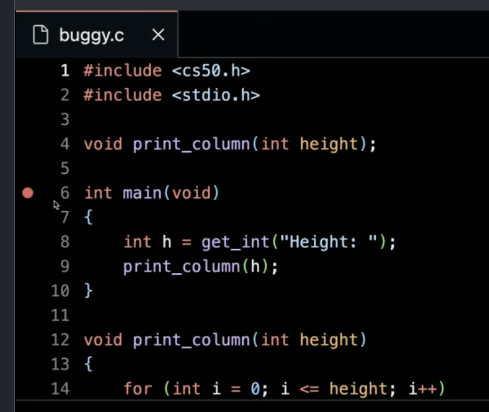
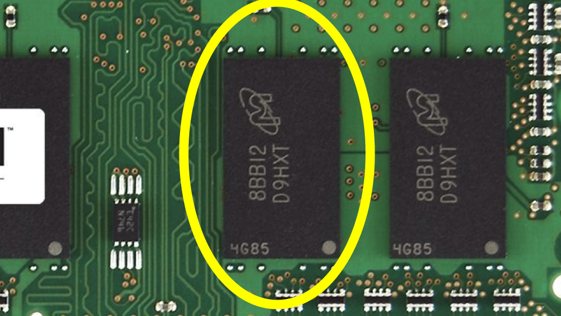
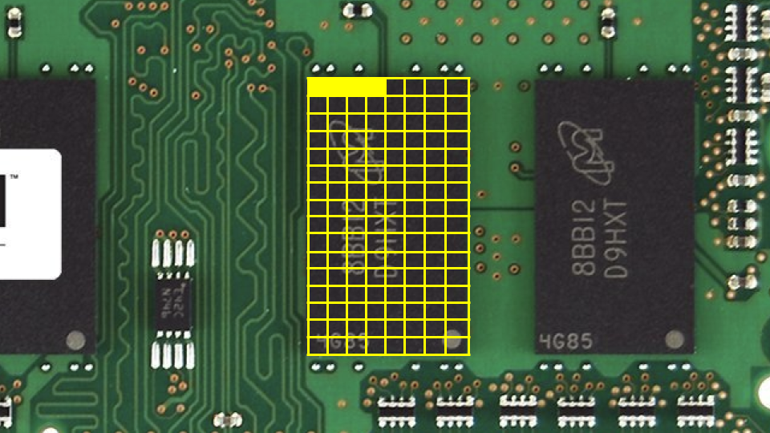
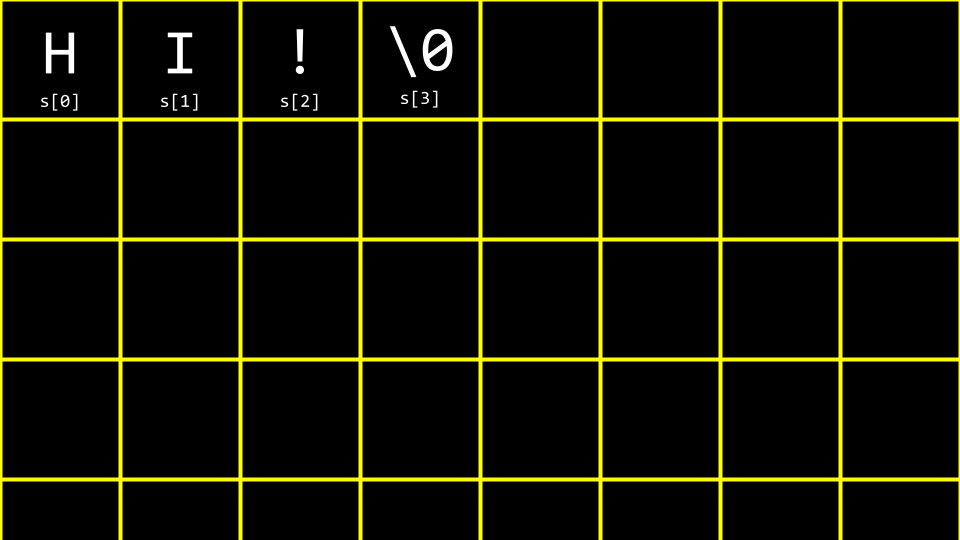
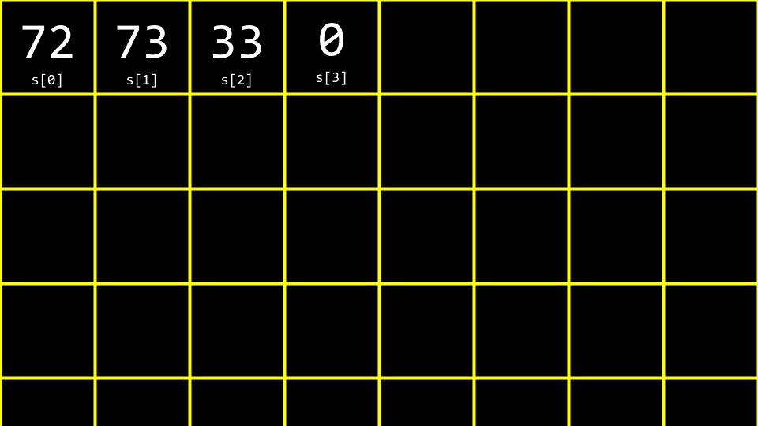
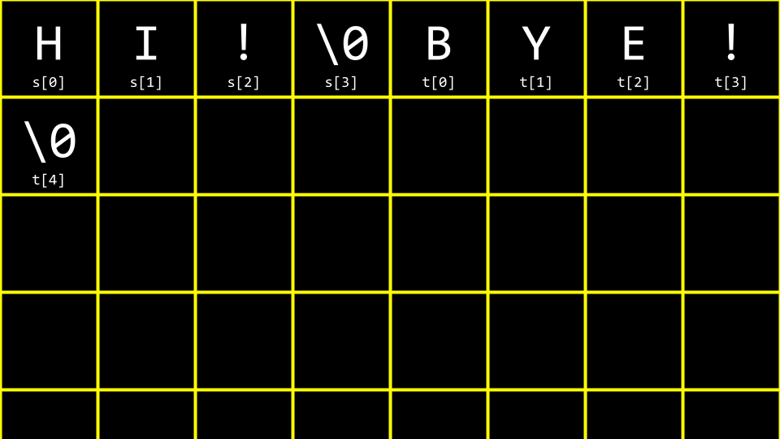

[License](https://cs50.harvard.edu/license/)

Lecture 2
=========

*   [Welcome!](##welcome)
*   [Reading Levels](##reading-levels)
*   [Debugging](##debugging)
*   [Compiling](##compiling)
*   [Arrays](##arrays)
*   [Strings](##strings)
*   [String Length](##string-length)
*   [Command-Line Arguments](##command-line-arguments)
*   [Exit Status](##exit-status)
*   [Summing Up](##summing-up)


## Welcome!

*   In our previous session, we learned about C, a text-based programming language.
*   This week, we are going to take a deeper look at additional building blocks that will support our goals of learning more about programming from the bottom up.
*   Fundamentally, in addition to the essentials of programming, this course is about problem-solving. Accordingly, we will also focus further on how to approach computer science problems.
*   By the end of the course, you will learn how to use these aforementioned building blocks to solve a whole host of computer science problems.
*   We take for granted many of these solutions provided by computer science.

Reading Levels
--------------

*   One of the real-world problems we will solve in this course is understanding reading levels.
*   With the help of some of your peers, we presented readings at various reading levels.
*   We will be quantifying reading levels this week as one of your many programming challenges.

Debugging
---------

*   Everyone will make mistakes while coding.
*   _Debugging_ is the process of locating and removing bugs from your code.
*   One of the debugging techniques you will use during this course to debug your code is called _rubber duck debugging_, where you can talk to an inanimate object (or yourself) to help think through your code and why it is not working as intended. When you are having challenges with your code, consider how speaking out loud to, quite literally, a rubber duck about the code problem. If you’d rather not talk to a small plastic duck, you are welcome to speak to a human near you!
*   We have created the CS50 Duck and [CS50.ai](https://cs50.ai/) as tools that can help you debug your code.
*   Consider the following code:
    
    ```
    // Missing #include for stdio.h
    
    int main(void)
    {
        printf("hello, world\n");
    }
    
    ```
    
    Notice how the `#include` directive for `stdio.h` is missing. This header file is required for the `printf` function to work properly. Without it, the compiler will not recognize the `printf` function and will generate an error.
    
*   Similarly, consider the following code:
    
    ```
    // Misspelled stdio.h
    
    #include <studio.h>
    int main(void)
    {
        printf("hello, world\n");
    }
    
    ```
    
    Notice how `stdio.h` is misspelled as `studio.h`. This typo will cause a compilation error because the compiler cannot find a file called `studio.h`. The correct header file name is `stdio.h`, which stands for “standard input/output.”
    
*   We might forget to declare the type of a variable:
    
    ```
    // Missing cs50.h, variable's type, semicolon, %s, and second printf argument.
    
    #include <stdio.h>
    int main(void)
    {
        name = get_string("What's your name? ")
        printf("hello, world\n");
    }
    
    ```
    
    Notice there are multiple errors. First, the type of `name` is not declared. Second, the `cs50.h` library is missing to allow us to use `string`. Third, there’s a missing semicolon after the `get_string` call. Fourth, the `printf` statement doesn’t actually use the `name` variable.
    
*   Some bugs will prompt an error message. Others are logical errors that will not prompt a message, but will result in unexpected behavior in your program.
*   The `printf` statement can be used to debug your code. Consider the following:
*   Consider the following image from last week:
    
    
    
*   Consider the following code that has a bug purposely inserted within it:
    
    ```
    // Buggy example for printf
    
    #include <stdio.h>
    int main(void)
    {
        for (int i = 0; i <= 3; i++)
        {
            printf("#\n");
        }
    }
    
    ```
    
    Notice that this code prints four blocks instead of three.
    
*   Type `code buggy.c` into the terminal window and write the above code.
*   Running this code, four bricks appear instead of the intended three.
*   `printf` is a very useful way of debugging your code. You could modify your code as follows:
    
    ```
    // Buggy example for printf
    
    #include <stdio.h>
    int main(void)
    {
        for (int i = 0; i <= 3; i++)
        {
            printf("i is %i\n", i);
            printf("#\n");
        }
    }
    
    ```
    
    Notice how this code outputs the value of `i` during each iteration of the loop such that we can debug our code.
    
*   Running this code, you will see numerous statements, including `i is 0`, `i is 1`, `i is 2`, and `i is 3`. Seeing this, you might realize that further code needs to be corrected as follows:
    
    ```
    #include <stdio.h>
    int main(void)
    {
        for (int i = 0; i < 3; i++)
        {
            printf("#\n");
        }
    }
    
    ```
    
    Notice the `<=` has been replaced with `<`.
    
*   This code can be further improved as follows:
    
    ```
    // Buggy example for debug50
    
    #include <cs50.h>
    #include <stdio.h>
    void print_column(int height);
    
    int main(void)
    {
        int h = get_int("Height: ");
        print_column(h);
    }
    
    void print_column(int height)
    {
        for (int i = 0; i <= height; i++)
        {
            printf("#\n");
        }
    }
    
    ```
    
    Notice that compiling and running this code still results in a bug.
    
*   To address this bug, we will use a new tool.
*   A second tool in debugging is called a _debugger_, a software tool created by programmers to help track down bugs in code.
*   In VS Code, a pre-configured debugger has been provided to you called `debug50`.
*   To utilize this debugger, first set a _breakpoint_ by clicking to the left of a line of your code, just to the left of the line number. When you click there, you will see a red dot appearing. Imagine this as a stop sign, asking the debugger to pause so that you can consider what’s happening in this part of your code.
    
    
    
*   Second, run `debug50 ./buggy`. You will notice that after the debugger comes to life and a line of your code will illuminate in a gold-like color. Quite literally, the code has _paused_ at this line of code. Notice in the top left corner how all local variables are being displayed, including `h`, which currently does not have a value. At the top of your window, you can click the `step over` button, and it will keep moving through your code. Notice how the value of `i` increases as you step through the loop.
*   While this tool will not show you where your bug is, it will help you slow down and see how your code is running step by step. You can use `step into` as a way to look further into the details of your buggy code.
*   A third way of debugging is by speaking to a rubber duck, inanimate object, or a person to describe the problem you are facing and the specific steps you are taking to solve that problem as a means by which to discover your error.
*   Finally, , also known as the \*CS50 Duck\*, can help you with debugging your code.

Compiling
---------

*   Recall that last week, you learned about a _compiler_, a specialized computer program that converts _source code_ into _machine code_ that can be understood by a computer.
*   We convert _source code_ into machine code using a very special piece of software called a _compiler_. Today, we will be introducing you to a compiler that will allow you to convert source code in the programming language _C_ into machine code.
    
    ```mermaid
    flowchart LR
        in["source code"] --> BOX[" compiler "]
        BOX --> out["machine code"]
    
    ```
    
*   For example, you might have a computer program that looks like this:
    
    ```
    #include <stdio.h>
    int main(void)
    {
        printf("hello, world\n");
    }
    
    ```
    
*   A compiler will take the above code and turn it into the machine code that might look something like this:
    
    ```tex
    01010100 01001000 01001001 01010011
    00100000 01001001 01010011 00100000
    01000011 01010011 00110101 00110000
    ```
    
    Note that the above is only illustrative. The machine code for the problem above would be much longer.
    
*   _VS Code_, the programming environment provided to you as a CS50 student, utilizes a compiler called `clang` (which stands for “C Language Family Frontend”).
*   You can enter the following into the terminal window to compile your code: `clang -o hello hello.c`.
*   _Command-line arguments_ are provided at the command line to `clang` as `-o hello hello.c`.
*   Running `./hello` in the terminal window, your program runs as intended.
*   Consider the following code from last week:
    
    ```
    #include <cs50.h>
    #include <stdio.h>
    int main(void)
    {
        string name = get_string("What's your name? ");
        printf("hello, %s\n", name);
    }
    
    ```
    
*   To compile this code, you can type `clang -o hello hello.c -lcs50`.
*   If you were to type `make hello`, it runs a command that executes clang to create an output file that you can run as a user.
*   VS Code has been pre-programmed such that `make` will run numerous command line arguments along with clang for your convenience as a user.
*   While the above is offered as an illustration, such that you can understand more deeply the process and concept of compiling code, using `make` in CS50 is perfectly fine and the expectation!
*   Compiling involves four major steps, including the following:
*   First, _preprocessing_ is where the header files in your code, designated by a `#` (such as `#include <cs50.h>`) are effectively copied and pasted into your file. During this step, the code from `cs50.h` is copied into your program. Similarly, just as your code contains `#include <stdio.h>`, code contained within `stdio.h` somewhere on your computer is copied to your program. This step can be visualized as follows:
    
    ```
      string get_string(string prompt);
      int printf(string format, ...);
    
      int main(void)
      {
          string name = get_string("What's your name? ");
          printf("hello, %s\n", name);
      }
    
    ```
    
*   Second, _compiling_ is where your program is converted into assembly code. This step can be visualized as follows:
    
    ```
    ...
    main:
        .cfi_startproc
    # BB#0:
        pushq    %rbp
    .Ltmp0:
        .cfi_def_cfa_offset 16
    .Ltmp1:
        .cfi_offset %rbp, -16
        movq    %rsp, %rbp
    .Ltmp2:
        .cfi_def_cfa_register %rbp
        subq    $16, %rsp
        xorl    %eax, %eax
        movl    %eax, %edi
        movabsq    $.L.str, %rsi
        movb    $0, %al
        callq    get_string
        movabsq    $.L.str.1, %rdi
        movq    %rax, -8(%rbp)
        movq    -8(%rbp), %rsi
        movb    $0, %al
        callq    printf
        ...
    
    ```
    
*   Third, _assembling_ involves the assembler (a tool in the compiler toolchain) converting your assembly code into machine code. This step can be visualized as follows:
    
    ```
    01111111010001010100110001000110
    00000010000000010000000100000000
    00000000000000000000000000000000
    00000000000000000000000000000000
    00000001000000000011111000000000
    00000001000000000000000000000000
    00000000000000000000000000000000
    ...
    
    ```
    
*   Finally, during the _linking_ step, pre-compiled machine code from your included libraries is combined with your code. The final executable file is then outputted.
    
    ```
    01111111010001010100110001000110
    00000010000000010000000100000000
    00000000000000000000000000000000
    00000000000000000000000000000000
    00000001000000000011111000000000
    00000001000000000000000000000000
    00000000000000000000000000000000
    00000000000000000000000000000000
    00000000000000000000000000000000
    00000000000000000000000000000000
    10100000000000100000000000000000
    00000000000000000000000000000000
    00000000000000000000000000000000
    01000000000000000000000000000000
    00000000000000000100000000000000
    00001010000000000000000100000000
    01010101010010001000100111100101
    01001000100000111110110000010000
    00110001110000001000100111000111
    01001000101111100000000000000000
    00000000000000000000000000000000
    00000000000000001011000000000000
    11101000000000000000000000000000
    00000000010010001011111100000000
    00000000000000000000000000000000
    00000000000000000000000001001000
    ...
    
    ```
    

Arrays
------

*   In Week 0, we talked about _data types_ such as `bool`, `int`, `char`, `string`, etc.
*   Each data type requires a certain amount of system resources (these are typical sizes in the CS50 environment):
    *   `bool` 1 byte
    *   `int` 4 bytes
    *   `long` 8 bytes
    *   `float` 4 bytes
    *   `double` 8 bytes
    *   `char` 1 byte
    *   `string` ? bytes
*   Inside of your computer, you have a finite amount of memory available.
    
    
    
*   Physically, on the memory of your computer, you can imagine how specific types of data are stored on your computer. You might imagine that a `char`, which only requires 1 byte of memory, may look as follows:
    
    
    
*   Similarly, an `int`, which requires 4 bytes, might look as follows:
    
    
    
*   We can create a program that explores these concepts. Inside your terminal, type `code scores.c` and write code as follows:
    
    ```
    // Averages three (hardcoded) numbers
    
    #include <stdio.h>
    int main(void)
    {
        // Scores
        int score1 = 72;
        int score2 = 73;
        int score3 = 33;
    
        // Print average
        printf("Average: %f\n", (score1 + score2 + score3) / 3.0);
    }
    
    ```
    
    Notice that the number on the right is a floating point value of `3.0`, so that the calculation is rendered as a floating point value in the end.
    
*   Running `make scores` compiles the program. Then running `./scores` executes it.
*   You can imagine how these variables are stored in memory:
    
    
    
*   _Arrays_ are a sequence of values that are stored back-to-back in memory.
*   `int scores[3]` is a way of telling the compiler to provide you three back-to-back places in memory of size `int` to store three `scores`. Considering our program, you can revise your code as follows:
    
    ```
    // Averages three (hardcoded) numbers using an array
    
    #include <cs50.h>
    #include <stdio.h>
    int main(void)
    {
        // Scores
        int scores[3];
        scores[0] = 72;
        scores[1] = 73;
        scores[2] = 33;
    
        // Print average
        printf("Average: %f\n", (scores[0] + scores[1] + scores[2]) / 3.0);
    }
    
    ```
    
    Notice that `scores[0]` examines the value at this location of memory by `indexing into` the array called `scores` at location `0` to see what value is stored there.
    
*   You can see how, while the above code works, there is still an opportunity for improving our code. Revise your code as follows:
    
    ```
    // Averages three numbers using an array and a loop
    
    #include <cs50.h>
    #include <stdio.h>
    int main(void)
    {
        // Get scores
        int scores[3];
        for (int i = 0; i < 3; i++)
        {
            scores[i] = get_int("Score: ");
        }
    
        // Print average
        printf("Average: %f\n", (scores[0] + scores[1] + scores[2]) / 3.0);
    }
    
    ```
    
    Notice how we index into `scores` by using `scores[i]` where `i` is supplied by the `for` loop.
    
*   We can simplify or _abstract away_ the calculation of the average. Modify your code as follows:
    
    ```
    // Averages three numbers using an array, a constant, and a helper function
    
    #include <cs50.h>
    #include <stdio.h>
    // Constant
    const int N = 3;
    
    // Prototype
    float average(int length, int array[]);
    
    int main(void)
    {
        // Get scores
        int scores[N];
        for (int i = 0; i < N; i++)
        {
            scores[i] = get_int("Score: ");
        }
    
        // Print average
        printf("Average: %f\n", average(N, scores));
    }
    
    float average(int length, int array[])
    {
        // Calculate average
        int sum = 0;
        for (int i = 0; i < length; i++)
        {
            sum += array[i];
        }
        return sum / (float) length;
    }
    
    ```
    
    Notice that a new function called `average` is declared. Further, notice that a `const` or constant value of `N` is declared. Most importantly, notice how the `average` function takes `int array[]`, which means that the function can receive an array as a parameter.
    
*   Not only can arrays be containers: They can be passed between functions.

Strings
-------

*   A `string` is simply an array of values of type `char`: an array of characters.
*   To explore `char` and `string`, type `code hi.c` in the terminal window and write code as follows:
    
    ```
    // Prints chars
    
    #include <stdio.h>
    int main(void)
    {
        char c1 = 'H';
        char c2 = 'I';
        char c3 = '!';
    
        printf("%c%c%c\n", c1, c2, c3);
    }
    
    ```
    
    Notice that this will output a string of characters.
    
*   Similarly, make the following modification to your code:
    
    ```
    // Prints chars' ASCII codes
    
    #include <stdio.h>
    int main(void)
    {
        char c1 = 'H';
        char c2 = 'I';
        char c3 = '!';
    
        printf("%i %i %i\n", c1, c2, c3);
    }
    
    ```
    
    Notice that ASCII codes are printed by replacing `%c` with `%i`.
    
*   Considering the following image, you can see how a string is an array of characters that begins with the first character and ends with a special character called a `NUL character` (note: NUL with one L is the ‘\\0’ character, different from NULL with two L’s):
    
    
    
*   Imagining this in decimal, your array would look like the following:
    
    
    
*   We can imagine the above as follows:
    
    ```
    // Prints string
    
    #include <cs50.h>
    #include <stdio.h>
    int main(void)
    {
        string s = "HI!";
        printf("%s\n", s);
    }
    
    ```
    
    Notice that all characters are represented within a `string`.
    
*   To further understand how a `string` works, revise your code as follows:
    
    ```
    // Treats string as array
    
    #include <cs50.h>
    #include <stdio.h>
    int main(void)
    {
        string s = "HI!";
        printf("%c%c%c\n", s[0], s[1], s[2]);
    }
    
    ```
    
    Notice how the `printf` statement presents three values from our array called `s`.
    
*   As before, we can replace `%c` with `%i` as follows:
    
    ```
    // Prints string's ASCII codes, including NUL
    
    #include <cs50.h>
    #include <stdio.h>
    int main(void)
    {
        string s = "HI!";
        printf("%i %i %i %i\n", s[0], s[1], s[2], s[3]);
    }
    
    ```
    
    Notice that this prints the string’s ASCII codes, including NUL.
    
*   Let’s imagine we want to say both `HI!` and `BYE!`. Modify your code as follows:
    
    ```
    // Multiple strings
    
    #include <cs50.h>
    #include <stdio.h>
    int main(void)
    {
        string s = "HI!";
        string t = "BYE!";
    
        printf("%s\n", s);
        printf("%s\n", t);
    }
    
    ```
    
    Notice that two strings are declared and used in this example.
    
*   You can visualize this as follows:
    
    
    
*   We can further improve this code. Modify your code as follows:
    
    ```
    // Array of strings
    
    #include <cs50.h>
    #include <stdio.h>
    int main(void)
    {
        string words[2];
    
        words[0] = "HI!";
        words[1] = "BYE!";
    
        printf("%s\n", words[0]);
        printf("%s\n", words[1]);
    }
    
    ```
    
    Notice that both strings are stored within a single array of type `string`.
    
*   We can consolidate our two strings into an array of strings.
    
    ```
    #include <cs50.h>
    #include <stdio.h>
    int main(void)
    {
        string words[2];
    
        words[0] = "HI!";
        words[1] = "BYE!";
    
        printf("%c%c%c\n", words[0][0], words[0][1], words[0][2]);
        printf("%c%c%c%c\n", words[1][0], words[1][1], words[1][2], words[1][3]);
    }
    
    ```
    
    Notice that an array of `words` is created. It is an array of strings. Each word is stored in `words`.
    

String Length
-------------

*   A common problem within programming, and perhaps C more specifically, is to discover the length of a string. How could we implement this in code? Type `code length.c` in the terminal window and code as follows:
    
    ```
    // Determines the length of a string
    
    #include <cs50.h>
    #include <stdio.h>
    int main(void)
    {
        // Prompt for user's name
        string name = get_string("Name: ");
    
        // Count number of characters up until '\0' (aka NUL)
        int n = 0;
        while (name[n] != '\0')
        {
            n++;
        }
        printf("%i\n", n);
    }
    
    ```
    
    Notice that this code loops until the NUL character is found.
    
*   This code can be improved by abstracting away the counting into a function as follows:
    
    ```
    // Determines the length of a string using a function
    
    #include <cs50.h>
    #include <stdio.h>
    int string_length(string s);
    
    int main(void)
    {
        // Prompt for user's name
        string name = get_string("Name: ");
        int length = string_length(name);
        printf("%i\n", length);
    }
    
    int string_length(string s)
    {
        // Count number of characters up until '\0' (aka NUL)
        int n = 0;
        while (s[n] != '\0')
        {
            n++;
        }
        return n;
    }
    
    ```
    
    Notice that a new function called `string_length` counts characters until NUL is located.
    
*   Since this is such a common problem within programming, other programmers have created code in the `string.h` library to find the length of a string. You can find the length of a string by modifying your code as follows:
    
    ```
    // Determines the length of a string using a function
    
    #include <cs50.h>
    #include <stdio.h>
    #include <string.h>
    int main(void)
    {
        // Prompt for user's name
        string name = get_string("Name: ");
        int length = strlen(name);
        printf("%i\n", length);
    }
    
    ```
    
    Notice that this code uses the `string.h` library, declared at the top of the file. Further, it uses a function from that library called `strlen`, which calculates the length of the string passed to it.
    
*   Our code can stand on the shoulders of programmers who came before and use libraries they created.
*   `ctype.h` is another library that is quite useful. Imagine we wanted to create a program that converted all lowercase characters to uppercase ones. In the terminal window, type `code uppercase.c` and write code as follows:
    
    ```
    // Uppercases a string
    
    #include <cs50.h>
    #include <stdio.h>
    #include <string.h>
    int main(void)
    {
        string s = get_string("Before: ");
        printf("After:  ");
        for (int i = 0, n = strlen(s); i < n; i++)
        {
            if (s[i] >= 'a' && s[i] <= 'z')
            {
                printf("%c", s[i] - 32);
            }
            else
            {
                printf("%c", s[i]);
            }
        }
        printf("\n");
    }
    
    ```
    
    Notice that this code _iterates_ through each value in the string. The program looks at each character. If the character is lowercase, it subtracts 32 from the character’s ASCII value to convert it to uppercase.
    
*   Recalling our previous work from last week, you might remember this ASCII values chart:
    
    <table><tbody><tr><td><strong>0</strong></td><td>NUL</td><td><strong>16</strong></td><td>DLE</td><td><strong>32</strong></td><td>SP</td><td><strong>48</strong></td><td>0</td><td><strong>64</strong></td><td>@</td><td><strong>80</strong></td><td>P</td><td><strong>96</strong></td><td>`</td><td><strong>112</strong></td><td>p</td></tr><tr><td><strong>1</strong></td><td>SOH</td><td><strong>17</strong></td><td>DC1</td><td><strong>33</strong></td><td>!</td><td><strong>49</strong></td><td>1</td><td><strong>65</strong></td><td>A</td><td><strong>81</strong></td><td>Q</td><td><strong>97</strong></td><td>a</td><td><strong>113</strong></td><td>q</td></tr><tr><td><strong>2</strong></td><td>STX</td><td><strong>18</strong></td><td>DC2</td><td><strong>34</strong></td><td>”</td><td><strong>50</strong></td><td>2</td><td><strong>66</strong></td><td>B</td><td><strong>82</strong></td><td>R</td><td><strong>98</strong></td><td>b</td><td><strong>114</strong></td><td>r</td></tr><tr><td><strong>3</strong></td><td>ETX</td><td><strong>19</strong></td><td>DC3</td><td><strong>35</strong></td><td>#</td><td><strong>51</strong></td><td>3</td><td><strong>67</strong></td><td>C</td><td><strong>83</strong></td><td>S</td><td><strong>99</strong></td><td>c</td><td><strong>115</strong></td><td>s</td></tr><tr><td><strong>4</strong></td><td>EOT</td><td><strong>20</strong></td><td>DC4</td><td><strong>36</strong></td><td>$</td><td><strong>52</strong></td><td>4</td><td><strong>68</strong></td><td>D</td><td><strong>84</strong></td><td>T</td><td><strong>100</strong></td><td>d</td><td><strong>116</strong></td><td>t</td></tr><tr><td><strong>5</strong></td><td>ENQ</td><td><strong>21</strong></td><td>NAK</td><td><strong>37</strong></td><td>%</td><td><strong>53</strong></td><td>5</td><td><strong>69</strong></td><td>E</td><td><strong>85</strong></td><td>U</td><td><strong>101</strong></td><td>e</td><td><strong>117</strong></td><td>u</td></tr><tr><td><strong>6</strong></td><td>ACK</td><td><strong>22</strong></td><td>SYN</td><td><strong>38</strong></td><td>&amp;</td><td><strong>54</strong></td><td>6</td><td><strong>70</strong></td><td>F</td><td><strong>86</strong></td><td>V</td><td><strong>102</strong></td><td>f</td><td><strong>118</strong></td><td>v</td></tr><tr><td><strong>7</strong></td><td>BEL</td><td><strong>23</strong></td><td>ETB</td><td><strong>39</strong></td><td>’</td><td><strong>55</strong></td><td>7</td><td><strong>71</strong></td><td>G</td><td><strong>87</strong></td><td>W</td><td><strong>103</strong></td><td>g</td><td><strong>119</strong></td><td>w</td></tr><tr><td><strong>8</strong></td><td>BS</td><td><strong>24</strong></td><td>CAN</td><td><strong>40</strong></td><td>(</td><td><strong>56</strong></td><td>8</td><td><strong>72</strong></td><td>H</td><td><strong>88</strong></td><td>X</td><td><strong>104</strong></td><td>h</td><td><strong>120</strong></td><td>x</td></tr><tr><td><strong>9</strong></td><td>HT</td><td><strong>25</strong></td><td>EM</td><td><strong>41</strong></td><td>)</td><td><strong>57</strong></td><td>9</td><td><strong>73</strong></td><td>I</td><td><strong>89</strong></td><td>Y</td><td><strong>105</strong></td><td>i</td><td><strong>121</strong></td><td>y</td></tr><tr><td><strong>10</strong></td><td>LF</td><td><strong>26</strong></td><td>SUB</td><td><strong>42</strong></td><td>*</td><td><strong>58</strong></td><td>:</td><td><strong>74</strong></td><td>J</td><td><strong>90</strong></td><td>Z</td><td><strong>106</strong></td><td>j</td><td><strong>122</strong></td><td>z</td></tr><tr><td><strong>11</strong></td><td>VT</td><td><strong>27</strong></td><td>ESC</td><td><strong>43</strong></td><td>+</td><td><strong>59</strong></td><td>;</td><td><strong>75</strong></td><td>K</td><td><strong>91</strong></td><td>[</td><td><strong>107</strong></td><td>k</td><td><strong>123</strong></td><td>{</td></tr><tr><td><strong>12</strong></td><td>FF</td><td><strong>28</strong></td><td>FS</td><td><strong>44</strong></td><td>,</td><td><strong>60</strong></td><td>&lt;</td><td><strong>76</strong></td><td>L</td><td><strong>92</strong></td><td>\</td><td><strong>108</strong></td><td>l</td><td><strong>124</strong></td><td>|</td></tr><tr><td><strong>13</strong></td><td>CR</td><td><strong>29</strong></td><td>GS</td><td><strong>45</strong></td><td>-</td><td><strong>61</strong></td><td>=</td><td><strong>77</strong></td><td>M</td><td><strong>93</strong></td><td>]</td><td><strong>109</strong></td><td>m</td><td><strong>125</strong></td><td>}</td></tr><tr><td><strong>14</strong></td><td>SO</td><td><strong>30</strong></td><td>RS</td><td><strong>46</strong></td><td>.</td><td><strong>62</strong></td><td>&gt;</td><td><strong>78</strong></td><td>N</td><td><strong>94</strong></td><td>^</td><td><strong>110</strong></td><td>n</td><td><strong>126</strong></td><td>~</td></tr><tr><td><strong>15</strong></td><td>SI</td><td><strong>31</strong></td><td>US</td><td><strong>47</strong></td><td>/</td><td><strong>63</strong></td><td>?</td><td><strong>79</strong></td><td>O</td><td><strong>95</strong></td><td>_</td><td><strong>111</strong></td><td>o</td><td><strong>127</strong></td><td>DEL</td></tr></tbody></table>
    
*   When an ASCII lowercase letter (a-z) has `32` subtracted from it, it results in the uppercase version of that same letter. Note this only works for ASCII letters a-z, not for accented or non-ASCII characters.
*   While the program does what we want, there is an easier way using the `ctype.h` library. Modify your program as follows:
    
    ```
    // Uppercases string using ctype library (and an unnecessary condition)
    
    #include <cs50.h>
    #include <ctype.h>
    #include <stdio.h>
    #include <string.h>
    int main(void)
    {
        string s = get_string("Before: ");
        printf("After:  ");
        for (int i = 0, n = strlen(s); i < n; i++)
        {
            if (islower(s[i]))
            {
                printf("%c", toupper(s[i]));
            }
            else
            {
                printf("%c", s[i]);
            }
        }
        printf("\n");
    }
    
    ```
    
    Notice that the program iterates through each character of the string. The `toupper` function is passed `s[i]`. Each character (if lowercase) is converted to uppercase.
    
*   It’s worth mentioning that `toupper` automatically knows to uppercase only lowercase characters. Hence, your code can be simplified as follows:
    
    ```
    // Uppercases string using ctype library
    
    #include <cs50.h>
    #include <ctype.h>
    #include <stdio.h>
    #include <string.h>
    int main(void)
    {
        string s = get_string("Before: ");
        printf("After:  ");
        for (int i = 0, n = strlen(s); i < n; i++)
        {
            printf("%c", toupper(s[i]));
        }
        printf("\n");
    }
    
    ```
    
    Notice that this code uppercases a string using the `ctype` library.
    
*   You can read about all the capabilities of the `ctype` library on the [Manual Pages](https://manual.cs50.io/#ctype.h).

Command-Line Arguments
----------------------

*   `Command-line arguments` are those arguments that are passed to your program at the command line. For example, all those statements you typed after `clang` are considered command line arguments. You can use these arguments in your own programs!
*   In your terminal window, type `code greet.c` and write code as follows:
    
    ```
    // Uses get_string
    
    #include <cs50.h>
    #include <stdio.h>
    int main(void)
    {
        string answer = get_string("What's your name? ");
        printf("hello, %s\n", answer);
    }
    
    ```
    
    Notice that this says `hello` to the user.
    
*   Still, would it not be nice to be able to take arguments before the program even runs? Modify your code as follows:
    
    ```
    // Prints a command-line argument
    
    #include <cs50.h>
    #include <stdio.h>
    int main(int argc, string argv[])
    {
        if (argc == 2)
        {
            printf("hello, %s\n", argv[1]);
        }
        else
        {
            printf("hello, world\n");
        }
    }
    
    ```
    
    Notice that this program knows both `argc`, the number of command line arguments, and `argv`, which is an array of strings passed as arguments at the command line.
    
*   Therefore, using the syntax of this program, executing `./greet David` would result in the program saying `hello, David`.
*   You can print each of the command-line arguments with the following:
    
    ```
    // Prints command-line arguments
    
    #include <cs50.h>
    #include <stdio.h>
    int main(int argc, string argv[])
    {
        for (int i = 0; i < argc; i++)
        {
            printf("%s\n", argv[i]);
        }
    }
    
    ```
    
    Notice how this code prints out each command-line argument on its own line. The first argument (argv\[0\]) is always the name of the program itself, followed by any arguments you provide when running the program.
    

Exit Status
-----------

*   When a program ends, a special exit code is provided to the computer.
*   When a program exits without error, a status code of `0` is provided to the computer. Often, when an error occurs that results in the program ending, a status of `1` is provided to the computer.
*   You could write a program as follows that illustrates this by typing `code status.c` and writing code as follows:
    
    ```
    // Returns explicit value from main
    
    #include <cs50.h>
    #include <stdio.h>
    int main(int argc, string argv[])
    {
        if (argc != 2)
        {
            printf("Missing command-line argument\n");
            return 1;
        }
        printf("hello, %s\n", argv[1]);
        return 0;
    }
    
    ```
    
    Notice that if you fail to provide `./status David`, you will get an exit status of `1`. However, if you do provide `./status David`, you will get an exit status of `0`.
    
*   You can type `echo $?` in the terminal to see the exit status of the last run command.
*   You can imagine how you might use portions of the above program to check if a user provided the correct number of command-line arguments.

Summing Up
----------

In this lesson, you learned more details about compiling and how data is stored within a computer. Specifically, you learned…

*   Generally, how a compiler works.
*   How to debug your code using four methods.
*   How to utilize arrays within your code.
*   How arrays store data in back-to-back portions of memory.
*   How strings are simply arrays of characters.
*   How to interact with arrays in your code.
*   How command-line arguments can be passed to your programs.

See you next time!

  

> 本文转自 [https://cs50.harvard.edu/x/notes/2/](https://cs50.harvard.edu/x/notes/2/)，如有侵权，请联系删除。