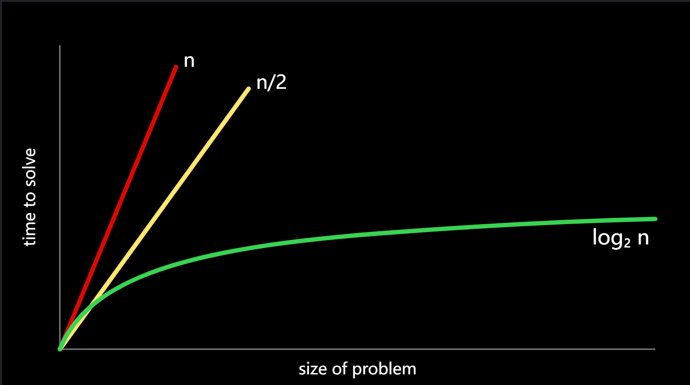

Lecture 3
=========

*   [Welcome!](about:blank#welcome)
*   [Linear Search](about:blank#linear-search)
*   [Binary Search](about:blank#binary-search)
*   [Running Time](about:blank#running-time)
*   [search.c](about:blank#searchc)
*   [phonebook.c](about:blank#phonebookc)
*   [Structs](about:blank#structs)
*   [Sorting and Selection Sort](about:blank#sorting-and-selection-sort)
*   [Bubble Sort](about:blank#bubble-sort)
*   [Recursion](about:blank#recursion)
*   [Merge Sort](about:blank#merge-sort)
*   [Summing Up](about:blank#summing-up)

Welcome!
--------

*   In week zero, we introduced the idea of an _algorithm_: A black box that may take an input and create an output.
*   This week, we are going to expand upon our understanding of algorithms through pseudocode and into code itself.
*   Also, we are going to consider the efficiency of these algorithms. Indeed, we are going to be building upon our understanding of how to use some of the concepts we discussed last week in building algorithms.
*   Consider the following graph:
    
    
    
*   Algorithms can be slow, having a high time and processing cost, or fast, having a low processing and time cost.
*   As we step into this week, you should consider how the way an algorithm works with a problem may determine the time it takes to solve a problem! Algorithms can be designed to be more and more efficient to a limit.
*   Today, we will focus on the design of algorithms and how to measure their efficiency.

Linear Search
-------------

*   Recall that last week, you were introduced to the idea of an _array_, blocks of memory that are consecutive: Side-by-side with one another.
*   You can metaphorically imagine an array like a series of seven red lockers as follows:
    
    <table role="img" aria-label="Array of 7 red boxes indexed 0 through 6" style="width:min(100%,420px);margin:0;margin-right:auto;border-collapse:collapse;"><tbody><tr><td style="background:#e10600;height:44px;"></td><td style="background:#e10600;height:44px;"></td><td style="background:#e10600;height:44px;"></td><td style="background:#e10600;height:44px;"></td><td style="background:#e10600;height:44px;"></td><td style="background:#e10600;height:44px;"></td><td style="background:#e10600;height:44px;"></td></tr><tr><td>[0]</td><td>[1]</td><td>[2]</td><td>[3]</td><td>[4]</td><td>[5]</td><td>[6]</td></tr></tbody></table>
    
*   The far-left position is called _location 0_ or _the beginning of the array_. The far-right position is _location 6_ or _the end of the array_.
*   We can imagine that we have an essential problem of wanting to know, “Is the number `50` inside an array?” A computer must look at each locker to be able to see if the number `50` is inside. We call this process of finding such a number, character, string, or other item _searching_.
*   We can potentially hand our array to an algorithm, wherein our algorithm will search through our lockers to see if the number `50` is behind one of the doors, returning the value `true` or `false`.
*   We can imagine various instructions we might provide our algorithm to undertake this task as follows:
    
    ```tex
    For each door from left to right
        If 50 is behind door
            Return true
    Return false
    
    ```
    
    Notice that the above instructions are called _pseudocode_: A human-readable version of the instructions that we could provide the computer.
    
*   A computer scientist could translate that pseudocode as follows:
    
    ```tex
    For i from 0 to n-1
        If 50 is behind doors[i]
            Return true
    Return false
    
    ```
    
    Notice that the above is still not code, but it is a pretty close approximation of what the final code might look like.
    

Binary Search
-------------

*   _Binary search_ is another _search algorithm_ that could be employed in our task of finding the `50`.
*   Assuming that the values within the lockers have been arranged from smallest to largest, the pseudocode for binary search would appear as follows:
    
    ```tex
    If no doors left
        Return false
    If 50 is behind middle door
        Return true
    Else if 50 < middle door
        Search left half
    Else if 50 > middle door
        Search right half
    ```
    
*   Using the nomenclature of code, we can further modify our algorithm as follows:
    
    ```tex
    If no doors left
        Return false
    If 50 is behind doors[middle]
        Return true
    Else if 50 < doors[middle]
        Search doors[0] through doors[middle - 1]
    Else if 50 > doors[middle]
        Search doors[middle + 1] through doors[n - 1]
    
    ```
    
    Notice that by looking at this approximation of code, you can nearly imagine what this might look like in actual code.
    

Running Time
------------

* You can consider how much time it takes an algorithm to solve a problem.

*   _Running time_ involves an analysis using _big O_ notation. Take a look at the following graph:
    
    
    
* Rather than being ultra-specific about the mathematical efficiency of an algorithm, computer scientists discuss efficiency in terms of _the order of_ various running times.

* In the above graph, the first algorithm is $\mathcal{O}(n)$or _in the order of n_. The second is in $\mathcal{O}(n)$ as well, in that constants are dropped in big O. The third is in $\mathcal{O}(log n)$.

*   It’s the shape of the curve that shows the efficiency of an algorithm. Some common running times we may see are:
	- [ ] $\mathcal{O}(n^2)$
	
	- [ ] $\mathcal{O}(n \log n)$
	
	- [ ] $\mathcal{O}(n)$
	
	- [ ] $\mathcal{O}(\log n)$
	
	- [ ] $\mathcal{O}(1)$
	
	  
	
* Of the running times above,$\mathcal{O}(n^2)$ is considered the slowest running time.$\mathcal{O}(1)$ is the fastest.

* Linear search was of order $\mathcal{O}(n)$ because it could take _n_ steps in the worst case to run.

* Binary search was of order $\mathcal{O}(\log n)$because it would take fewer and fewer steps to run, even in the worst case.

* Programmers are interested in both the worst case, or _upper bound_, and the best case, or _lower bound_.

* The **$\mathcal{Ω}$** symbol is used to denote the best case of an algorithm, such as $\mathcal{Ω}(n \log n)$。

* The **$\mathcal{Θ}$** symbol is used to denote where the upper bound and lower bound are the same: Where the best case and the worst case running times are the same.

* _Asymptotic notation_ is the measure of how well algorithms perform as the input gets larger and larger.

*   As you continue to develop your knowledge in computer science, you will explore these topics in more detail in future courses.

search.c
--------

*   You can implement linear search by typing `code search.c` in your terminal window and writing code as follows:
    
    ```c
    // Implements linear search for integers
    
    #include <cs50.h>
    #include <stdio.h>
    int main(void)
    {
        // An array of integers
        int numbers[] = {20, 500, 10, 5, 100, 1, 50};
    
        // Search for number
        int n = get_int("Number: ");
        for (int i = 0; i < 7; i++)
        {
            if (numbers[i] == n)
            {
                printf("Found\n");
                return 0;
            }
        }
        printf("Not found\n");
        return 1;
    }
    
    ```
    
    Notice that the line beginning with `int numbers[]` allows us to define the values of each element of the array as we create it. Then, in the `for` loop, we have an implementation of linear search. `return 0` is used to indicate success and exit the program. `return 1` is used to exit the program with an error (failure).
    
*   We have now implemented linear search ourselves in C!
*   What if we wanted to search for a string within an array? Modify your code as follows:
    
    ```c
    // Implements linear search for strings
    
    #include <cs50.h>
    #include <stdio.h>
    #include <string.h>
    int main(void)
    {
        // An array of strings
        string strings[] = {"battleship", "boot", "cannon", "iron", "thimble", "top hat"};
    
        // Search for string
        string s = get_string("String: ");
        for (int i = 0; i < 6; i++)
        {
            if (strcmp(strings[i], s) == 0)
            {
                printf("Found\n");
                return 0;
            }
        }
        printf("Not found\n");
        return 1;
    }
    
    ```
    
    Notice that we cannot utilize `==` as in our previous iteration of this program. Instead, we use `strcmp`, which comes from the `string.h` library. `strcmp` will return `0` if the strings are the same. Also, notice that the array length of `6` is hard-coded, which is not good programming practice.
    
*   Indeed, running this code allows us to iterate over this array of strings to see if a certain string is within it. However, if you see a _segmentation fault_, where a part of memory was touched by your program that it should not have access to, do make sure you have `i < 6` noted above instead of `i < 7`.
*   You can learn more about `strcmp` at the [CS50 Manual Pages](https://manual.cs50.io/3/strcmp).

phonebook.c
-----------

*   We can combine these ideas of both numbers and strings into a single program. Type `code phonebook.c` into your terminal window and write code as follows:
    
    ```c
    // Implements a phone book without structs
    
    #include <cs50.h>
    #include <stdio.h>
    #include <string.h>
    int main(void)
    {
        // Arrays of strings
        string names[] = {"Kelly", "David", "John"};
        string numbers[] = {"+1-617-495-1000", "+1-617-495-1000", "+1-949-468-2750"};
    
        // Search for name
        string name = get_string("Name: ");
        for (int i = 0; i < 3; i++)
        {
            if (strcmp(names[i], name) == 0)
            {
                printf("Found %s\n", numbers[i]);
                return 0;
            }
        }
        printf("Not found\n");
        return 1;
    }
    
    ```
    
    Notice that Kelly’s number begins with `+1-617`, David’s phone number starts with `+1-617`, and John’s number starts with `+1-949`. Therefore, `names[0]` is Kelly, and `numbers[0]` is Kelly’s number. This code will allow us to search the phonebook for a person’s specific number.
    
*   While this code works, there are numerous inefficiencies. Indeed, there is a chance that names and phone numbers may not correspond to one another. Wouldn’t it be nice if we could create our own data type where we could associate a person with their phone number?
    

Structs
-------

*   It turns out that C allows us to create our own data types via a `struct`.
*   Would it not be useful to create our own data type called a `person` that has inside of it a `name` and a `number`? Consider the following:
    
    ```c
    typedef struct
    {
        string name;
        string number;
    } person;
    
    ```
    
    Notice how this represents our own datatype called a `person` that has a string called `name` and another string called `number`.
    
*   We can improve our prior code by modifying our phonebook program as follows:
    
    ```c
    // Implements a phone book with structs
    
    #include <cs50.h>
    #include <stdio.h>
    #include <string.h>
    typedef struct
    {
        string name;
        string number;
    } person;
    
    int main(void)
    {
        person people[3];
    
        people[0].name = "Kelly";
        people[0].number = "+1-617-495-1000";
    
        people[1].name = "David";
        people[1].number = "+1-617-495-1000";
    
        people[2].name = "John";
        people[2].number = "+1-949-468-2750";
    
        // Search for name
        string name = get_string("Name: ");
        for (int i = 0; i < 3; i++)
        {
            if (strcmp(people[i].name, name) == 0)
            {
                printf("Found %s\n", people[i].number);
                return 0;
            }
        }
        printf("Not found\n");
        return 1;
    }
    
    ```
    
    Notice that the code begins with `typedef struct` where a new datatype called `person` is defined. Inside a `person` is a string called `name` and a `string` called `number`. In the `main` function, we begin by creating an array called `people` that is of type `person` that is of size 3. Then, we update the names and phone numbers of the three people in our `people` array. Most importantly, notice how the _dot notation_, such as `people[0].name`, allows us to access the `person` at the 0th location and assign that individual a name.
    

Sorting and Selection Sort
--------------------------

*   _Sorting_ is the act of taking an unsorted list of values and transforming this list into a sorted one.
*   When a list is sorted, searching that list is far less taxing on the computer. Recall that we can use binary search on a sorted list but not on an unsorted one.
*   It turns out that there are many different types of sorting algorithms.
*   _Selection sort_ is one such sorting algorithm.
*   We can represent an array as follows:
    
    <table role="img" aria-label="Seven red lockers side by side with the last labeled as n-1" style="width:min(100%,420px);margin:0;margin-right:auto;border-collapse:collapse;table-layout:fixed;"><colgroup><col span="7" style="width:14.2857%"></colgroup><tbody><tr><td style="background:#e10600;height:44px;"></td><td style="background:#e10600;height:44px;"></td><td style="background:#e10600;height:44px;"></td><td style="background:#e10600;height:44px;"></td><td style="background:#e10600;height:44px;"></td><td style="background:#e10600;height:44px;"></td><td style="background:#e10600;height:44px;"></td></tr><tr><td style="text-align:center;white-space:nowrap;">[0]</td><td style="text-align:center;white-space:nowrap;">[1]</td><td style="text-align:center;white-space:nowrap;">[2]</td><td style="text-align:center;white-space:nowrap;">[...]</td><td style="text-align:center;white-space:nowrap;">[n-3]</td><td style="text-align:center;white-space:nowrap;">[n-2]</td><td style="text-align:center;white-space:nowrap;">[n-1]</td></tr></tbody></table>
    
*   The algorithm for selection sort in pseudocode is:
    
    ```c
    For i from 0 to n–1
        Find smallest number between numbers[i] and numbers[n-1]
        Swap smallest number with numbers[i]
    
    ```
    
*   Summarizing those steps, the first time iterating through the list takes `n - 1` steps. The second time, it takes `n - 2` steps. Carrying this logic forward, the steps required could be represented as follows:
    
    ```c
    (n - 1) + (n - 2) + (n - 3) + ... + 1
    
    ```
    
*   This could be simplified to n(n-1)/2 or, more simply, $\mathcal{O}(n^2)$. In the worst case or upper bound, selection sort is in the order of $\mathcal{O}(n^2)$. In the best case or lower bound, selection sort is in the order of $\mathcal{O}(n^2)$.

Bubble Sort
-----------

*   _Bubble sort_ is another sorting algorithm that works by repeatedly swapping elements to “bubble” larger elements to the end.
*   The pseudocode for bubble sort is:
    
    ```tex
    Repeat n-1 times
        For i from 0 to n–2
            If numbers[i] and numbers[i+1] out of order
                Swap them
        If no swaps
            Quit
    
    ```
    
*   As we further sort the array, we know more and more of it becomes sorted, so we only need to look at the pairs of numbers that haven’t been sorted yet.
*   Bubble sort can be analyzed as follows:
    
    *   $((n - 1) * times (n - 1))$
    *   $(n^2 - n - n + 1)$
    *   $(n^2 - 2n + 1)$
    *   or, more simply$\mathcal{O}(n^2)$.
*   In the worst case or upper bound, bubble sort is in the order of $\mathcal{O}(n^2)$. In the best case or lower bound, bubble sort is in the order of $\mathcal{O}(n)$.
*   You can [visualize](https://www.cs.usfca.edu/~galles/visualization/ComparisonSort.html) a comparison of these algorithms.

Recursion
---------

*   How could we improve our efficiency in our sorting?
*   _Recursion_ is a concept within programming where a function calls itself. We saw this earlier when we saw…
    
    ```tex
    If no doors left
        Return false
    If number behind middle door
        Return true
    Else if number < middle door
        Search left half
    Else if number > middle door
        Search right half
    
    ```
    
    Notice that we are calling `search` on smaller and smaller iterations of this problem.
    
*   Similarly, in our pseudocode for Week 0, you can see where recursion was implemented:
    
    ```tex
    1  Pick up phone book
    2  Open to middle of phone book
    3  Look at page
    4  If person is on page
    5      Call person
    6  Else if person is earlier in book
    7      Open to middle of left half of book
    8      Go back to line 3
    9  Else if person is later in book
    10     Open to middle of right half of book
    11     Go back to line 3
    12 Else
    13     Quit
    
    ```
    
*   This code could have been simplified to highlight its recursive properties as follows:
    
    ```
    1  Pick up phone book
    2  Open to middle of phone book
    3  Look at page
    4  If person is on page
    5      Call person
    6  Else if person is earlier in book
    7      Search left half of book
    9  Else if person is later in book
    10     Search right half of book
    12 Else
    13     Quit
    
    ```
    
*   A _base case_ is defined as the condition that stops the recursion from continuing indefinitely, preventing infinite loops.
*   A _recursive case_ is defined as the part of the recursive function that calls itself with a modified input, moving toward the base case.
    
*   Consider how in Week 1 we wanted to create a pyramid structure as follows:
    
    ```
      #
      ##
      ###
      ####
    
    ```
    
*   Type `code iteration.c` into your terminal window and write code as follows:
    
    ```c
    // Draws a pyramid using iteration
    
    #include <cs50.h>
    #include <stdio.h>
    void draw(int n);
    
    int main(void)
    {
        // Get height of pyramid
        int height = get_int("Height: ");
    
        // Draw pyramid
        draw(height);
    }
    
    void draw(int n)
    {
        // Draw pyramid of height n
        for (int i = 0; i < n; i++)
        {
            for (int j = 0; j < i + 1; j++)
            {
                printf("#");
            }
            printf("\n");
        }
    }
    
    ```
    
    Notice that this code builds the pyramid by looping.
    
*   To implement this using recursion, type `code recursion.c` into your terminal window and write code as follows:
    
    ```c
    // Draws a pyramid using recursion
    
    #include <cs50.h>
    #include <stdio.h>
    void draw(int n);
    
    int main(void)
    {
        // Get height of pyramid
        int height = get_int("Height: ");
    
        // Draw pyramid
        draw(height);
    }
    
    void draw(int n)
    {
        // If nothing to draw
        if (n <= 0)
        {
            return;
        }
    
        // Draw pyramid of height n - 1
        draw(n - 1);
    
        // Draw one more row of width n
        for (int i = 0; i < n; i++)
        {
            printf("#");
        }
        printf("\n");
    }
    
    ```
    
    Notice the base case will ensure the code does not run forever. The line `if (n <= 0)` terminates the recursion because the problem has been solved. Every time `draw` calls itself, it calls itself with `n-1`. At some point, `n-1` will equal `0`, resulting in the `draw` function returning, and the program will end.
    

Merge Sort
----------

*   We can now leverage recursion in our quest for a more efficient sort algorithm and implement what is called _merge sort_, a very efficient sort algorithm.
*   The pseudocode for merge sort is quite short:
    
    ```
    If only one number
        Quit
    Else
        Sort left half of numbers
        Sort right half of numbers
        Merge sorted halves
    
    ```
    
*   Consider the following list of numbers:
    
    ```
      6341
    
    ```
    
*   First, merge sort asks, “Is this one number?” The answer is “no,” so the algorithm continues.
    
    ```
      6341
    
    ```
    
*   Second, merge sort will now split the numbers down the middle (or as close as it can get) and sort the left half of numbers.
    
    ```
      63|41
    
    ```
    
*   Third, merge sort would look at these numbers on the left and ask, “Is this one number?” Since the answer is no, it would then split the numbers on the left down the middle.
    
    ```
      6|3
    
    ```
    
*   Fourth, merge sort will again ask, “Is this one number?” The answer is yes this time! Therefore, it will quit this task and return to the last task it was running at this point:
    
    ```
      63|41
    
    ```
    
*   Fifth, merge sort will sort the numbers on the left.
    
    ```
      36|41
    
    ```
    
*   Now, we return to where we left off in the pseudocode now that the left side has been sorted. A similar process of steps 3-5 will occur with the right-hand numbers. This will result in:
    
    ```
      36|14
    
    ```
    
*   Both halves are now sorted. Finally, the algorithm will merge both sides. It will look at the first number on the left and the first number on the right. It will put the smaller number first, then the second smallest. The algorithm will repeat this for all numbers, resulting in:
    
    ```
      1346
    
    ```
    
*   Merge sort is complete, and the program quits.
*   Merge sort is a very efficient sort algorithm with a worst case of $\mathcal{O}(n \log n)$. The best case is still $\mathcal{Ω}(n \log n)$ because the algorithm still must visit each place in the list. Therefore, merge sort is also $\mathcal{Θ}(n \log n)$ since the best case and worst case are the same.
*   A final [visualization](https://www.youtube.com/watch?v=ZZuD6iUe3Pc) was shared.

Summing Up
----------

In this lesson, you learned about algorithmic thinking and building your own data types. Specifically, you learned…

*   Algorithms.
*   Big _O_ notation.
*   Binary search and linear search.
*   Various sort algorithms, including bubble sort, selection sort, and merge sort.
*   Recursion.

See you next time!

  

本文转自 [https://cs50.harvard.edu/x/notes/3/](https://cs50.harvard.edu/x/notes/3/)，如有侵权，请联系删除。