Lecture 5
=========

*   [Welcome!](about:blank#welcome)
*   [Jack Learns the Facts](about:blank#jack-learns-the-facts)
*   [Data Structures](about:blank#data-structures)
*   [Queues](about:blank#queues)
*   [Stacks](about:blank#stacks)
*   [Arrays](about:blank#arrays)
*   [Linked Lists](about:blank#linked-lists)
*   [Trees](about:blank#trees)
*   [Hashing and Hash Tables](about:blank#hashing-and-hash-tables)
*   [Tries](about:blank#tries)
*   [Summing Up](about:blank#summing-up)

Welcome!
--------

*   Prior weeks of the course presented you with the fundamental building blocks of programming.
*   All you have learned in C will enable you to implement these building blocks in higher-level programming languages such as Python.
*   Each week, concepts have become more and more challenging, like a hill becoming steeper and steeper. This week, the challenge evens off as we explore data structures.
*   To date, you have learned about how an array can organize data in memory.
*   Today, we are going to talk about organizing data in memory and design possibilities that emerge from your growing knowledge.

Jack Learns the Facts
---------------------

*   We watched a video called [Jack Learns the Facts](https://www.youtube.com/watch?v=ItAG3s6KIEI) by Professor Shannon Duvall of Elon University.

Data Structures
---------------

*   _Data structures_ essentially are forms of organization in memory.
*   There are many ways to organize data in memory.
*   _Abstract data types_ are those that we can conceptually imagine. When learning about computer science, it’s often useful to begin with these conceptual data structures. Learning these will make it easier later to understand how to implement more concrete data structures.

Queues
------

*   _Queues_ are one form of abstract data structure.
*   Queues have specific properties. Namely, they are _FIFO_ or “first in first out.” You can imagine yourself in a line for a ride at an amusement park. The first person in the line gets to go on the ride first. The last person gets to go on the ride last.
*   Queues have specific actions associated with them. For example, an item can be _enqueued_; that is, the item can join the line or queue. Further, an item can be _dequeued_ or leave the queue once it reaches the front of the line.
*   In code, you can imagine a queue as follows:
    
    ```
    const int CAPACITY = 50;
    
    typedef struct
    {
        person people[CAPACITY];
        int size;
    }
    queue;
    
    ```
    
    Notice that an array called `people` is of type `person`. The `CAPACITY` is how high the queue could be. The integer `size` is how full the queue actually is, regardless of how much it _can_ hold.
    

Stacks
------

*   Queues contrast with a _stack_. Fundamentally, the properties of a stack are different from those of a queue. Specifically, it is _LIFO_ or “last in first out.” Just like stacking trays in a dining hall, a tray that is placed in a stack last is the first that may be picked up.
*   Stacks have specific actions associated with them. For example, _push_ places something on top of a stack. _Pop_ is removing something from the top of the stack.
*   In code, you might imagine a stack as follows:
    
    ```
    const int CAPACITY = 50;
    
    typedef struct
    {
        person people[CAPACITY];
        int size;
    }
    stack;
    
    ```
    
    Notice that an array called `people` is of type `person`. The `CAPACITY` is how high the stack could be. The integer `size` is how full the stack actually is, regardless of how much it _could_ hold. Notice that this code is the same as the code from the queue.
    
*   You might imagine that the above code has a limitation since the capacity of the array is always predetermined in this code. Therefore, the stack may always be oversized. You might imagine only using one place in the stack out of 5000.
*   It would be nice for our stack to be dynamic – able to grow as items are added to it.

Arrays
------

*   Rewinding to Week 2, we introduced you to your first data structure.
*   An array is a block of contiguous memory.
*   You might imagine an array as follows:
    
    
    
*   In your terminal, type `code list.c` and write code as follows:
    
    ```c
    // Implements a list of numbers with an array of fixed size
    
    #include <stdio.h>
    int main(void)
    {
        // List of size 3
        int list[3];
    
        // Initialize list with numbers
        list[0] = 1;
        list[1] = 2;
        list[2] = 3;
    
        // Print list
        for (int i = 0; i < 3; i++)
        {
            printf("%i\n", list[i]);
        }
    }
    
    ```
    
    Notice that the above is very much like what we learned earlier in this course. Memory is preallocated for three items. You can download this code [here](https://cdn.cs50.net/2025/fall/lectures/5/src5/list0.c?download).
    
*   Wouldn’t it be nice if we were able to put the `4` somewhere else in memory? By definition, this would no longer be an array because `4` would no longer be in contiguous memory. How could we connect different locations in memory?
*   In memory, there are other values being stored by other programs, functions, and variables. Many of these may be unused garbage values that were utilized at one point but are available now for use.
    
    
    
*   Imagine you wanted to store a fourth value `4` in our array. What would be needed would be to allocate a new area of memory and move the old array to a new one. Initially, this new area of memory would be populated with garbage values.
    
    
    
*   As values are added to this new area of memory, old garbage values would be overwritten.
    
    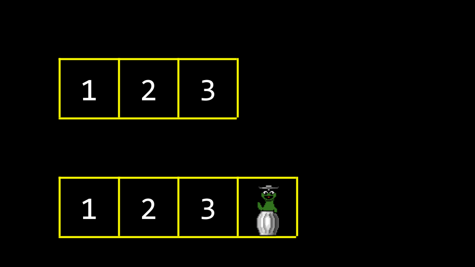
    
*   Eventually, all old garbage values would be overwritten with our new data.
    
    
    
*   One of the drawbacks of this approach is that it’s bad design: Every time we add a number, we have to copy the array item by item.
*   Building upon our knowledge obtained more recently, we can leverage our understanding of pointers to create a better design in this code. Modify your code as follows:
    
    ```c
    // Implements a list of numbers with an array of dynamic size
    
    #include <stdio.h>
    #include <stdlib.h>
    int main(void)
    {
        // List of size 3
        int *list = malloc(3 * sizeof(int));
        if (list == NULL)
        {
            return 1;
        }
    
        // Initialize list of size 3 with numbers
        list[0] = 1;
        list[1] = 2;
        list[2] = 3;
    
        // List of size 4
        int *tmp = malloc(4 * sizeof(int));
        if (tmp == NULL)
        {
            free(list);
            return 1;
        }
    
        // Copy list of size 3 into list of size 4
        for (int i = 0; i < 3; i++)
        {
            tmp[i] = list[i];
        }
    
        // Add number to list of size 4
        tmp[3] = 4;
    
        // Free list of size 3
        free(list);
    
        // Remember list of size 4
        list = tmp;
    
        // Print list
        for (int i = 0; i < 4; i++)
        {
            printf("%i\n", list[i]);
        }
    
        // Free list
        free(list);
        return 0;
    }
    
    ```
    
    Notice that a list of size three integers is created. Then, three memory addresses can be assigned the values `1`, `2`, and `3`. Then, a list of size four is created. Next, the list is copied from the first to the second. The value for the `4` is added to the `tmp` list. Since the block of memory that `list` points to is no longer used, it is freed using the command `free(list)`. Finally, the `list` pointer is now told to point to the block of memory that `tmp` points to. The contents of `list` are printed and then freed. Further, notice the inclusion of `stdlib.h`. You can download this code [here](https://cdn.cs50.net/2025/fall/lectures/5/src5/list1.c?download).
    
*   It’s useful to think about `list` and `tmp` as both signs that point to a chunk of memory. As in the example above, `list` at one point _pointed_ to an array of size 3. By the end, `list` was told to point to a chunk of memory of size 4. Technically, by the end of the above code, `tmp` and `list` both pointed to the same block of memory.
*   One way by which we can copy the array without a for loop is by using `realloc`:
    
    ```
    // Implements a list of numbers with an array of dynamic size using realloc
    
    #include <stdio.h>
    #include <stdlib.h>
    int main(void)
    {
        // List of size 3
        int *list = malloc(3 * sizeof(int));
        if (list == NULL)
        {
            return 1;
        }
    
        // Initialize list of size 3 with numbers
        list[0] = 1;
        list[1] = 2;
        list[2] = 3;
    
        // Resize list to be of size 4
        int *tmp = realloc(list, 4 * sizeof(int));
        if (tmp == NULL)
        {
            free(list);
            return 1;
        }
        list = tmp;
    
        // Add number to list
        list[3] = 4;
    
        // Print list
        for (int i = 0; i < 4; i++)
        {
            printf("%i\n", list[i]);
        }
    
        // Free list
        free(list);
        return 0;
    }
    
    ```
    
    Notice that the list is reallocated to a new array via `realloc`. You can download this code [here](https://cdn.cs50.net/2025/fall/lectures/5/src5/list2.c?download).
    
*   One may be tempted to allocate way more memory than required for the list, such as 30 items instead of the required 3 or 4. However, this is bad design as it taxes system resources when they are not potentially needed. Further, there is little guarantee that memory for more than 30 items will be needed eventually.

Linked Lists
------------

*   In recent weeks, you have learned about three useful primitives. A `struct` is a data type that you can define yourself. A `.` in _dot notation_ allows you to access variables inside that structure. The `*` operator is used to declare a pointer or dereference a variable.
*   Today, you are introduced to the `->` operator. It is an arrow. This operator goes to an address and looks inside a structure.
*   A _linked list_ is one of the most powerful data structures within C. A linked list allows you to include values that are located in varying areas of memory. Further, they allow you to dynamically grow and shrink the list as you desire.
*   You might imagine three values stored in three different areas of memory as follows:
    
    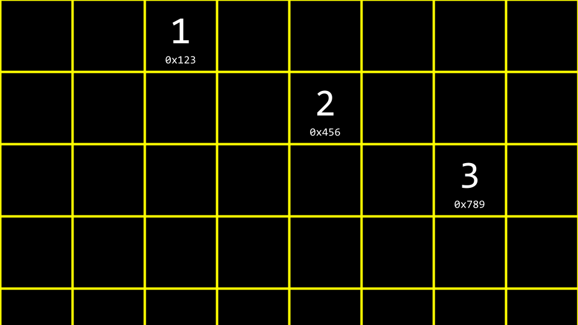
    
*   How could one stitch together these values in a list?
*   We could imagine the data pictured above as follows:
    
    
    
*   We could utilize more memory to keep track of where the next item is using a pointer.
    
    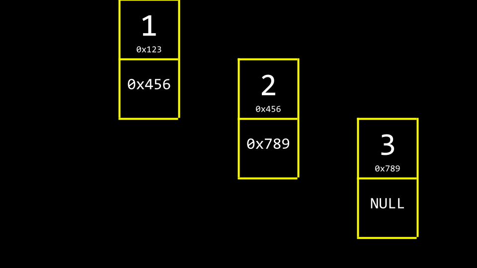
    
    Notice that NULL is utilized to indicate that nothing else is _next_ in the list.
    
*   By convention, we would keep one more element in memory, a pointer, that keeps track of the first item in the list, called the _head_ of the list.
    
    
    
*   Abstracting away the memory addresses, the list would appear as follows:
    
    
    
*   These boxes are called _nodes_. A _node_ contains both an _item_ and a pointer called _next_. In code, you can imagine a node as follows:
    
    ```
    typedef struct node
    {
        int number;
        struct node *next;
    }
    node;
    
    ```
    
    Notice that the item contained within this node is an integer called `number`. Second, a pointer to a node called `next` is included, which will point to another node somewhere in memory.
    
*   We can recreate `list.c` to utilize a linked list:
    
    ```
    // Start to build a linked list by prepending nodes
    
    #include <cs50.h>
    #include <stdio.h>
    #include <stdlib.h>
    typedef struct node
    {
        int number;
        struct node *next;
    } node;
    
    int main(void)
    {
        // Memory for numbers
        node *list = NULL;
    
        // Build list
        for (int i = 0; i < 3; i++)
        {
            // Allocate node for number
            node *n = malloc(sizeof(node));
            if (n == NULL)
            {
                return 1;
            }
            n->number = get_int("Number: ");
            n->next = NULL;
    
            // Prepend node to list
            n->next = list;
            list = n;
        }
        return 0;
    }
    
    ```
    
    First, a `node` is defined as a `struct`. For each element of the list, memory for a `node` is allocated via `malloc` to the size of a node. `n->number` (or `n`’s number field) is assigned an integer. `n->next` (or `n`’s next field) is assigned `NULL`. Then, the node is placed at the start of the list at memory location `list`. You can download this code [here](https://cdn.cs50.net/2025/fall/lectures/5/src5/list3.c?download).
    
*   Conceptually, we can imagine the process of creating a linked list. First, `node *list` is declared, but it has a garbage value.
    
    
    
*   Next, a node called `n` is allocated in memory.
    
    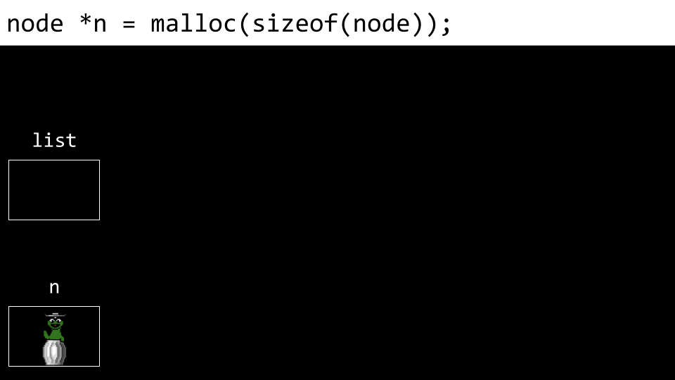
    
*   Next, the `number` of the node is assigned the value `1`.
    
    
    
*   Next, the node’s `next` field is assigned `NULL`.
    
    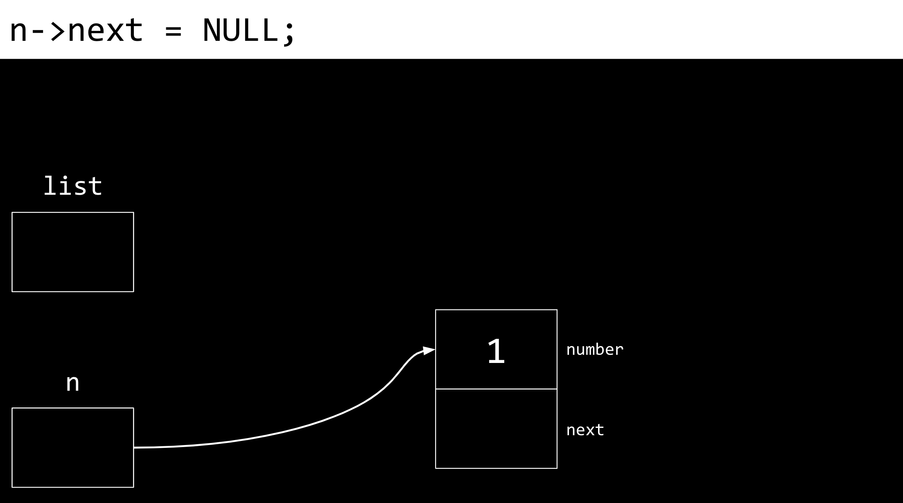
    
*   Next, `list` is pointed at the memory location to where `n` points. `n` and `list` now point to the same place.
    
    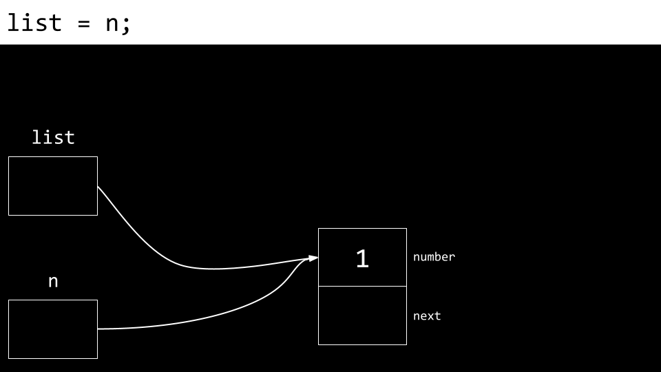
    
*   A new node is then created. Both the `number` and `next` fields are filled with garbage values.
    
    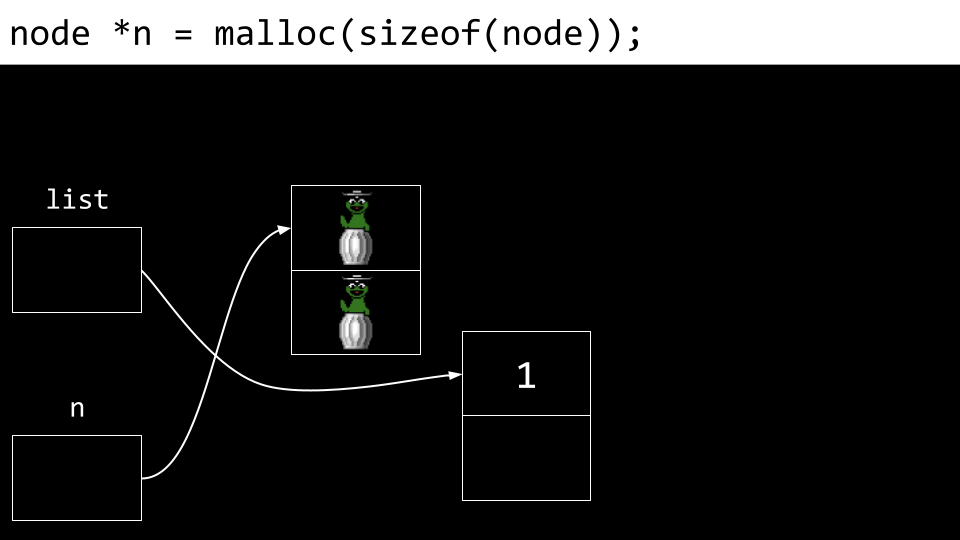
    
*   The `number` value of `n`’s node (the new node) is updated to `2`.
    
    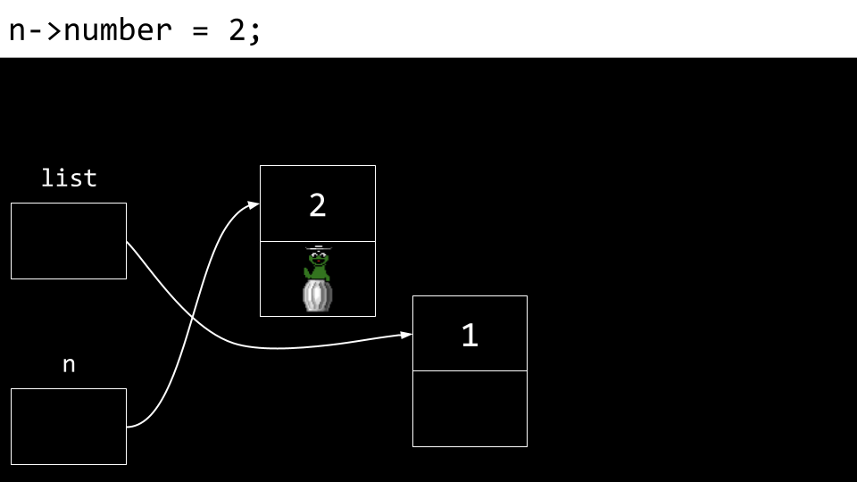
    
*   Also, the `next` field is updated as well.
    
    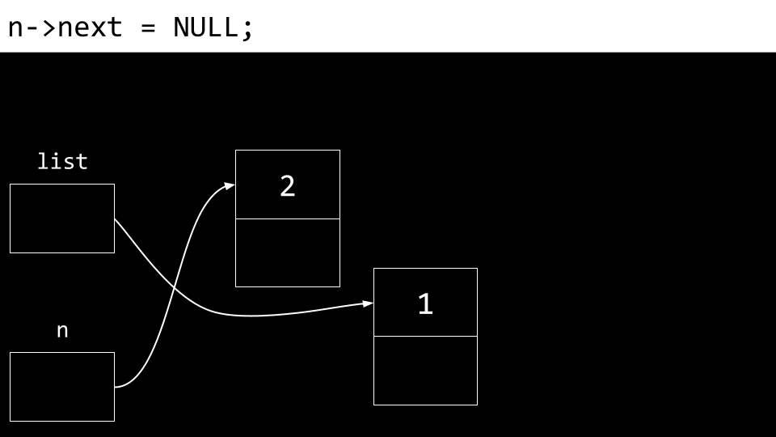
    
*   Most importantly, we do not want to lose our connection to any of these nodes lest they be lost forever. Accordingly, `n`’s `next` field is pointed to the same memory location as `list`.
    
    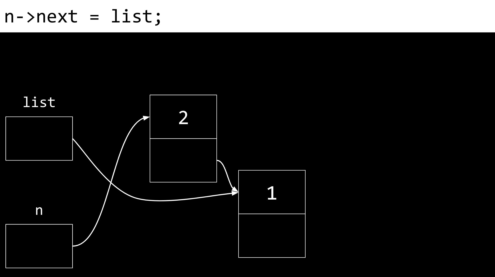
    
*   Finally, `list` is updated to point at `n`. We now have a linked list of two items.
    
    
    
*   Looking at our diagram of the list, we can see that the last number added is the first number that appears in the list. Accordingly, if we print the list in order, starting with the first node, the list will appear out of order.
*   We can print the list in the correct order as follows:
    
    ```
    // Print nodes in a linked list with a while loop
    
    #include <cs50.h>
    #include <stdio.h>
    #include <stdlib.h>
    typedef struct node
    {
        int number;
        struct node *next;
    } node;
    
    int main(void)
    {
        // Memory for numbers
        node *list = NULL;
    
        // Build list
        for (int i = 0; i < 3; i++)
        {
            // Allocate node for number
            node *n = malloc(sizeof(node));
            if (n == NULL)
            {
                return 1;
            }
            n->number = get_int("Number: ");
            n->next = NULL;
    
            // Prepend node to list
            n->next = list;
            list = n;
        }
    
        // Print numbers
        node *ptr = list;
        while (ptr != NULL)
        {
            printf("%i\n", ptr->number);
            ptr = ptr->next;
        }
        return 0;
    }
    
    ```
    
    Notice that `node *ptr = list` creates a temporary variable that points at the same spot that `list` points to. The `while` loop prints what the node `ptr` points to, and then updates `ptr` to point to the `next` node in the list. You can download this code [here](https://cdn.cs50.net/2025/fall/lectures/5/src5/list4.c?download).
    
*   In this example, inserting into the list is always in the order of \\(O(1)\\), as it only takes a very small number of steps to insert at the front of a list.
*   Considering the amount of time required to search this list, it is in the order of \\(O(n)\\), because in the worst case the entire list must always be searched to find an item. The time complexity for adding a new element to the list will depend on where that element is added. This is illustrated in the examples below.
*   Linked lists are not stored in a contiguous block of memory. They can grow as large as you wish, provided that enough system resources exist. The downside, however, is that more memory is required to keep track of the list instead of an array. For each element you must store not just the value of the element, but also a pointer to the next node. Further, linked lists cannot be indexed into like is possible in an array because we need to pass through the first \\(n - 1\\) elements to find the location of the \\(n\\)th element. Because of this, the list pictured above must be linearly searched. Binary search, therefore, is not possible in a list constructed as above.
*   Further, you could place numbers at the end of the list as illustrated in this code:
    
    ```
    // Appends numbers to a link list
    
    #include <cs50.h>
    #include <stdio.h>
    #include <stdlib.h>
    typedef struct node
    {
        int number;
        struct node *next;
    } node;
    
    int main(void)
    {
        // Memory for numbers
        node *list = NULL;
    
        // Build list
        for (int i = 0; i < 3; i++)
        {
            // Allocate node for number
            node *n = malloc(sizeof(node));
            if (n == NULL)
            {
                return 1;
            }
            n->number = get_int("Number: ");
            n->next = NULL;
    
            // If list is empty
            if (list == NULL)
            {
                // This node is the whole list
                list = n;
            }
    
            // If list has numbers already
            else
            {
                // Iterate over nodes in list
                for (node *ptr = list; ptr != NULL; ptr = ptr->next)
                {
                    // If at end of list
                    if (ptr->next == NULL)
                    {
                        // Append node
                        ptr->next = n;
                        break;
                    }
                }
            }
        }
    
        // Print numbers
        for (node *ptr = list; ptr != NULL; ptr = ptr->next)
        {
            printf("%i\n", ptr->number);
        }
    
        // Free memory
        node *ptr = list;
        while (ptr != NULL)
        {
            node *next = ptr->next;
            free(ptr);
            ptr = next;
        }
        return 0;
    }
    
    ```
    
    Notice how this code _walks down_ this list to find the end. When appending an element (adding to the end of the list) our code will run in \\(O(n)\\), as we have to go through our entire list before we can add the final element. Further, notice that a temporary variable called `next` is used to track `ptr->next`. You can download this code [here](https://cdn.cs50.net/2025/fall/lectures/5/src5/list7.c?download).
    
*   Further, you could sort your list as items are added:
    
    ```
    // Implements a sorted linked list of numbers
    
    #include <cs50.h>
    #include <stdio.h>
    #include <stdlib.h>
    typedef struct node
    {
        int number;
        struct node *next;
    } node;
    
    int main(void)
    {
        // Memory for numbers
        node *list = NULL;
    
        // Build list
        for (int i = 0; i < 3; i++)
        {
            // Allocate node for number
            node *n = malloc(sizeof(node));
            if (n == NULL)
            {
                return 1;
            }
            n->number = get_int("Number: ");
            n->next = NULL;
    
            // If list is empty
            if (list == NULL)
            {
                list = n;
            }
    
            // If number belongs at beginning of list
            else if (n->number < list->number)
            {
                n->next = list;
                list = n; 
            }
    
            // If number belongs later in list
            else
            {
                // Iterate over nodes in list
                for (node *ptr = list; ptr != NULL; ptr = ptr->next)
                {
                    // If at end of list
                    if (ptr->next == NULL)
                    {
                        // Append node
                        ptr->next = n;
                        break;
                    }
    
                    // If in middle of list
                    if (n->number < ptr->next->number)
                    {
                        n->next = ptr->next;
                        ptr->next = n;
                        break;
                    }
                }
            }
        }
    
        // Print numbers
        for (node *ptr = list; ptr != NULL; ptr = ptr->next)
        {
            printf("%i\n", ptr->number);
        }
    
        // Free memory
        node *ptr = list;
        while (ptr != NULL)
        {
            node *next = ptr->next;
            free(ptr);
            ptr = next;
        }
        return 0;
    }
    
    ```
    
    Notice how this list is sorted as it is built. To insert an element in this specific order, our code will still run in \\(O(n)\\) for each insertion, as in the worst case we will have to look through all current elements. You can download this code [here](https://cdn.cs50.net/2025/fall/lectures/5/src5/list8.c?download).
    
*   As a final flourish, one could create a function by which to unload the linked list:
    
    ```
    // Frees memory in cases of error too
    
    #include <cs50.h>
    #include <stdio.h>
    #include <stdlib.h>
    typedef struct node
    {
        int number;
        struct node *next;
    } node;
    
    void unload(node *list);
    
    int main(void)
    {
        // Memory for numbers
        node *list = NULL;
    
        // Build list
        for (int i = 0; i < 3; i++)
        {
            // Allocate node for number
            node *n = malloc(sizeof(node));
            if (n == NULL)
            {
                unload(list);
                return 1;
            }
            n->number = get_int("Number: ");
            n->next = NULL;
    
            // If list is empty
            if (list == NULL)
            {
                list = n;
            }
    
            // If number belongs at beginning of list
            else if (n->number < list->number)
            {
                n->next = list;
                list = n; 
            }
    
            // If number belongs later in list
            else
            {
                // Iterate over nodes in list
                for (node *ptr = list; ptr != NULL; ptr = ptr->next)
                {
                    // If at end of list
                    if (ptr->next == NULL)
                    {
                        // Append node
                        ptr->next = n;
                        break;
                    }
    
                    // If in middle of list
                    if (n->number < ptr->next->number)
                    {
                        n->next = ptr->next;
                        ptr->next = n;
                        break;
                    }
                }
            }
        }
    
        // Print numbers
        for (node *ptr = list; ptr != NULL; ptr = ptr->next)
        {
            printf("%i\n", ptr->number);
        }
    
        // Free memory
        unload(list);
        return 0;
    }
    
    void unload(node *list)
    {
        node *ptr = list;
        while (ptr != NULL)
        {
            node *next = ptr->next;
            free(ptr);
            ptr = next;
        }
    }
    
    ```
    
    Notice that the `unload` function frees the entire list. You can download this code [here](https://cdn.cs50.net/2025/fall/lectures/5/src5/list9.c?download).
    
*   This code may seem complicated. However, notice that with pointers and the syntax above, we can stitch data together in different places in memory.

Trees
-----

*   Arrays offer contiguous memory that can be searched quickly. Arrays also offer the opportunity to engage in binary search.
*   Could we combine the best of both arrays and linked lists?
*   _Binary search trees_ are another data structure that can be used to store data more efficiently so that it can be searched and retrieved.
*   You can imagine a sorted sequence of numbers.
    
    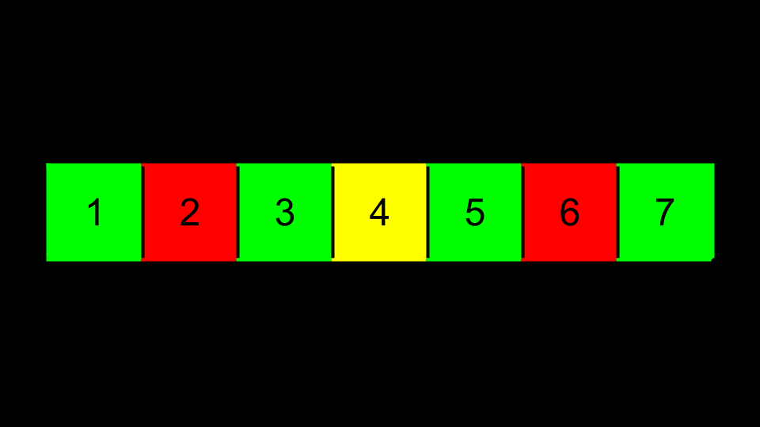
    
*   Imagine then that the center value becomes the top of a tree. Those that are less than this value are placed to the left. Values greater than this are placed to the right.
    
    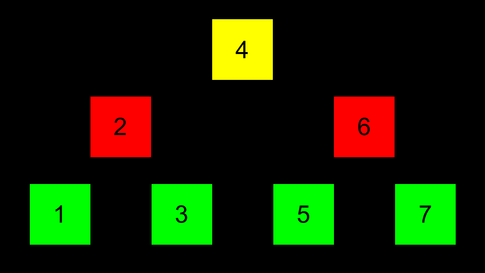
    
*   Pointers can then be used to point to the correct location of each area of memory such that each of these nodes can be connected.
    
    
    
*   In code, searching such a tree could be implemented as follows:
    
    ```
    bool search(node *tree, int number)
    {
        if (tree == NULL)
        {
            return false;
        }
        else if (number < tree->number)
        {
            return search(tree->left, number);
        }
        else if (number > tree->number)
        {
            return search(tree->right, number);
        }
        else if (number == tree->number)
        {
            return true;
        }
    }
    
    ```
    
    Notice how this search function recursively searches the tree. If the searched number is less than the current node’s number, it searches the left subtree. If greater, it searches the right subtree. This recursive approach allows for efficient searching with a time complexity of O(log n) when the tree is balanced.
    
*   A tree offers dynamism that an array does not offer. It can grow and shrink as we wish.
*   Further, this structure offers a search time of \\(O(log n)\\) when the tree is balanced.

Hashing and Hash Tables
-----------------------

*   The _holy grail_ of algorithmic time complexity is \\(O(1)\\) or _constant time_. That is, the ultimate is for access to be instantaneous.
    
    
    
*   _Hashing_ is the idea of taking a value and being able to output a value that becomes a shortcut to it later.
*   For example, hashing _apple_ may hash as a value of `1`, and _berry_ may be hashed as `2`. Therefore, finding _apple_ is as easy as asking the _hash_ algorithm where _apple_ is stored. While not ideal in terms of design, ultimately, putting all _a_’s in one bucket and _b_’s in another, this concept of _bucketizing_ hashed values illustrates how you can use this concept: a hashed value can be used to shortcut finding such a value.
*   A _hash function_ is an algorithm that reduces a larger value to something small and predictable. Generally, this function takes in an item you wish to add to your hash table, and returns an integer representing the array index in which the item should be placed.
*   A _hash table_ is a fantastic combination of both arrays and linked lists. When implemented in code, a hash table is an _array_ of _pointers_ to _node_s.
*   A hash table could be imagined as follows:
    
    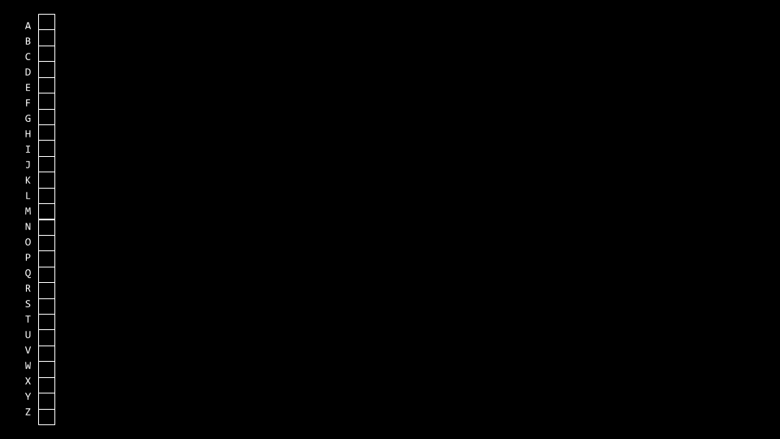
    
    Notice that this is an array that is assigned each value of the alphabet.
    
*   Then, at each location of the array, a linked list is used to track each value being stored there:
    
    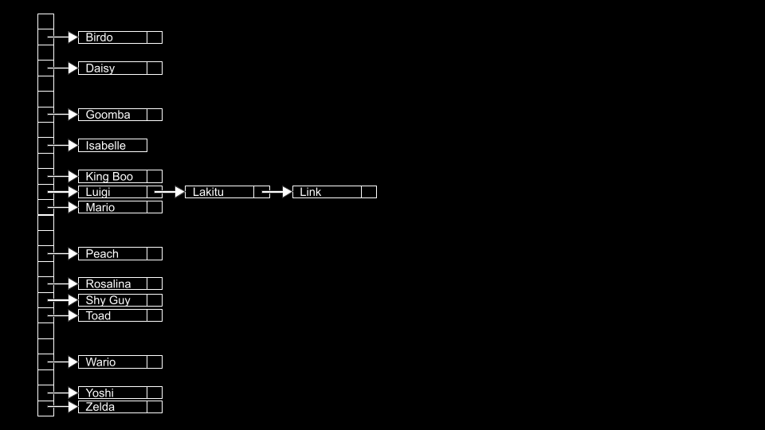
    
*   _Collisions_ are when you add values to the hash table, and something already exists at the hashed location. In the above, collisions are simply appended to the end of the list.
*   Collisions can be reduced by better programming your hash table and hash algorithm. You can imagine an improvement upon the above as follows:
    
    
    
*   Consider the following example of a hash algorithm:
    
    
    
*   This could be implemented in code as follows:
    
    ```
    #include <ctype.h>
    unsigned int hash(const char *word)
    {
        return toupper(word[0]) - 'A';
    }
    
    
    ```
    
    Notice how the hash function returns the value of `toupper(word[0]) - 'A'`.
    
*   You, as the programmer, have to make a decision about the advantages of using more memory to have a large hash table and potentially reducing search time or using less memory and potentially increasing search time.
*   This structure offers a search time of \\(O(n)\\).

Tries
-----

*   _Tries_ are another form of data structure. Tries are trees of arrays.
*   _Tries_ are always searchable in constant time.
*   One downside to _Tries_ is that they tend to take up a large amount of memory. Notice that we need \\(26 \\times 4 = 104\\) nodes just to store _Toad_!
*   _Toad_ would be stored as follows:
    
    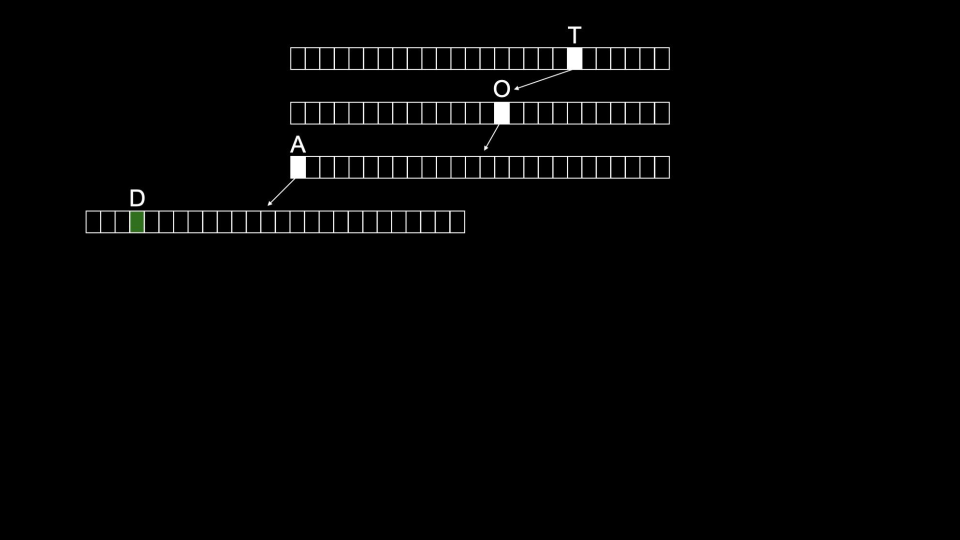
    
*   _Tom_ would then be stored as follows:
    
    
    
*   This structure offers a search time of \\(O(1)\\).
*   The downside of this structure is how many resources are required to use it.

Summing Up
----------

In this lesson, you learned about using pointers to build new data structures. Specifically, we delved into…

*   Data structures
*   Stacks and queues
*   Linked lists
*   Hashing and Hash Tables
*   Tries

See you next time!

  

本文转自 [./week_5_note_English.assets/x/notes/5/](./week_5_note_English.assets/x/notes/5/)，如有侵权，请联系删除。