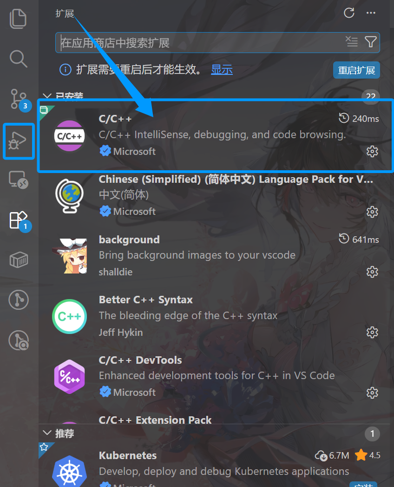
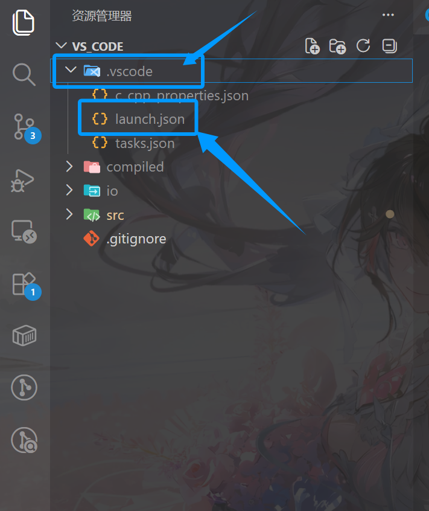
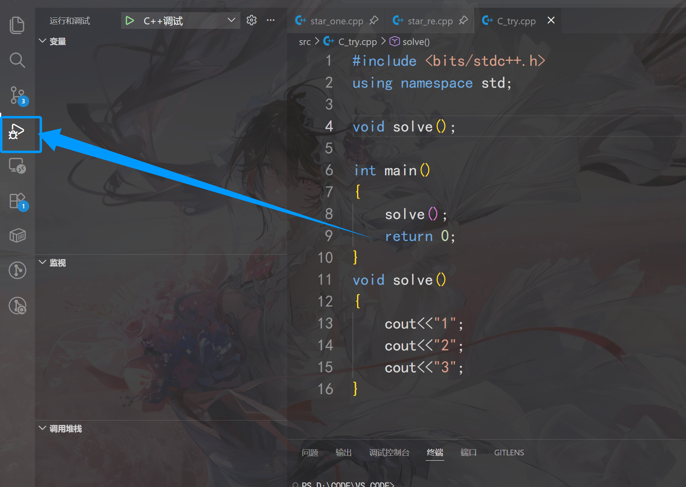

# week_2

## 调试

我使用的是**VSCode**,如果是**Visual Studio**它有自带的。

我们以C/C++为示例。

### 流程

1. **安装对应语言的调试扩展** VSCode默认仅内置了JavaScript/TypeScript的调试支持，其他语言需要先安装对应的扩展：

   - C/C++：安装C/C++扩展包

   

2. 打开目录中的**.vscode**创建配置文件**launch.json**

   

   ```json
   {
     "version": "0.2.0",
     "configurations": [
       {
         "name": "C++调试",
         "type": "cppdbg",
         "request": "launch",
         // exe生成在src文件夹下，所以路径要加上src
         "program": "${workspaceFolder}/src/${fileBasenameNoExtension}.exe",
         "args": [],
         "cwd": "${workspaceFolder}",
         "externalConsole": false, // 用VSCode内置终端输出，改成true会弹出独立黑框
         "MIMode": "gdb",
         "preLaunchTask": "C/C++: g++.exe 生成活动文件" // 和tasks.json的任务名对应，保证调试前自动编译最新代码
       }
     ]
   }
   ```

3. 设置**断点**，然后点击debug图标就行




