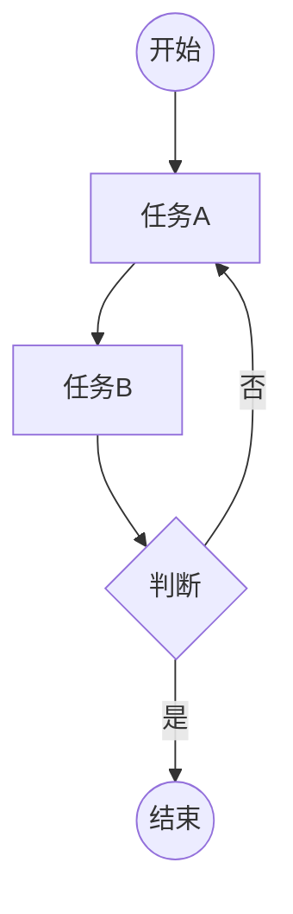
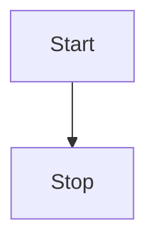
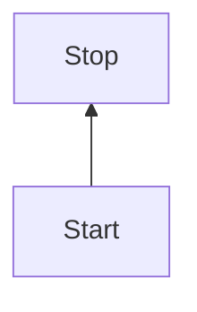
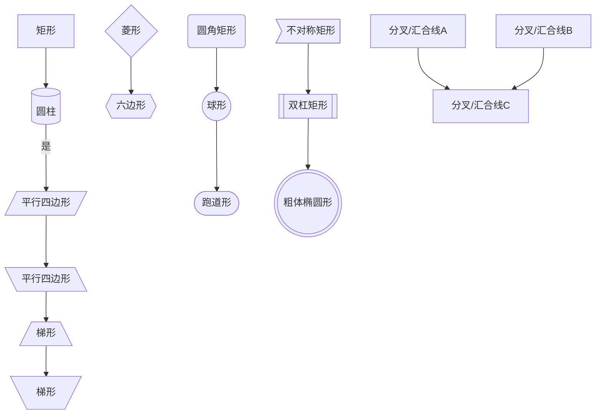

## 示例

可以使用以下文本来制作一份流程图

```tex




**结果如下**


----


## 流程图的符号

| 符号名称                | 图形表示                 | 核心用途                                       | 补充说明                                                     |
| :---------------------- | :----------------------- | :--------------------------------------------- | :----------------------------------------------------------- |
| **起止符**              | 圆角矩形/跑道形/椭圆形   | 表示流程的**开始**或**结束**                   | 通常在一个流程图中，**开始符号只能有一个**，结束符号可以有多个。内部一般标注“开始”或“结束”。 |
| **处理/过程符**         | **矩形**                 | 表示一个具体的**操作步骤或处理过程**           | 这是流程图中最常用、出现频率最高的符号。                     |
| **判断/决策符**         | **菱形**                 | 表示需要做出**决策或判断**的分支节点           | 通常有一个入口，至少两个出口。                               |
| **输入/输出符**         | **平行四边形**           | 表示数据的**输入**或**输出**                   | 可以泛指任何类型的I/O操作。                                  |
| **流程线**              | **带箭头的线**           | 表示各步骤之间的**顺序和流向**                 | 箭头方向至关重要，标准流向是**从上到下，从左到右**。         |
| **连接符**              | **圆形**                 | 用于**避免流程线过长或交叉**                   | 相同标识（如字母或数字）的连接符表示流程在此处衔接。**必须成对出现**，不能只有一个。 |
| **注释符**              | 括号或虚线矩形           | 对某个步骤进行**补充说明**                     | 它只起解释作用，**不是流程的逻辑环节**，不影响流程走向。     |
| **子流程/预定义过程符** | 矩形左右两边为双竖线     | 表示一个**已经定义好或在别处展开的详细子流程** | 用于简化主流程图，使逻辑更清晰。例如，在“订单处理”主流程中，“验证支付”可作为一个子流程符号。 |
| **并行符**              | 双杠矩形或分叉/汇合线    | 表示**多个可以同时进行的步骤**                 | 常用于描述可以并发处理的任务，之后再进行汇合，能有效节省总流程时间。 |
| **延迟符**              | 圆角矩形带波浪线或沙漏形 | 表示流程中的**等待状态**                       | 明确标注出非人为操作的时间间隔，如“等待客户确认”、“等待系统响应”。 |
| **终止符**              | 粗体椭圆形               | 表示流程**异常或强制终止**                     | 与正常的结束符区分，用于标识因错误、拒绝等原因导致流程无法正常完成的情况。 |


----
## 格式

```tex 
```mermaid
graph 方向
	id
```


-----


## 布局方向


| 方向标识  | 含义                      | 说明                               |
| :-------- | :------------------------ | :--------------------------------- |
| **TB/TD** | 从上到下（Top to Bottom） | 节点按从上到下的顺序排列，最常用。 |
| **BT**    | 从下到上（Bottom to Top） | 节点按从下到上的顺序排列。         |
| **LR**    | 从左到右（Left to Right） | 节点按从左到右的顺序排列。         |
| **RL**    | 从右到左（Right to Left） | 节点按从右到左的顺序排列。         |

> 注意：用大写英文字母表示方向

### 方向朝下(TB/TD)（from **T**op to **B**ottom）

**源码**

```tex
graph TB
    Start --> Stop
```

**效果**




### 方向朝上（BT）(from **B**ottom to **T**op)

**源码**
```tex
graph BT
    Start --> Stop
```

**效果**


### 方向朝右（LR）( from **L**eft to **R**ight)

**源码**
```tex
graph LR
    Start --> Stop
```

**效果**


### 方向朝左（RL）(**R**ight to **L**eft)

**源码**
```tex
graph RL
    Start --> Stop
```

**效果**


----


## 节点形状

```tex





----


## 连接线

```tex

```


