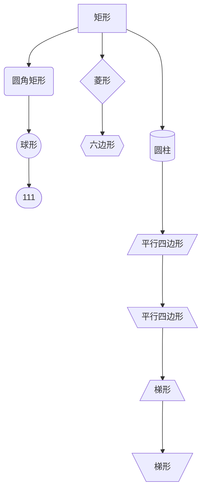
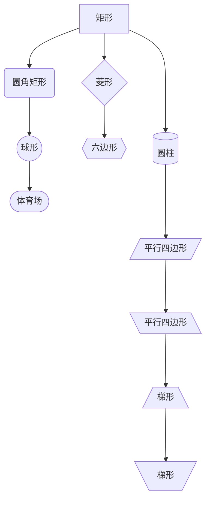

## 示例

```tex

```mermaid
graph TD
	A1[矩形]--->B1[(圆柱)]
	B1[(圆柱)]--->C1[/平行四边形/]
	C1[/平行四边形/]--->D1[\平行四边形\]
	D1[\平行四边形\]--->E1[/梯形\]
	E1[/梯形\]--->F1[\梯形/]
	
	A1[矩形]-->A2{菱形}
	A2{菱形}-->B2{{六边形}}
	
	A1[矩形]-->A3(圆角矩形)
	A3(圆角矩形)-->B3((球形))
	B3((球形))-->C3([111])
	
```



```mermaid
graph TD
	A1[矩形]--->B1[(圆柱)]
	B1[(圆柱)]--->C1[/平行四边形/]
	C1[/平行四边形/]--->D1[\平行四边形\]
	D1[\平行四边形\]--->E1[/梯形\]
	E1[/梯形\]--->F1[\梯形/]
	
	A1[矩形]-->A2{菱形}
	A2{菱形}-->B2{{六边形}}
	
	A1[矩形]-->A3(圆角矩形)
	A3(圆角矩形)-->B3((球形))
	B3((球形))-->C3([体育场])
	
```


----


----


## 节点形状


