## 参数解析

> ==echo==默认以空格分隔的形式打印其参数。**也就是说，它会自动跳过空格**

```shell
echo hello world
```

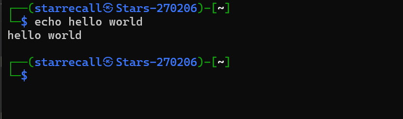

```shell
echo hello          world
```

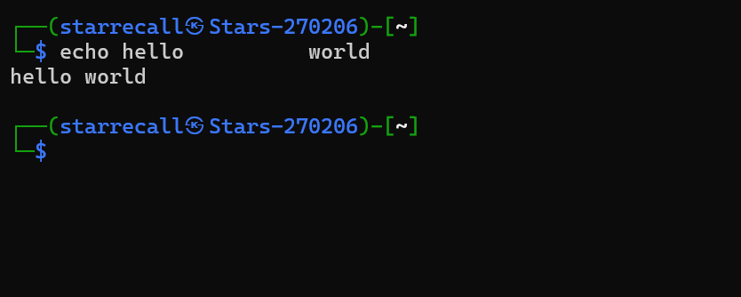

```shell
echo "hello world"
```

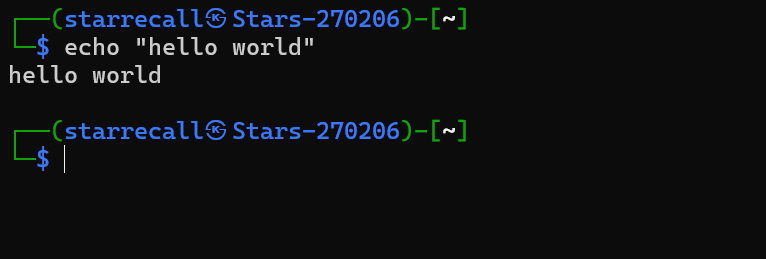


==注意和上面的做对比， “” 会让hello world视为一个整体==

```shell
echo "hello          world"
```

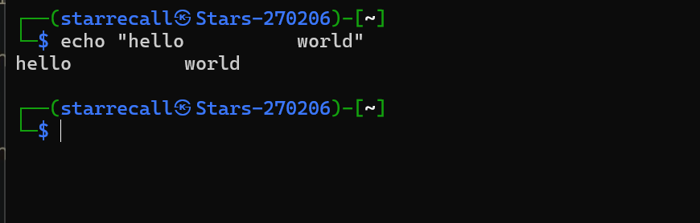

**还有一份方法是使用“/”来表示它不是一个特殊字符，这个字符串并没有中断**

> 比如，你想打印一个字符串==jos‘s world==

如果你使用单引号

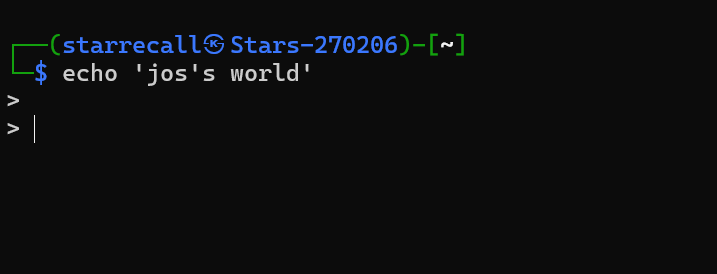

这是在提示你还需要输入字符==’==作为结束

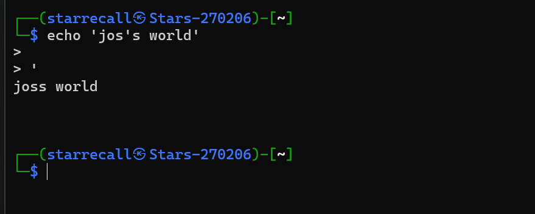

但是使用双引号就不会

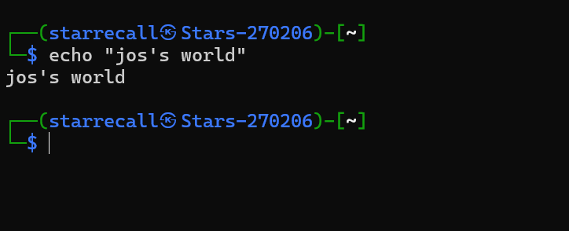


## 重要的指令

### **man**

==它将会告诉你，xx程序的技术文档（简单版）==

格式：

```shell
man echo
```

然后你就会进入像这样的一个页面。

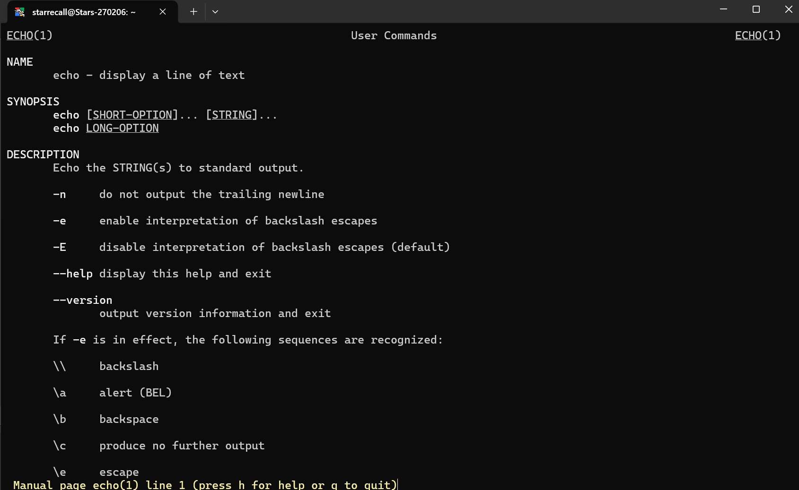


### **cd**

==去往文件的不同位置==

格式

```shell
cd xxx      #xxx是路径
```

#### 一些小知识：


```shell
.   #代表当前目录的简化
```

仍然在当目录

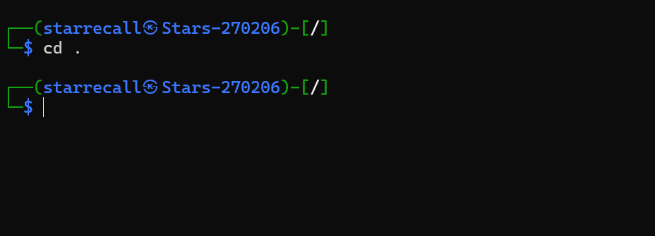

```shell
cd ..  #返回上一级目录
```

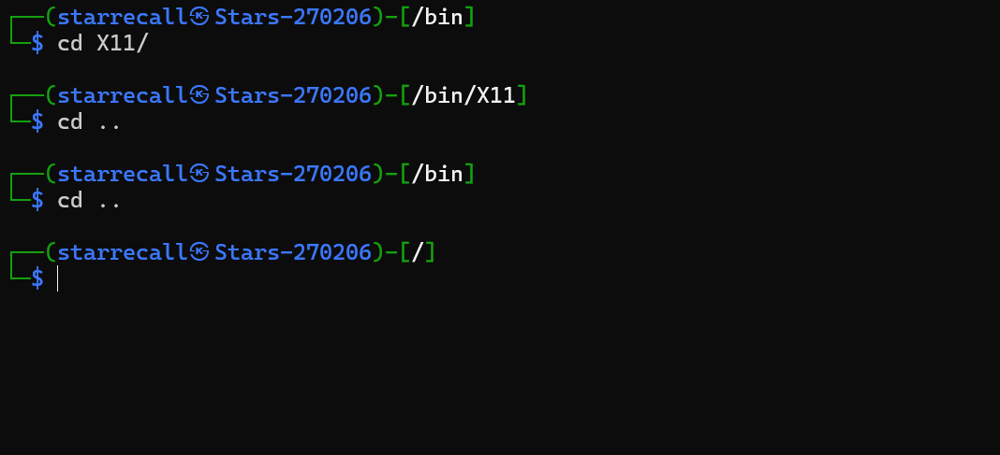

> **记住：所有指令都可以合在一起用**

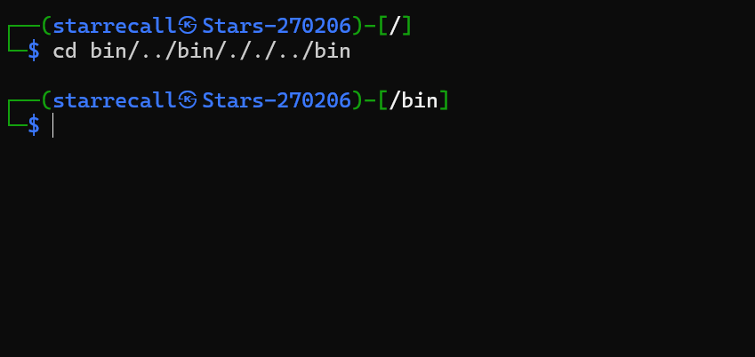

### **Tab**键的妙用

- 按两次，展示所有相关的文件

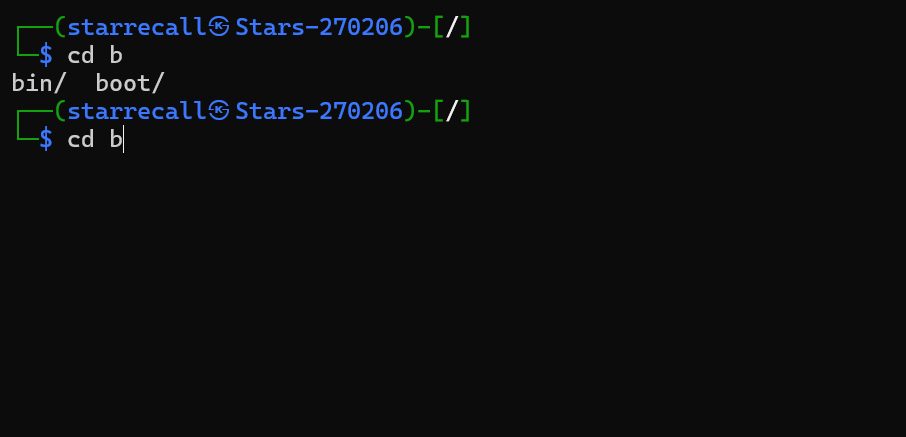

### **which**

找到你要的运行的**第一个**程序

格式

```shell
which echo
```

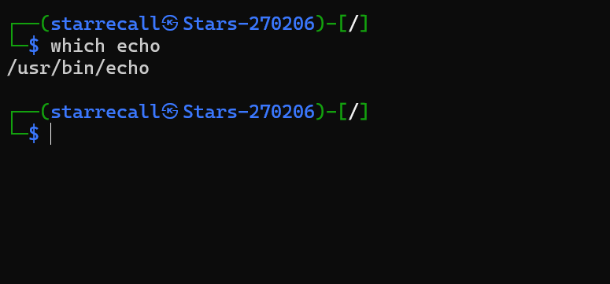

**特殊**(找到所有位置)

```shell
which -a sh
```

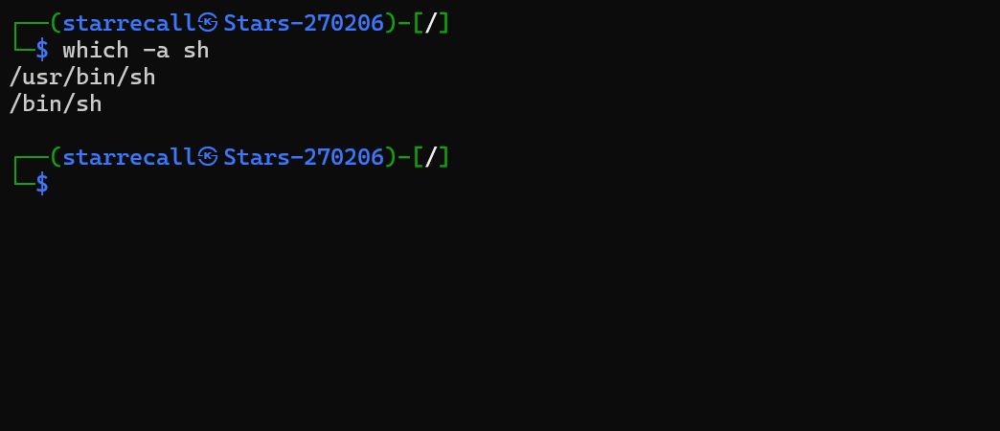

which的查找路径顺序

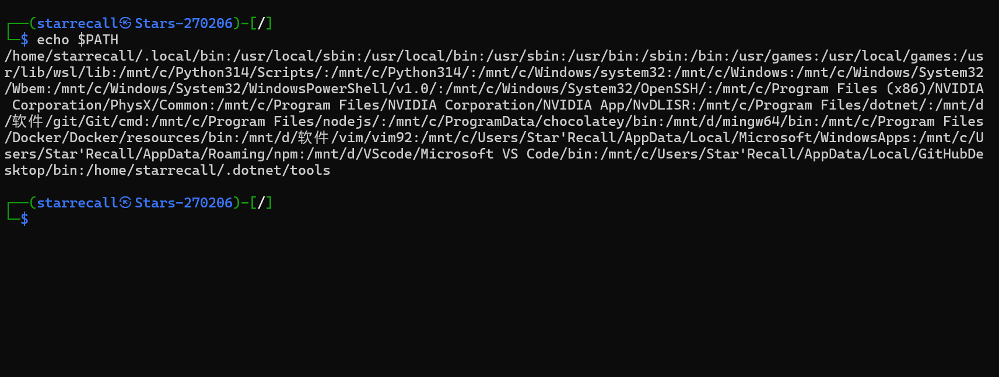

### **ls**

展示文件夹内所有的文件

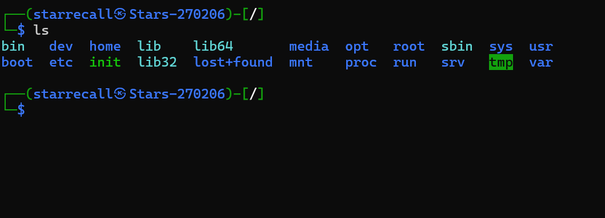

### **nvim**

打开一个文本编辑器（需要下载）

> [怎么退出](./../补充/如何退出nvim.md)（我觉得你可能需要这个）😂

```shell
nvim xxx #xxx是文件名
```


### **cat**

打印文件

```shell
cat xxx #xxx是文件名
```


### **uniq**

```shell
uniq xxx #xxx是文件名
```


打印文件，但是消除连续的重复行


### **sort**

```shell
sort xxx #xxx是文件名
```

按字典序排序输出


```shell
sort -u xxx #可以达成和uniq差不多的效果
```


### **head**

打印前n行。

```shell
head -nx xxx #x可以为任意数字
```


### **tail**

打印后n行。

```shell
tail -nx xxx #x可以为任意数字
```


### **grep**

使用一个正则表达式进行查找。**（只有查找）**

**非常非常强大**

```shell
grep A B #查找A(或满足A的东西)在B中  
```


### **sed**

以行为标志的文本查找并编辑


### **find**

可以使用海量表达式进行查找。**（只有查找）**

**非常非常强大**


### **Ctrl+C**

停止程序或是取消操作。


### **awk**

一个内置的编程化脚本语言。用于从半结构化的文件中提取数据。


## 分隔符与重定向

>
>
>[一些小坑](.\..\补充\一些小坑.md)

你可以使用“**|**”来分隔程序，使得以程序作为输入和输出。

```shell
```


“**>**”代表定向输入，但它会擦除文件内部内容。

```shell
date > the_date.text
```

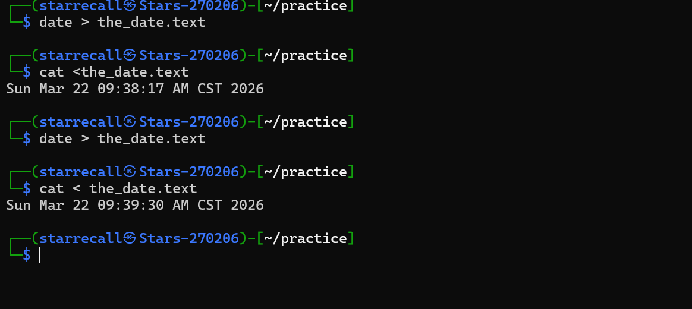


“**>>**”代表重定向输入，它会在原有基础上加入输入内容。

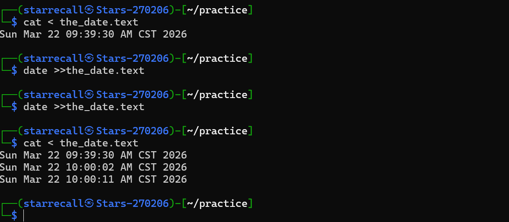


