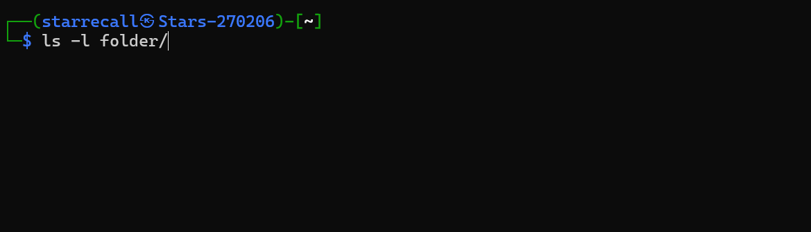

# Lecture_2_shell

Shell脚本的所有设计都围绕「运行程序、让程序之间简单高效地通信」这一目标展开。

## 核心概念：

*   参数（Arguments）
*   流（Streams）
*   环境变量（Environment Variables）
*   返回码（Return Codes）
*   信号（Signals）

### 参数

Shell程序在执行时会接收一组参数列表。

如：

```bash
ls -l folder/
```



我们实际是运行`/bin/ls`程序，并传入参数`['-l', 'folder/']`。

我们可以通过Shell语法访问这些参数：`$1`对应第一个参数，`$2`对应第二个，依此类推直到`$9`；`$@`用于获取所有参数组成的列表，`$#`用于获取参数的总数；此外`$0`可以获取当前程序的名称。

可以类比一下c++；

```c++
int main(int argc ,char *argv[]){
    ......
}
```

==\$# 就是 argc.==

==\$1~\$9 就是argc[1] ~ argv[9];==


参数会由**选项（Flags）**和普通字符串混合组成。选项的特征是以单横杠（`-`）或双横杠（`--`）开头，通常是可选的，作用是修改程序的运行行为。例如`ls -l`就改变了`ls`的输出格式。


**单横杠的短选项还可以合并书写**，因此`ls -l -a`和`ls -la`也等价。选项的顺序通常也不影响结果，`ls -la`和`ls -al`的输出完全一致。


> 选项是Shell约定规范的第一个典型例子。Shell语言本身并没有强制要求程序必须用`-`或`--`来表示选项，你完全可以写出支持`myprogram +myoption myfile`这种语法的程序，但这会造成用户困惑，因为行业默认约定就是用横杠表示选项。实际开发中，大多数编程语言都提供了CLI选项解析库（例如Python的`argparse`），用于解析符合横杠语法的参数。


```bash
mkdir src
mkdir docs
# 等价于
mkdir src docs
```

结合通配符后会很强。


最常用的glob模式包括通配符`*`（匹配零个或多个任意字符）、`?`（匹配恰好一个任意字符），以及花括号展开。花括号`{}`可以将逗号分隔的模式列表展开为多个参数。


```bash
touch folder/{a,b,c}.py
# 会展开为
touch folder/a.py folder/b.py folder/c.py

convert image.{png,jpg}
# 会展开为
convert image.png image.jpg

cp /path/to/project/{setup,build,deploy}.sh /newpath
# 会展开为
cp /path/to/project/setup.sh /path/to/project/build.sh /path/to/project/deploy.sh /newpath

# glob模式还可以组合使用
mv *{.py,.sh} folder
# 会移动所有.py和.sh文件
```

-----

## 流

例子

```bash
cat myfile | grep -P '\d+' | uniq -c
```

Shell并不是先运行cat，再运行grep，再运行uniq，而是同时启动三个程序，将cat的输出连接到grep的输入，再将grep的输出连接到uniq的输入。

使用管道符`|`时，Shell是基于**数据流**来处理的，数据会沿着管道链从一个程序流向下一个程序。

每个程序都有一个输入流，称为**标准输入（stdin, standard input）**。使用管道时，标准输入会被自动连接。很多程序接受`-`作为特殊文件名，代表「从标准输入读取内容」

每个程序有两个输出流：**标准输出（stdout, standard output）**和**标准错误（stderr, standard error）**。**标准错误是独立的输出流**,为防止被错误当成标准输入。

```bash
$ ls /nonexistent
ls: cannot access '/nonexistent': No such file or directory
$ ls /nonexistent | grep "pattern"
ls: cannot access '/nonexistent': No such file or directory
# 错误信息依然会显示，因为标准错误没有被管道传递
$ ls /nonexistent 2>/dev/null
# 没有输出——标准错误被重定向到了/dev/null 

# 将标准输出重定向到文件（覆盖写入）
echo "hello" > output.txt

# 将标准输出重定向到文件（追加写入）
echo "world" >> output.txt

# 将标准错误重定向到文件
ls foobar 2> errors.txt

# 将标准输出和标准错误都重定向到同一个文件
ls foobar &> all_output.txt

# 从文件读取内容到标准输入
grep "pattern" < input.txt

# 将输出重定向到/dev/null来丢弃所有输出
cmd > /dev/null 2>&1
```

----

### 环境变量

> **在Shell脚本中，空格的作用是分割参数**

在bash中赋值变量的语法是`foo=bar`，之后通过`$foo`语法访问变量的值。注意`foo = bar`是非法语法，因为Shell会将其解析为运行`foo`程序，并传入参数`['=', 'bar']`。

> **Shell变量没有类型，所有变量都是字符串。**

单引号`'`包裹的是字面字符串，**不会展开变量、执行命令替换或处理转义序列**；而双引号`"`包裹的字符串会执行这些操作。

```bash
foo=bar
echo "$foo"
# 输出bar
echo '$foo'
# 输出$foo
```

**命令替换（Command Substitution）**

将命令的输出保存到变量中

```bash
files=$(ls)
echo "$files" | grep README
echo "$files" | grep ".py"
```

**进程替换（Process Substitution）**：

`<( CMD )`会执行`CMD`，将输出存入临时文件，然后把`<()`替换为该临时文件的名称。当命令要求通过文件而非标准输入传入数据时，这个特性非常有用。

```bash
diff <(ls src) <(ls docs)
# 可以比较`src`和`docs`两个目录下文件列表的差异。
```

> 环境变量约定俗成使用全大写命名

```bash
TZ=Asia/Tokyo date  # 输出东京的当前时间
echo $TZ  # 这里输出为空，因为TZ只针对子命令生效
```

我们可以用内置命令`export`修改当前Shell的环境变量，这样所有后续启动的子进程都会继承该变量.

要删除变量可以使用内置命令`unset`

```bash
export DEBUG=1
# 所有后续启动的程序的环境变量中都会有DEBUG=1
bash -c 'echo $DEBUG'
# 输出1
unset DEBUG
# 删除 DEBUG
```

---

### 返回码


