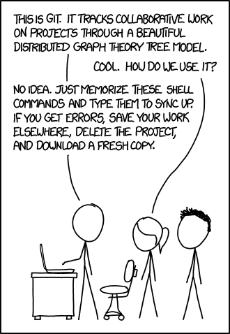

【翻译结果】
[./missing-semester](https://missing.csail.mit.edu/) 

[课程列表](https://missing.csail.mit.edu/2026/) [往期课程](https://missing.csail.mit.edu/past/) [关于课程](https://missing.csail.mit.edu/about/)

# 版本控制与Git

版本控制系统（Version Control System, VCS）是用于追踪源代码（或其他文件、目录集合）变更的工具。顾名思义，这类工具可以帮你维护变更历史，同时还能支持多人协作。从逻辑上讲，版本控制系统会以一系列**快照（snapshot）**的形式追踪目录及其内容的变更，每个快照都封装了顶层目录下所有文件/目录的完整状态。版本控制系统还会维护元数据，比如每个快照的创建者、关联的备注信息等。

为什么版本控制这么有用？哪怕你独自工作，它也能让你查看项目的历史快照，记录某一变更的原因，并行开发不同分支等等。和他人协作时，它是查看其他人变更、解决并发开发冲突的不可或缺的工具。

现代版本控制系统还能帮你轻松（通常是自动）解答以下问题：
* 谁编写了这个模块？
* 某个特定文件的某一行是何时被修改的？是谁改的？为什么修改？
* 在过去的1000个版本中，某个单元测试是何时、为何失效的？

尽管存在其他版本控制系统，但**Git**是目前版本控制的事实标准。这则[XKCD漫画](https://xkcd.com/1597/)精准概括了大众对Git的印象：



由于Git的接口是一个**抽象泄漏（leaky abstraction）**，如果采用自上而下的学习路径（从接口/命令行开始学），很容易产生大量困惑。你可能会记住一堆命令，把它们当成魔法咒语，一旦出问题就照着上面漫画里的做法操作。

虽然Git的接口确实不够友好，但其底层设计和思想却十分优雅。丑陋的接口只能靠死记硬背，而优美的设计却可以被理解。因此，我们将采用自下而上的方式讲解Git，先从它的数据模型开始，再介绍命令行接口。一旦理解了数据模型，你就能更清楚地明白各个命令是如何操作底层数据模型的。

---

## Git的数据模型

Git的精巧之处在于其精心设计的数据模型，它支持版本控制的所有优秀特性，比如维护历史、支持分支、实现协作等。

### 快照
Git将顶层目录下的文件、目录集合的历史建模为一系列快照。在Git的术语体系中，文件被称为**二进制大对象（blob）**，本质就是一串字节序列。目录被称为**树（tree）**，它将名称映射到blob或其他树（因此目录可以嵌套其他目录）。快照就是被追踪的顶层树。例如，我们可能有如下结构的树：
```
<root> (tree)
|
+- foo (tree)
|  |
|  + bar.txt (blob, 内容 = "hello world")
|
+- baz.txt (blob, 内容 = "git is wonderful")
```
顶层树包含两个元素：树“foo”（自身包含一个blob元素“bar.txt”）和blob“baz.txt”。

### 历史建模：快照的关联
版本控制系统应该如何关联不同的快照？一个简单的模型是采用线性历史：历史是按时间顺序排列的快照列表。但出于多种原因，Git并没有采用这种简单模型。

在Git中，历史是由快照组成的**有向无环图（Directed Acyclic Graph, DAG）**。这听起来像是个复杂的数学术语，但不必害怕。它的含义是：Git中的每个快照都指向一组“父提交”，也就是它之前的快照。之所以是一组父提交而非单个父提交（线性历史就是单个父提交），是因为一个快照可能来自多个父提交，比如合并两个并行开发的分支时就会出现这种情况。

Git将这些快照称为**提交（commit）**。提交历史的可视化效果大概是这样的：
```
o <-- o <-- o <-- o
            ^
             \
              --- o <-- o
```
在上面的ASCII图中，`o`对应单个提交（快照）。箭头指向每个提交的父提交（这是“早于”的关系，而非“晚于”）。在第三次提交后，历史分叉为两个独立的分支，这可能对应两个并行开发、相互独立的功能。未来这些分支可能会被合并，生成一个同时包含两个功能的新快照，新的历史如下，加粗的是新生成的合并提交：
```
o <-- o <-- o <-- o <---- **o**
            ^            /
             \          v
              --- o <-- o
```
Git中的提交是不可变的。但这并不意味着无法修正错误，只是“编辑”提交历史实际上是创建了全新的提交，然后更新**引用（reference）**（见下文）使其指向新的提交而已。

### 数据模型的伪代码表示
通过伪代码来理解Git的数据模型可能会更清晰：
```
// 文件就是一串字节序列
type blob = array<byte>

// 目录包含命名的文件和子目录
type tree = map<string, tree | blob>

// 提交包含父提交、元数据和顶层树
type commit = struct {
    parents: array<commit>
    author: string
    message: string
    snapshot: tree
}
```
这是一个简洁、清晰的历史模型。

### 对象与内容寻址
**对象（object）**是blob、树或提交的统称：
```
type object = blob | tree | commit
```
在Git的数据存储中，所有对象都通过其**SHA-1哈希（SHA-1 hash）**进行**内容寻址（content-addressing）**。
```
objects = map<string, object>

def store(object):
    id = sha1(object)
    objects[id] = object

def load(id):
    return objects[id]
```
Blob、树和提交通过这种方式被统一处理：它们都是对象。当它们引用其他对象时，并不会在磁盘存储中实际包含这些对象，而是通过哈希值引用它们。

例如，上文示例目录结构对应的树（可通过`git cat-file -p 698281bc680d1995c5f4caaf3359721a5a58d48d`查看）如下：
```
100644 blob 4448adbf7ecd394f42ae135bbeed9676e894af85    baz.txt
040000 tree c68d233a33c5c06e0340e4c224f0afca87c8ce87    foo
```
树本身包含指向其内容的指针：`baz.txt`（一个blob）和`foo`（一个树）。如果我们用`git cat-file -p 4448adbf7ecd394f42ae135bbeed9676e894af85`查看baz.txt对应的哈希指向的内容，会得到：
```
git is wonderful
```

### 引用
现在，所有快照都可以通过其SHA-1哈希值来标识。但这很不方便，因为人类不擅长记忆40位的十六进制字符串。

Git解决这个问题的方案是给SHA-1哈希设置人类可读的名称，称为**引用**。引用是指向提交的指针。和不可变的对象不同，引用是可变的（可以更新以指向新的提交）。例如，`master`引用通常指向开发主线的最新提交。
```
references = map<string, string>

def update_reference(name, id):
    references[name] = id

def read_reference(name):
    return references[name]

def load_reference(name_or_id):
    if name_or_id in references:
        return load(references[name_or_id])
    else:
        return load(name_or_id)
```
有了引用，Git就可以用“master”这类人类可读的名称来指代历史中的某个特定快照，而不用使用很长的十六进制字符串。

还有一个细节：我们通常需要知道“当前在历史中的哪个位置”，这样当我们创建新快照时，就能知道它的相对位置（如何设置提交的`parents`字段）。在Git中，这个“当前位置”是一个名为`HEAD`的特殊引用。

### 仓库
最后，我们可以大致定义Git**仓库（repository）**的概念：它就是所有数据`objects`和`references`的集合。

在磁盘上，Git存储的所有内容就是对象和引用：这就是Git数据模型的全部本质。所有`git`命令最终都对应着对提交有向无环图（DAG）的某种操作，本质是新增对象、新增或更新引用。

当你输入任何Git命令时，都可以思考一下这个命令会对底层的图数据结构产生什么操作。反过来，如果你想对提交DAG做某种特定修改，比如“丢弃未提交的变更，让‘master’引用指向提交`5d83f9e`”，那大概率存在对应的命令（比如这个场景的命令是`git checkout master; git reset --hard 5d83f9e`）。

---

## 暂存区
暂存区是一个和数据模型正交的概念，但它是创建提交的接口的一部分。

你可能会觉得快照功能的实现逻辑应该是：有一个“创建快照”的命令，基于工作目录的**当前状态**生成新的快照。有些版本控制工具确实是这么工作的，但Git不是。我们希望生成干净的快照，而基于当前状态生成快照并不总是理想选择。例如，假设你同时实现了两个独立功能，希望生成两个独立的提交，第一个提交引入第一个功能，第二个提交引入第二个功能。再比如，你在代码里到处加了调试打印语句，同时还修复了一个bug，你希望只提交bug修复，而丢弃所有打印语句。

Git通过**暂存区（staging area）**机制来满足这类需求，你可以指定哪些修改需要被包含到下一个快照中。

---

## Git命令行接口
为了避免重复信息，我们不会在讲义中详细解释以下命令的用法。强烈推荐阅读《Pro Git》了解更多信息，或是观看课程视频。

### 基础命令
* `git help <command>`：获取Git命令的帮助信息
* `git init`：创建新的Git仓库，数据存储在`.git`目录中
* `git status`：查看当前仓库的状态
* `git add <filename>`：将文件添加到暂存区
* `git commit`：创建新的提交
  * 请编写[优质的提交信息](https://tbaggery.com/2008/04/19/a-note-about-git-commit-messages.html)！
  * 还有更多[编写优质提交信息的理由](https://chris.beams.io/posts/git-commit/)！
* `git log`：展示扁平化的历史日志
* `git log --all --graph --decorate`：将历史可视化为有向无环图
* `git diff <filename>`：展示你相对于暂存区的修改
* `git diff <revision> <filename>`：展示某个文件在两个快照之间的差异
* `git checkout <revision>`：更新HEAD（如果切换的是分支，还会更新当前分支）

### 分支与合并
* `git branch`：展示所有分支
* `git branch <name>`：创建新分支
* `git switch <name>`：切换到指定分支
* `git checkout -b <name>`：创建新分支并切换到该分支
  * 等同于`git branch <name>; git switch <name>`
* `git merge <revision>`：将指定版本合并到当前分支
* `git mergetool`：使用高级工具辅助解决**合并冲突（merge conflict）**
* `git rebase`：将一系列补丁变基到新的基线

### 远程操作
* `git remote`：列出所有远程仓库
* `git remote add <name> <url>`：添加远程仓库
* `git push <remote> <local branch>:<remote branch>`：将对象发送到远程仓库，并更新远程引用
* `git branch --set-upstream-to=<remote>/<remote branch>`：建立本地分支和远程分支的对应关系
* `git fetch`：从远程仓库获取对象和引用
* `git pull`：等同于`git fetch; git merge`
* `git clone`：从远程下载仓库到本地

### 撤销操作
* `git commit --amend`：编辑提交的内容或信息
* `git reset <file>`：将文件移出暂存区
* `git restore`：丢弃工作区的修改

---

## 高级Git功能
* `git config`：Git支持[高度自定义](https://git-scm.com/docs/git-config)
* `git clone --depth=1`：浅克隆，不下载完整的版本历史
* `git add -p`：交互式暂存
* `git rebase -i`：交互式变基
* `git blame`：展示每一行代码最后是谁修改的
* `git stash`：临时移除工作区的修改
* `git bisect`：二分查找历史（比如查找回归bug的引入点）
* `git revert`：创建新提交，撤销某个更早提交的影响
* `git worktree`：同时检出多个分支
* `.gitignore`：[指定](https://git-scm.com/docs/gitignore)不需要被Git追踪的文件

---

## 其他内容
* **图形界面**：Git有很多[图形客户端](https://git-scm.com/downloads/guis)。我们个人不使用图形界面，而是直接使用命令行接口。
* **Shell集成**：将Git状态集成到Shell提示符中非常方便（[zsh](https://github.com/olivierverdier/zsh-git-prompt)、[bash](https://github.com/magicmonty/bash-git-prompt)）。这类功能通常已经被包含在[Oh My Zsh](https://github.com/ohmyzsh/ohmyzsh)等框架中。
* **编辑器集成**：和上面类似，很多编辑器都提供实用的Git集成。Vim的标准集成插件是[fugitive.vim](https://github.com/tpope/vim-fugitive)。
* **工作流**：我们教了你数据模型和一些基础命令，但没有讲大型项目开发需要遵循的实践（存在[很多](https://nvie.com/posts/a-successful-git-branching-model/) [不同](https://www.endoflineblog.com/gitflow-considered-harmful) [的实践方案](https://www.atlassian.com/git/tutorials/comparing-workflows/gitflow-workflow)）。
* **GitHub**：Git不等于GitHub。GitHub提供了一种向其他项目贡献代码的特定方式，叫做**拉取请求（Pull Request, PR）**。
* **其他Git托管平台**：GitHub并不特殊，还有很多Git仓库托管服务，比如GitLab和BitBucket。

---

## 学习资源
* 《[Pro Git](https://git-scm.com/book/en/v2)》是**强烈推荐**的阅读材料。既然你已经理解了Git的数据模型，阅读第1-5章就能学会绝大多数熟练使用Git所需的知识。后面的章节包含很多有趣的高级内容。
* 《[Oh Shit, Git!?!](https://ohshitgit.com/)》是一份简短的指南，教你如何从常见的Git错误中恢复。
* 《[Git for Computer Scientists](https://eagain.net/articles/git-for-computer-scientists/)》是对Git数据模型的简短解释，相比本讲义伪代码更少、图表更多。
* 《[Git from the Bottom Up](https://jwiegley.github.io/git-from-the-bottom-up/)》详细解释了Git数据模型之外的实现细节，适合好奇的学习者。
* 《[如何用简单的语言解释Git](https://smusamashah.github.io/blog/2017/10/14/explain-git-in-simple-words)》
* 《[Learn Git Branching](https://learngitbranching.js.org/)》是一个浏览器端的游戏，用于教学Git。

---

## 练习
1. 如果你之前没有Git使用经验，可以阅读《Pro Git》的前几章，或是完成[Learn Git Branching](https://learngitbranching.js.org/)这类教程。学习的过程中，尝试将Git命令和它的数据模型关联起来。
2. 克隆课程网站的[仓库](https://github.com/missing-semester/missing-semester)。
   1. 通过图形化方式查看版本历史的结构。
   2. 谁是最后修改`README.md`的人？（提示：给`git log`传一个文件参数）
   3. 最后一次修改`_config.yml`中`collections:`行的提交信息是什么？（提示：使用`git blame`和`git show`）
3. 学习Git时的一个常见错误是提交了不应该被Git管理的大文件，或是提交了敏感信息。尝试向仓库中添加一个文件，进行若干次提交，然后将该文件从**历史记录**中删除（而不仅仅是从最新提交中移除）。你可以参考[这篇文档](https://help.github.com/articles/removing-sensitive-data-from-a-repository/)。
4. 从GitHub克隆任意一个仓库，修改其中的一个现有文件。执行`git stash`会发生什么？运行`git log --all --oneline`会看到什么？运行`git stash pop`撤销你刚才执行的`git stash`操作。这个功能在什么场景下会有用？
5. 和很多命令行工具一样，Git有一个名为`~/.gitconfig`的配置文件（dotfile）。请在`~/.gitconfig`中创建一个别名，使得当你运行`git graph`时，等价于执行`git log --all --graph --